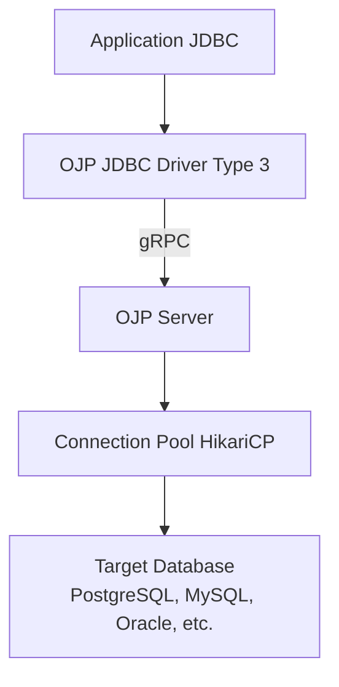
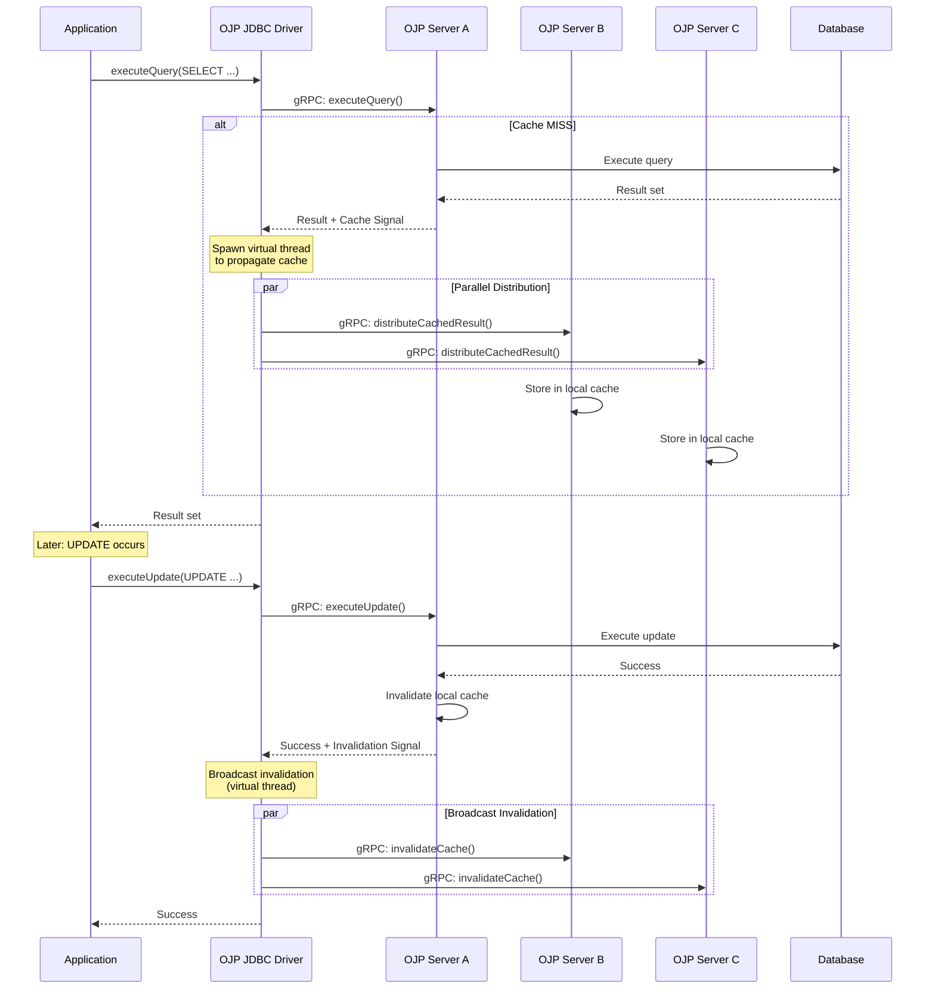
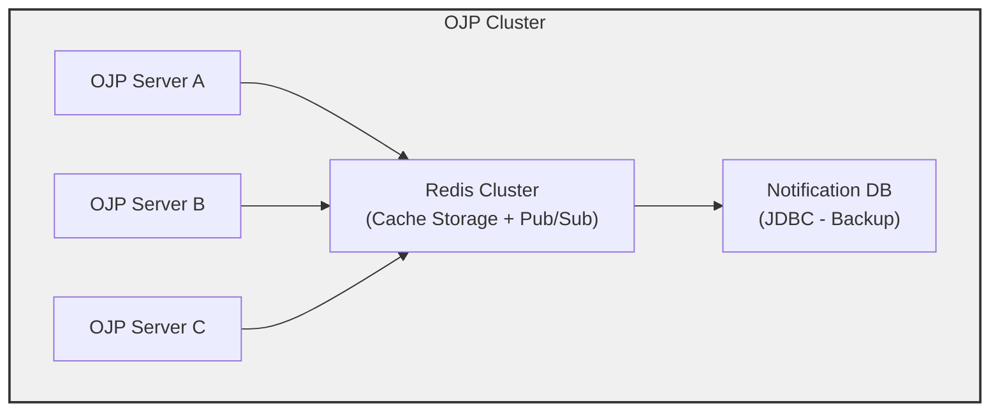

# OJP Query Result Caching Implementation Analysis

**Date:** February 11, 2026  
**Status:** Analysis and Recommendations  
**Scope:** SELECT statement result caching with distributed cache support

---

## Executive Summary

This document provides a comprehensive analysis of how query result caching could be implemented in Open J Proxy (OJP) specifically for SELECT statements. It explores various approaches for marking queries as cacheable, cache invalidation strategies, and examines the feasibility of using JDBC drivers to replicate cache data across multiple OJP server instances.

**Key Findings:**
- ✅ OJP's existing architecture has excellent extension points for adding caching
- ✅ Multiple viable approaches exist for marking queries as cacheable
- ✅ JDBC drivers can be used for cache replication, with tradeoffs
- ⚠️ Distributed caching requires careful consideration of consistency guarantees

---

## ⭐ FINAL DESIGN DECISION

After thorough analysis and iterative refinement based on real-world constraints, the **recommended approach** is:

### 1. Query Marking: Client-Side Configuration in `ojp.properties` ✅

**Configuration is defined client-side** in the same `ojp.properties` file used for connection pools and datasource configuration:

```properties
# In ojp.properties (with connection pool config)
postgres_prod.ojp.cache.enabled=true
postgres_prod.ojp.cache.distribute=true  # Optional: enable/disable driver relay (default: false)
postgres_prod.ojp.cache.queries.1.pattern=SELECT .* FROM products WHERE .*
postgres_prod.ojp.cache.queries.1.ttl=600s
postgres_prod.ojp.cache.queries.1.invalidateOn=products

postgres_prod.ojp.cache.queries.2.pattern=SELECT .* FROM users WHERE id = ?
postgres_prod.ojp.cache.queries.2.ttl=300s
postgres_prod.ojp.cache.queries.2.invalidateOn=users
```

**Why this approach:**
- ✅ **Follows existing OJP patterns** - All datasource config is already client-side
- ✅ **Simple** - No server-side config files or hot-reload mechanisms
- ✅ **Decoupled** - Each datasource controls its own cache independently
- ✅ **No OJP restart** - Only restart affected application, not OJP server
- ✅ **Works with ORMs** - Pattern matching works for Hibernate/Spring Data generated SQL

### 2. Cache Distribution: JDBC Driver as Active Relay (Optional) ✅

**Cache data distribution is OPTIONAL** and controlled per-datasource:
- `ojp.cache.distribute=true` - Enable driver relay to other OJP servers
- `ojp.cache.distribute=false` - Cache only maintained locally on each server (default)

**When distribution is enabled**, cached data is distributed by the JDBC driver when returning query results:
- Data is already in driver memory (being returned to application)
- Driver streams cached results to other OJP servers via virtual threads (Java 21+)
- Smart distribution policy: Only distribute results < 200KB, TTL > 60s, > 1 row

**Why this approach:**
- ✅ **Optional** - Can use local-only caching for simpler deployments
- ✅ **Data already in memory** - No additional database queries needed when distributing
- ✅ **Saves N-1 database queries** - The whole point of distributed caching
- ✅ **Real-time propagation** - Immediate, no polling delays
- ✅ **Zero database overhead** - No notification tables or polling

### 3. Fallback Options for Special Cases

- **Legacy Java (<21)**: Use JDBC Notification Table (polling-based)
- **PostgreSQL-only**: Use LISTEN/NOTIFY for real-time propagation
- **Very large clusters (20+)**: Consider Redis + JDBC hybrid

---

### Implementation Flow

1. **Configuration**: Define cache rules in client's `ojp.properties` file (with optional distribution)
2. **Connection**: JDBC driver sends cache config to OJP server during connection
3. **Per-Session Storage**: Server stores cache rules for each session
4. **Query Execution**: Server matches queries against session's cache rules
5. **Cache Hit**: Return cached result immediately
6. **Cache Miss**: Execute query, cache result locally
7. **Distribution** (if enabled): Driver distributes cached result to other servers
8. **Invalidation**: DML operations invalidate affected cache entries

---

### Alternative Approaches Considered

The document explores other approaches for completeness, but they are **not recommended** for the following reasons:

- **SQL Comment Hints** (`/* @cache */`): Doesn't work with ORMs (Hibernate, Spring Data)
- **Server-Side Configuration**: Too complex (hot-reload, admin API, affects multiple apps)
- **JDBC Notification Table**: Adds database overhead, polling latency (good fallback though)
- **Redis**: Additional infrastructure complexity (only for very large clusters)

**See Section 13 for detailed comparison and rationale.**

---

## 1. Background: OJP Architecture

### 1.1 Current Query Flow



### 1.2 Existing Caching Mechanisms

OJP already implements caching in specific areas:

#### SqlEnhancerEngine Cache
- **Location:** `ojp-server/src/main/java/org/openjproxy/grpc/server/sql/SqlEnhancerEngine.java`
- **Purpose:** Caches SQL enhancement results (parsing, validation, optimization)
- **Implementation:** `ConcurrentHashMap<String, SqlEnhancementResult>`
- **Key:** Original SQL string
- **Thread-Safety:** Fully concurrent, lock-free reads

```java
private final ConcurrentHashMap<String, SqlEnhancementResult> cache;
```

#### SchemaCache
- **Location:** `ojp-server/src/main/java/org/openjproxy/grpc/server/sql/SchemaCache.java`
- **Purpose:** Caches database schema metadata for SQL enhancement
- **Implementation:** Volatile reference with atomic refresh locking
- **Thread-Safety:** Thread-safe via volatile semantics and AtomicBoolean

```java
private volatile SchemaMetadata currentSchema;
private final AtomicBoolean refreshInProgress = new AtomicBoolean(false);
```

### 1.3 Key Extension Points

OJP's architecture provides several excellent extension points for caching:

1. **Action Pattern** - Modular request handlers in StatementServiceImpl
2. **SQL Enhancement Pipeline** - Already intercepts and analyzes all SQL
3. **gRPC Protocol** - Metadata can be passed via request/response headers
4. **Multinode Architecture** - Existing infrastructure for server-to-server communication

---

## 2. Caching Strategy Options

### 2.1 Option 1: SQL String-Based Caching

**Approach:** Cache query results using the SQL string + parameter values as the cache key.

#### Implementation Overview

```java
// Cache structure
public class QueryResultCache {
    private final ConcurrentHashMap<QueryCacheKey, CachedResult> cache;
    
    static class QueryCacheKey {
        private final String sql;
        private final List<Object> parameters;
        private final int hashCode;
        
        @Override
        public boolean equals(Object o) {
            // Compare SQL and parameters
        }
        
        @Override
        public int hashCode() {
            return hashCode; // Pre-computed
        }
    }
    
    static class CachedResult {
        private final List<List<Object>> rows;      // Result data
        private final ResultSetMetaData metadata;    // Column info
        private final long timestamp;                // Cache time
        private final long ttl;                      // Time-to-live
        
        boolean isExpired() {
            return System.currentTimeMillis() - timestamp > ttl;
        }
    }
}
```

#### Integration Point: ExecuteQueryAction

```java
// ojp-server/src/main/java/org/openjproxy/grpc/server/action/statement/ExecuteQueryAction.java
public class ExecuteQueryAction implements Action {
    
    private final QueryResultCache resultCache;
    
    @Override
    public OpResult execute(StatementRequest request, SessionManager sessionManager) {
        String sql = request.getSql();
        List<Object> params = extractParameters(request);
        
        // Check if query is marked as cacheable
        if (isCacheable(request)) {
            QueryCacheKey key = new QueryCacheKey(sql, params);
            
            // Try to get from cache
            CachedResult cached = resultCache.get(key);
            if (cached != null && !cached.isExpired()) {
                log.debug("Cache HIT for query: {}", sql);
                return buildOpResultFromCache(cached);
            }
            
            // Cache MISS - execute query
            OpResult result = executeQueryOnDatabase(request, sessionManager);
            
            // Store in cache if successful
            if (result.getSuccess()) {
                resultCache.put(key, extractResultForCache(result));
            }
            
            return result;
        }
        
        // Non-cacheable query - execute normally
        return executeQueryOnDatabase(request, sessionManager);
    }
}
```

#### Advantages
- ✅ Simple and straightforward implementation
- ✅ Works with parameterized queries
- ✅ No application code changes needed
- ✅ Automatic cache key generation

#### Disadvantages
- ⚠️ Cannot handle semantically equivalent queries with different SQL text
  - Example: `SELECT * FROM users WHERE id=1` vs `SELECT * FROM users WHERE 1=id`
- ⚠️ Parameter order matters (could be normalized)
- ⚠️ No semantic understanding of query dependencies

#### Best For
- Read-heavy workloads with repeated identical queries
- Parameterized prepared statements
- Simple caching with minimal configuration

---

### 2.2 Option 2: Semantic Query Analysis with Apache Calcite

**Approach:** Use OJP's existing SqlEnhancerEngine to analyze queries semantically and create normalized cache keys.

#### Implementation Overview

```java
public class SemanticQueryCache {
    private final ConcurrentHashMap<NormalizedQuery, CachedResult> cache;
    private final SqlEnhancerEngine enhancer;
    
    static class NormalizedQuery {
        private final RelNode relationalAlgebra;  // Calcite's RelNode
        private final List<Object> parameters;
        
        @Override
        public boolean equals(Object o) {
            // Compare RelNode structure (normalized)
            return RelOptUtil.eq(this.relationalAlgebra, 
                                 ((NormalizedQuery)o).relationalAlgebra)
                && Objects.equals(this.parameters, 
                                 ((NormalizedQuery)o).parameters);
        }
    }
    
    public CachedResult lookup(String sql, List<Object> params) {
        // Parse SQL to RelNode using SqlEnhancerEngine
        RelNode normalized = enhancer.parseAndNormalize(sql);
        
        if (normalized == null) {
            return null; // Parsing failed
        }
        
        NormalizedQuery key = new NormalizedQuery(normalized, params);
        return cache.get(key);
    }
}
```

#### Integration with Existing SqlEnhancerEngine

The SqlEnhancerEngine already converts SQL to RelNode:

```java
// Existing code in SqlEnhancerEngine.java
private RelNode convertToRelNode(SqlNode validatedNode, SchemaMetadata schema) {
    // ... existing implementation ...
    // Returns normalized relational algebra representation
}
```

#### Advantages
- ✅ Handles semantically equivalent queries
  - `SELECT * FROM users WHERE id=1` ≡ `SELECT * FROM users WHERE 1=id`
- ✅ Leverages existing SqlEnhancerEngine infrastructure
- ✅ Can detect query dependencies (table access patterns)
- ✅ Enables intelligent cache invalidation

#### Disadvantages
- ⚠️ Requires SqlEnhancerEngine to be enabled
- ⚠️ Higher CPU overhead for cache key generation
- ⚠️ May encounter type system issues (as documented in INVESTIGATION_SQL_ENHANCER.md)
- ⚠️ Complex implementation

#### Best For
- Environments already using SQL enhancement
- Applications with varying query patterns
- Scenarios requiring sophisticated cache invalidation

---

### 2.3 Option 3: Hybrid Approach

**Approach:** Combine simple string-based caching with optional semantic analysis.

```java
public class HybridQueryCache {
    private final QueryResultCache stringCache;      // Fast path
    private final SemanticQueryCache semanticCache;  // Slow path
    private final boolean semanticEnabled;
    
    public CachedResult lookup(String sql, List<Object> params) {
        // Try fast string-based cache first
        CachedResult result = stringCache.get(sql, params);
        if (result != null) {
            return result;
        }
        
        // Fall back to semantic cache if enabled
        if (semanticEnabled) {
            return semanticCache.lookup(sql, params);
        }
        
        return null;
    }
}
```

---

## 3. Marking Queries as Cacheable

### 3.1 SQL Comment Hints

**Approach:** Use SQL comments to mark queries as cacheable.

#### Syntax Options

**Option A: Standard SQL Comments**
```sql
-- @cache ttl=300s
SELECT * FROM products WHERE category = 'electronics';

/* @cache ttl=5m invalidate_on=products */
SELECT id, name, price FROM products WHERE active = true;
```

**Option B: Hint-Style Comments**
```sql
SELECT /*+ CACHE(ttl=300) */ * FROM products;

SELECT /*+ CACHE(ttl=5m, key=product_list) */ 
  id, name, price 
FROM products;
```

#### Implementation

```java
public class CacheHintParser {
    private static final Pattern CACHE_HINT_PATTERN = 
        Pattern.compile("/\\*\\+\\s*CACHE\\(([^)]+)\\)\\s*\\*/");
    
    private static final Pattern COMMENT_HINT_PATTERN = 
        Pattern.compile("--\\s*@cache\\s+(.+)");
    
    public static CacheDirective parseCacheHint(String sql) {
        // Try hint-style comment
        Matcher m1 = CACHE_HINT_PATTERN.matcher(sql);
        if (m1.find()) {
            return parseCacheParams(m1.group(1));
        }
        
        // Try standard comment
        Matcher m2 = COMMENT_HINT_PATTERN.matcher(sql);
        if (m2.find()) {
            return parseCacheParams(m2.group(1));
        }
        
        return null; // Not cacheable
    }
    
    private static CacheDirective parseCacheParams(String params) {
        // Parse: ttl=300s, key=mykey, invalidate_on=table1,table2
        // Returns CacheDirective object
    }
}

public class CacheDirective {
    private final Duration ttl;
    private final String key;  // Optional explicit cache key
    private final Set<String> invalidateOnTables;
}
```

#### Integration in ExecuteQueryAction

```java
@Override
public OpResult execute(StatementRequest request, SessionManager sessionManager) {
    String sql = request.getSql();
    
    // Parse cache directive from SQL
    CacheDirective directive = CacheHintParser.parseCacheHint(sql);
    
    if (directive != null) {
        // Query is cacheable with specified settings
        return executeCachedQuery(request, directive, sessionManager);
    }
    
    // Not cacheable - execute normally
    return executeQueryOnDatabase(request, sessionManager);
}
```

#### Advantages
- ✅ Simple and explicit control
- ✅ No application code changes (just SQL modification)
- ✅ Works with any programming language/framework
- ✅ Human-readable and self-documenting
- ✅ Supports per-query TTL and invalidation rules

#### Disadvantages
- ⚠️ Requires SQL modification
- ⚠️ Can clutter SQL with comments
- ⚠️ Hint parsing adds slight overhead

#### Best For
- Applications with full control over SQL
- Scenarios requiring fine-grained cache control
- Teams comfortable with SQL hints (similar to Oracle hints)

---

### 3.2 JDBC Connection Properties

**Approach:** Configure caching behavior via JDBC connection URL or properties.

#### URL-Based Configuration

```java
// Enable caching for all SELECT statements
jdbc:ojp[localhost:1059]_postgresql://db:5432/mydb?cacheEnabled=true&cacheTtl=300

// Regex pattern for cacheable queries
jdbc:ojp[localhost:1059]_postgresql://db:5432/mydb
  ?cacheEnabled=true
  &cachePattern=SELECT.*FROM products.*
  &cacheTtl=300
```

#### Properties-Based Configuration

```java
Properties props = new Properties();
props.setProperty("user", "dbuser");
props.setProperty("password", "dbpass");

// Cache configuration
props.setProperty("ojp.cache.enabled", "true");
props.setProperty("ojp.cache.ttl.default", "300");
props.setProperty("ojp.cache.patterns", "SELECT.*FROM products.*,SELECT.*FROM users WHERE id=.*");
props.setProperty("ojp.cache.maxSize", "10000");

Connection conn = DriverManager.getConnection(url, props);
```

#### Implementation: Session-Level Cache Configuration

```java
// In ConnectionAction.java
public class ConnectionAction implements Action {
    
    @Override
    public OpResult execute(StatementRequest request, SessionManager sessionManager) {
        Properties props = extractProperties(request);
        
        // Parse cache configuration
        CacheConfiguration config = CacheConfiguration.fromProperties(props);
        
        // Store in session
        Session session = sessionManager.createSession(request.getConnectionDetails());
        session.setCacheConfiguration(config);
        
        // Return session info with cache configuration
        return buildConnectionResult(session);
    }
}

public class Session {
    private final CacheConfiguration cacheConfig;
    
    public boolean isCacheable(String sql) {
        if (!cacheConfig.isEnabled()) {
            return false;
        }
        
        // Check against patterns
        for (Pattern pattern : cacheConfig.getPatterns()) {
            if (pattern.matcher(sql).matches()) {
                return true;
            }
        }
        
        return false;
    }
}
```

#### Advantages
- ✅ No SQL modification required
- ✅ Connection-level configuration
- ✅ Can be configured per application/environment
- ✅ Supports regex patterns for flexible matching

#### Disadvantages
- ⚠️ Less granular than per-query control
- ⚠️ Pattern matching can be expensive
- ⚠️ Harder to understand which queries are cached

#### Best For
- Applications without control over SQL
- Global caching policies
- Environment-specific cache configuration

---

### 3.3 Server-Side Configuration

**Approach:** Configure caching rules on the OJP server side.

#### Configuration File: ojp-cache-rules.yml

```yaml
cache:
  enabled: true
  defaultTtl: 300s
  maxSize: 10000
  
  rules:
    - name: product_catalog
      pattern: "SELECT .* FROM products WHERE .*"
      ttl: 600s
      invalidateOn:
        - products
        - product_categories
      
    - name: user_profile
      pattern: "SELECT .* FROM users WHERE id = ?"
      ttl: 300s
      invalidateOn:
        - users
      
    - name: static_reference_data
      pattern: "SELECT .* FROM (countries|currencies|timezones)"
      ttl: 3600s
      invalidateOn:
        - countries
        - currencies
        - timezones
```

#### Implementation: ServerConfiguration with Multi-Datasource Support

```java
// In ServerConfiguration.java
public class ServerConfiguration {
    
    private final CacheRuleEngine cacheRuleEngine;
    
    public void loadConfiguration() {
        // ... existing configuration loading ...
        
        // Load cache rules
        String cacheRulesFile = System.getProperty("ojp.cache.rules.file", 
                                                   "ojp-cache-rules.yml");
        if (new File(cacheRulesFile).exists()) {
            cacheRuleEngine = CacheRuleEngine.fromYaml(cacheRulesFile);
            log.info("Loaded cache rules from {}", cacheRulesFile);
        }
    }
}

public class CacheRuleEngine {
    private final Map<String, List<CacheRule>> datasourceRules;  // Per-datasource rules
    private final List<CacheRule> globalRules;  // Apply to all datasources
    
    public CacheRule matchRule(String sql, String datasourceName) {
        // 1. Try datasource-specific rules first
        List<CacheRule> dsRules = datasourceRules.get(datasourceName);
        if (dsRules != null) {
            for (CacheRule rule : dsRules) {
                if (rule.matches(sql)) {
                    return rule;
                }
            }
        }
        
        // 2. Fall back to global rules
        for (CacheRule rule : globalRules) {
            if (rule.matches(sql)) {
                return rule;
            }
        }
        
        return null;
    }
}
```

#### Hot-Reload and Dynamic Configuration Updates

**CRITICAL OPERATIONAL CONCERN**: Server-side configuration requiring restarts affects all applications.

**Problem**: 
- Single OJP server serves multiple applications
- One app needs cache config update → requires OJP restart
- Restart affects ALL applications using that OJP server
- Unacceptable in production environments

**Solution 1: File-Watch Based Hot-Reload**

```java
// In ServerConfiguration.java
public class ServerConfiguration {
    
    private volatile CacheRuleEngine cacheRuleEngine;
    private final ScheduledExecutorService configWatcher;
    private final Path configFilePath;
    private long lastModified;
    
    public void loadConfiguration() {
        // ... existing configuration loading ...
        
        // Load cache rules
        String cacheRulesFile = System.getProperty("ojp.cache.rules.file", 
                                                   "ojp-cache-rules.yml");
        configFilePath = Paths.get(cacheRulesFile);
        
        if (Files.exists(configFilePath)) {
            reloadCacheConfiguration();
            startConfigWatcher();
        }
    }
    
    private void startConfigWatcher() {
        configWatcher = Executors.newScheduledThreadPool(1);
        
        // Check for config file changes every 10 seconds
        configWatcher.scheduleAtFixedRate(() -> {
            try {
                long currentModified = Files.getLastModifiedTime(configFilePath).toMillis();
                
                if (currentModified > lastModified) {
                    log.info("Cache configuration file changed, reloading...");
                    reloadCacheConfiguration();
                    log.info("Cache configuration reloaded successfully");
                }
            } catch (Exception e) {
                log.error("Failed to check/reload configuration", e);
            }
        }, 10, 10, TimeUnit.SECONDS);
    }
    
    private void reloadCacheConfiguration() throws IOException {
        // Load new configuration
        CacheRuleEngine newEngine = CacheRuleEngine.fromYaml(configFilePath.toFile());
        
        // Atomic swap (volatile ensures visibility)
        this.cacheRuleEngine = newEngine;
        this.lastModified = Files.getLastModifiedTime(configFilePath).toMillis();
        
        log.info("Loaded {} cache rules from {}", 
                newEngine.getRuleCount(), configFilePath);
    }
    
    public CacheRuleEngine getCacheRuleEngine() {
        return cacheRuleEngine;  // Volatile read, always gets latest
    }
}
```

**Solution 2: HTTP/gRPC Admin API for Dynamic Updates**

```java
// Add admin endpoint to StatementServiceImpl
public class StatementServiceImpl extends StatementServiceGrpc.StatementServiceImplBase {
    
    private final ServerConfiguration config;
    
    @Override
    public void updateCacheConfiguration(CacheConfigUpdateRequest request,
                                        StreamObserver<CacheConfigUpdateResponse> responseObserver) {
        try {
            // Authenticate admin request (API key, mTLS, etc.)
            if (!authenticateAdmin(request.getAdminToken())) {
                responseObserver.onError(new StatusException(Status.PERMISSION_DENIED));
                return;
            }
            
            // Parse new configuration
            CacheRuleEngine newEngine = CacheRuleEngine.fromYaml(request.getConfigYaml());
            
            // Validate configuration before applying
            if (!newEngine.validate()) {
                responseObserver.onError(new StatusException(
                    Status.INVALID_ARGUMENT.withDescription("Invalid configuration")));
                return;
            }
            
            // Apply new configuration atomically
            config.updateCacheRuleEngine(newEngine);
            
            // Optional: Persist to disk
            if (request.getPersist()) {
                Files.write(config.getConfigFilePath(), 
                           request.getConfigYaml().getBytes(StandardCharsets.UTF_8));
            }
            
            responseObserver.onNext(CacheConfigUpdateResponse.newBuilder()
                .setSuccess(true)
                .setMessage("Configuration updated successfully")
                .build());
            responseObserver.onCompleted();
            
            log.info("Cache configuration updated via admin API");
            
        } catch (Exception e) {
            log.error("Failed to update cache configuration", e);
            responseObserver.onError(e);
        }
    }
}

// Client utility for updating configuration
public class OjpAdminClient {
    
    public static void updateCacheConfig(String serverEndpoint, 
                                        String adminToken,
                                        String configYaml,
                                        boolean persist) throws Exception {
        ManagedChannel channel = ManagedChannelBuilder
            .forTarget(serverEndpoint)
            .build();
        
        try {
            StatementServiceBlockingStub stub = StatementServiceGrpc.newBlockingStub(channel);
            
            CacheConfigUpdateRequest request = CacheConfigUpdateRequest.newBuilder()
                .setAdminToken(adminToken)
                .setConfigYaml(configYaml)
                .setPersist(persist)
                .build();
            
            CacheConfigUpdateResponse response = stub.updateCacheConfiguration(request);
            
            if (response.getSuccess()) {
                System.out.println("Configuration updated: " + response.getMessage());
            } else {
                throw new Exception("Update failed: " + response.getMessage());
            }
            
        } finally {
            channel.shutdown();
        }
    }
}

// Usage from command line or CI/CD
// ojp-admin update-cache-config --server localhost:1059 
//                               --token $ADMIN_TOKEN 
//                               --config cache-rules.yml
//                               --persist
```

**Solution 3: Version-Based Configuration with Graceful Transition**

```java
public class CacheRuleEngine {
    private final int version;
    private final Map<String, List<CacheRule>> datasourceRules;
    private final List<CacheRule> globalRules;
    private final Instant loadedAt;
    
    public CacheRuleEngine(int version, /* ... */) {
        this.version = version;
        this.loadedAt = Instant.now();
        // ...
    }
}

public class ServerConfiguration {
    private volatile CacheRuleEngine currentEngine;
    private volatile CacheRuleEngine previousEngine;  // Keep one version back
    
    public void updateCacheRuleEngine(CacheRuleEngine newEngine) {
        if (newEngine.getVersion() <= currentEngine.getVersion()) {
            log.warn("Ignoring older configuration version: {} <= {}", 
                    newEngine.getVersion(), currentEngine.getVersion());
            return;
        }
        
        // Keep previous version for 5 minutes (allows in-flight requests to complete)
        this.previousEngine = this.currentEngine;
        this.currentEngine = newEngine;
        
        // Schedule cleanup of old version
        scheduler.schedule(() -> {
            log.info("Releasing old configuration version {}", 
                    previousEngine.getVersion());
            previousEngine = null;
        }, 5, TimeUnit.MINUTES);
        
        log.info("Updated cache configuration from version {} to {}", 
                previousEngine.getVersion(), currentEngine.getVersion());
    }
}
```

**Solution 4: Configuration as Code with Git Integration**

```yaml
# ojp-cache-rules.yml with metadata
version: 42
updatedAt: 2026-02-12T07:00:00Z
updatedBy: devops-team
git:
  commit: abc123def456
  branch: main
  repo: https://github.com/company/ojp-cache-config

cache:
  datasources:
    postgres_prod:
      rules:
        - name: product_catalog
          pattern: "SELECT .* FROM products WHERE .*"
          ttl: 600s
          # Audit: who, what, why
          comment: "Increased from 300s per JIRA-1234"
          lastUpdated: 2026-02-12T06:30:00Z
```

```java
// Git-backed configuration loader
public class GitConfigurationLoader {
    
    private final String gitRepoUrl;
    private final String configFilePath;
    private final Path localClonePath;
    
    public void startAutoSync() {
        scheduler.scheduleAtFixedRate(() -> {
            try {
                // Pull latest from git
                Git git = Git.open(localClonePath.toFile());
                git.pull().call();
                
                // Check if config file changed
                if (configFileChanged()) {
                    reloadConfiguration();
                }
                
            } catch (Exception e) {
                log.error("Failed to sync configuration from git", e);
            }
        }, 60, 60, TimeUnit.SECONDS);  // Check every minute
    }
}
```

**Configuration Update Workflow (Zero Downtime)**

```
1. Developer updates cache-rules.yml in git repo
2. Commits and pushes to main branch
3. CI/CD pipeline:
   a. Validates configuration (syntax, logic)
   b. Runs tests
   c. Calls OJP admin API to update config
   d. Verifies update successful
4. OJP servers:
   a. Receive new configuration via API or git-pull
   b. Validate configuration
   c. Atomically swap to new config (volatile)
   d. Keep old config for 5 minutes (in-flight requests)
5. Zero downtime for all applications
```

**Benefits of Hot-Reload Solutions:**

- ✅ **Zero downtime**: No restart required
- ✅ **Isolated impact**: Only affects cache behavior, not connections
- ✅ **Gradual rollout**: Update one server at a time
- ✅ **Quick rollback**: Keep previous version, easy to revert
- ✅ **Audit trail**: Git history shows who changed what and why
- ✅ **Validation**: Test config before applying
- ✅ **Multi-app safe**: One app's config change doesn't restart OJP

**Recommended Approach:**

**For Most Deployments:**
1. **File-watch hot-reload** (simple, automatic)
2. **Admin API** for manual updates (control, validation)

**For Large-Scale Production:**
1. **Git-backed configuration** (version control, audit)
2. **Admin API** for deployment automation
3. **Gradual rollout** across cluster

#### Addressing Multi-Datasource Reality

**CRITICAL CONSIDERATION**: A single OJP server can manage **dozens of different datasources**:

```
                         OJP Server
                             |
        +--------------------+--------------------+
        |                    |                    |
    DataSource 1        DataSource 2        DataSource 3
    (PostgreSQL Prod)   (MySQL Analytics)   (Oracle Legacy)
```

**Key Architectural Fact**: Datasource definitions are **client-side** - specified in the JDBC URL and connection properties:

```java
// Client 1: PostgreSQL production
jdbc:ojp[localhost:1059(postgres_prod)]_postgresql://prod-db:5432/sales

// Client 2: MySQL analytics
jdbc:ojp[localhost:1059(mysql_analytics)]_mysql://analytics-db:3306/reports

// Client 3: Oracle legacy
jdbc:ojp[localhost:1059(oracle_legacy)]_oracle:thin:@legacy-db:1521/LEGACY
```

**Solution: Datasource-Scoped Cache Configuration**

```yaml
# ojp-cache-rules.yml - Multi-datasource aware
cache:
  # Global rules (apply to ALL datasources if no specific rule)
  globalRules:
    - name: default_select_cache
      pattern: "SELECT .* FROM .*"
      ttl: 300s
      enabled: false  # Opt-in by default
  
  # Datasource-specific rules (override global)
  datasources:
    postgres_prod:
      rules:
        - name: product_catalog
          pattern: "SELECT .* FROM products WHERE .*"
          ttl: 600s
          invalidateOn: [products, product_categories]
        
        - name: user_profile
          pattern: "SELECT .* FROM users WHERE id = ?"
          ttl: 300s
          invalidateOn: [users]
    
    mysql_analytics:
      rules:
        - name: analytics_reports
          pattern: "SELECT .* FROM report_.*"
          ttl: 1800s  # 30 minutes for analytics
          invalidateOn: [report_tables]
    
    oracle_legacy:
      rules:
        - name: legacy_cache
          pattern: "SELECT .* FROM LEGACY_.*"
          ttl: 3600s  # 1 hour for legacy data
          invalidateOn: [LEGACY_TABLES]
```

**Alternative: Pattern-Based Datasource Matching**

If explicit datasource names are too rigid, use pattern matching:

```yaml
cache:
  datasourcePatterns:
    - pattern: "postgres_.*"  # Matches: postgres_prod, postgres_dev, etc.
      rules:
        - name: postgres_standard
          pattern: "SELECT .* FROM .*"
          ttl: 300s
    
    - pattern: "mysql_.*"
      rules:
        - name: mysql_standard
          pattern: "SELECT .* FROM .*"
          ttl: 600s
    
    - pattern: ".*_analytics"  # Matches: mysql_analytics, postgres_analytics
      rules:
        - name: analytics_long_cache
          pattern: "SELECT .* FROM .*"
          ttl: 1800s  # Analytics can cache longer
```

**Implementation in ExecuteQueryAction**

```java
public class ExecuteQueryAction implements Action {
    
    private final CacheRuleEngine cacheRuleEngine;
    
    @Override
    public OpResult execute(StatementRequest request, SessionManager sessionManager) {
        String sql = request.getSql();
        Session session = sessionManager.getSession(request.getSessionId());
        
        // Get datasource name from session (comes from client connection)
        String datasourceName = session.getDataSourceName();
        
        // Match rule based on BOTH SQL and datasource
        CacheRule rule = cacheRuleEngine.matchRule(sql, datasourceName);
        
        if (rule != null && rule.isCacheable()) {
            // Query is cacheable for this datasource
            QueryCacheKey key = new QueryCacheKey(
                datasourceName,  // Include datasource in cache key
                sql,
                extractParameters(request)
            );
            
            // Try cache
            CachedResult cached = cache.get(key);
            if (cached != null && !cached.isExpired(rule.getTtl())) {
                return buildOpResultFromCache(cached);
            }
            
            // Execute and cache
            OpResult result = executeQueryOnDatabase(request, sessionManager);
            if (result.getSuccess()) {
                cache.put(key, extractResultForCache(result), rule);
            }
            
            return result;
        }
        
        // Not cacheable or no rule matched
        return executeQueryOnDatabase(request, sessionManager);
    }
}
```

**Cache Key Structure (Datasource-Aware)**

```java
public class QueryCacheKey {
    private final String datasourceName;  // CRITICAL: Isolate by datasource
    private final String sql;
    private final List<Object> parameters;
    
    @Override
    public boolean equals(Object o) {
        QueryCacheKey that = (QueryCacheKey) o;
        return Objects.equals(datasourceName, that.datasourceName)
            && Objects.equals(sql, that.sql)
            && Objects.equals(parameters, that.parameters);
    }
    
    // Different datasources with same SQL = different cache entries
}
```

**Why Datasource-Aware Caching Matters:**

1. **Isolation**: PostgreSQL production and MySQL analytics should have separate caches
2. **Different Policies**: Production might cache aggressively, analytics conservatively
3. **Security**: Prevent cache pollution across datasources
4. **Performance**: Different databases have different performance characteristics
5. **Multi-Tenancy**: Each tenant can have their own datasource with custom cache rules

**Real-World Example:**

```
OJP Server managing:
- postgres_prod (high-traffic e-commerce)
  → Cache product catalog aggressively (600s TTL)
  → Cache user data conservatively (300s TTL)

- mysql_analytics (reporting database)
  → Cache reports for 30 minutes (data changes infrequently)
  → Cache aggregations for 1 hour

- oracle_legacy (old ERP system)
  → Cache reference data for hours (rarely changes)
  → Don't cache transactional data
```

#### Advantages
- ✅ Centralized cache policy management
- ✅ No application or SQL changes needed
- ✅ **Hot-reload support**: Update configuration without restart
- ✅ **Zero downtime**: File-watch or admin API updates
- ✅ **Multi-app safe**: Config changes don't affect other applications
- ✅ Supports complex matching rules
- ✅ Declarative and version-controlled
- ✅ **Datasource-aware**: Different rules for different databases
- ✅ **Scales naturally**: Add new datasources without code changes
- ✅ **Isolation**: Each datasource has independent cache namespace
- ✅ **Gradual rollout**: Update servers one at a time
- ✅ **Quick rollback**: Keep previous config version for safety

#### Disadvantages
- ⚠️ Less visible to developers (unless using git-backed config)
- ⚠️ Can be out of sync with application expectations
- ⚠️ Configuration grows with number of datasources
- ⚠️ Requires monitoring to ensure hot-reload works correctly

#### Best For
- Production environments with DBAs/DevOps teams
- Multi-tenant scenarios with different cache policies
- Organizations with strict change control processes
- **Environments with multiple datasources per OJP server**
- **Heterogeneous database landscapes**
- **Multi-application deployments** (hot-reload prevents restart impact)

---

### 3.4 Client-Side Configuration (Connection-Time Distribution)

**Approach:** Define cacheable queries in client configuration files (`ojp.properties` or `ojp.yaml`) which are sent to all OJP servers in the cluster during connection establishment.

#### Configuration File: ojp-cache-client.yaml

```yaml
# Client-side cache configuration
ojp:
  cache:
    enabled: true
    queries:
      - sql: "SELECT * FROM products WHERE category = ?"
        ttl: 600s
        refreshInterval: 300s
        invalidateOn: [products, product_categories]
        
      - sql: "SELECT id, name, email FROM users WHERE id = ?"
        ttl: 300s
        refreshInterval: 150s
        invalidateOn: [users]
        
      - sql: "SELECT * FROM countries"
        ttl: 3600s
        refreshInterval: 1800s
        invalidateOn: [countries]
        preload: true  # Pre-populate cache on startup
```

#### Implementation: Connection-Time Propagation

```java
// In ojp-jdbc-driver: Connection establishment
public class OjpDriver implements Driver {
    
    @Override
    public Connection connect(String url, Properties info) throws SQLException {
        // Load client-side cache configuration
        CacheConfiguration clientConfig = loadCacheConfiguration();
        
        // Create connection request with cache config
        ConnectionRequest request = ConnectionRequest.newBuilder()
            .setConnectionDetails(details)
            .setCacheConfiguration(serializeCacheConfig(clientConfig))
            .build();
        
        // Send to OJP server (or all servers in multinode)
        SessionInfo session = statementService.connect(request);
        
        log.info("Connected with cache configuration: {} rules", 
                 clientConfig.getQueries().size());
        
        return new OjpConnection(session, statementService);
    }
    
    private CacheConfiguration loadCacheConfiguration() {
        // Try multiple sources in order:
        // 1. System property: -Dojp.cache.config=path/to/config.yaml
        // 2. Classpath: /ojp-cache-client.yaml
        // 3. Environment variable: OJP_CACHE_CONFIG
        // 4. Default location: ~/.ojp/cache-config.yaml
        
        String configPath = System.getProperty("ojp.cache.config");
        if (configPath != null) {
            return CacheConfiguration.fromFile(configPath);
        }
        
        InputStream stream = getClass().getResourceAsStream("/ojp-cache-client.yaml");
        if (stream != null) {
            return CacheConfiguration.fromYaml(stream);
        }
        
        return CacheConfiguration.empty();
    }
}

// In ojp-server: Connection handler
public class ConnectionAction implements Action {
    
    private final SessionManager sessionManager;
    private final QueryResultCache cache;
    
    @Override
    public OpResult execute(StatementRequest request, SessionManager manager) {
        // Extract cache configuration from connection request
        CacheConfiguration clientConfig = 
            deserializeCacheConfig(request.getCacheConfiguration());
        
        // Create session with client-provided cache rules
        Session session = sessionManager.createSession(request.getConnectionDetails());
        session.setCacheConfiguration(clientConfig);
        
        // Register cache rules for this session
        if (clientConfig.isEnabled()) {
            for (CacheQuery query : clientConfig.getQueries()) {
                cache.registerRule(session.getId(), query);
                
                // Preload cache if requested
                if (query.isPreload()) {
                    cache.preloadQuery(query);
                }
            }
            
            log.info("Registered {} cache rules for session {}", 
                    clientConfig.getQueries().size(), session.getId());
        }
        
        return buildConnectionResult(session);
    }
}

// Cache rule matching in ExecuteQueryAction
public class ExecuteQueryAction implements Action {
    
    @Override
    public OpResult execute(StatementRequest request, SessionManager manager) {
        Session session = manager.getSession(request.getSessionId());
        String sql = request.getSql();
        
        // Check if this query matches session's cache rules
        CacheQuery matchedRule = session.getCacheConfiguration().matchQuery(sql);
        
        if (matchedRule != null) {
            QueryCacheKey key = new QueryCacheKey(
                session.getId(), 
                sql, 
                extractParameters(request)
            );
            
            // Try cache first
            CachedResult cached = cache.get(key);
            if (cached != null && !cached.isExpired(matchedRule.getTtl())) {
                return buildOpResultFromCache(cached);
            }
            
            // Execute and cache
            OpResult result = executeQueryOnDatabase(request, manager);
            if (result.getSuccess()) {
                cache.put(key, extractResultForCache(result), matchedRule);
            }
            
            return result;
        }
        
        // No cache rule - execute normally
        return executeQueryOnDatabase(request, manager);
    }
}
```

#### Multinode Distribution

In a multinode setup, the JDBC driver can send the cache configuration to ALL servers:

```java
public class MultinodeStatementService implements StatementService {
    
    private final MultinodeConnectionManager connectionManager;
    
    @Override
    public SessionInfo connect(ConnectionDetails details, CacheConfiguration cacheConfig) {
        // Get all server endpoints
        List<ServerEndpoint> allServers = connectionManager.getAllServers();
        
        // Send cache configuration to ALL servers
        for (ServerEndpoint server : allServers) {
            try {
                StatementServiceBlockingStub stub = 
                    connectionManager.getStub(server);
                
                ConnectionRequest request = ConnectionRequest.newBuilder()
                    .setConnectionDetails(details)
                    .setCacheConfiguration(serializeCacheConfig(cacheConfig))
                    .setDistributionMode(DistributionMode.CLUSTER_WIDE)
                    .build();
                
                stub.distributeCacheConfiguration(request);
                
                log.debug("Distributed cache config to server: {}", server);
                
            } catch (Exception e) {
                log.warn("Failed to distribute cache config to {}: {}", 
                        server, e.getMessage());
            }
        }
        
        // Establish connection on primary server
        ServerEndpoint primary = connectionManager.selectHealthyServer();
        return connectionManager.getStub(primary).connect(details);
    }
}
```

#### Advantages
- ✅ **Application control**: Developers define cache rules close to the code
- ✅ **Per-application policies**: Different apps can have different cache rules
- ✅ **Cluster-wide consistency**: All servers receive the same configuration
- ✅ **Version controlled**: Cache config travels with application code
- ✅ **Environment-specific**: Can use different configs for dev/staging/prod
- ✅ **Dynamic distribution**: No server restart needed
- ✅ **Explicit and visible**: Clear what's being cached

#### Disadvantages
- ⚠️ **Configuration duplication**: Each application must define cache rules
- ⚠️ **Connection overhead**: Configuration sent on every connection
- ⚠️ **Memory per session**: Each session stores its own cache rules
- ⚠️ **Potential inconsistency**: Different apps may define conflicting rules
- ⚠️ **Network overhead**: Sending config to all servers adds latency
- ⚠️ **No centralized governance**: Harder to enforce organization-wide policies
- ⚠️ **Scaling concerns**: Large number of connections × large config = significant overhead

#### Best For
- Applications with unique caching requirements
- Development/testing environments
- Microservices with isolated caching needs
- Scenarios where cache rules are tightly coupled to application logic
- Teams that want application-level control

#### Performance Considerations

**Connection-time overhead:**
```
Small config (10 rules, ~2KB):  +5-10ms connection time
Medium config (50 rules, ~10KB): +20-30ms connection time
Large config (200 rules, ~40KB): +50-100ms connection time
```

**Mitigation strategies:**
1. **Compression**: GZIP compress configuration before sending
2. **Caching**: Server caches configs by hash, send only hash on reconnect
3. **Lazy distribution**: Send to servers as connections are made to them
4. **Smart delta**: Send only changed rules on reconnection

```java
// Optimized with compression and caching
public class CacheConfigurationOptimizer {
    
    private static final ConcurrentHashMap<String, CacheConfiguration> configCache 
        = new ConcurrentHashMap<>();
    
    public static byte[] serializeOptimized(CacheConfiguration config) {
        // Calculate hash
        String hash = calculateHash(config);
        
        // Compress with GZIP
        byte[] compressed = compress(config.toBytes());
        
        // Return: [hash(32 bytes)][compressed_data]
        return concat(hash.getBytes(), compressed);
    }
    
    public static CacheConfiguration deserializeOptimized(byte[] data, 
                                                         String sessionId) {
        String hash = new String(data, 0, 32);
        
        // Check if we've seen this config before
        CacheConfiguration cached = configCache.get(hash);
        if (cached != null) {
            log.debug("Using cached configuration for session {}", sessionId);
            return cached;
        }
        
        // Decompress and parse
        byte[] compressed = Arrays.copyOfRange(data, 32, data.length);
        byte[] decompressed = decompress(compressed);
        CacheConfiguration config = CacheConfiguration.fromBytes(decompressed);
        
        // Cache for future connections
        configCache.put(hash, config);
        
        return config;
    }
}
```

---

### 3.5 Recommendation: Hybrid Multi-Level Approach

**Best Practice:** Support all four methods with a clear precedence order:

```
1. SQL Comment Hints (highest priority - per-query override)
   ↓
2. Client-Side Configuration (per-application cache policy)
   ↓
3. JDBC Connection Properties (connection-level defaults)
   ↓
4. Server-Side Configuration (lowest priority - organization defaults)
```

This provides maximum flexibility:
- **SQL hints**: Developers can override for specific critical queries
- **Client config**: Applications define their standard caching patterns
- **Connection properties**: Environment-specific tuning (dev vs prod)
- **Server config**: Ops teams set organization-wide defaults and policies

**Practical Usage Patterns:**

```yaml
# Server-side (ojp-cache-rules.yml) - Organization defaults
cache:
  defaultTtl: 300s
  rules:
    - pattern: "SELECT .* FROM audit_.*"
      cacheable: false  # Never cache audit queries

# Client-side (ojp-cache-client.yaml) - Application-specific
ojp:
  cache:
    queries:
      - sql: "SELECT * FROM products WHERE category = ?"
        ttl: 600s

# Connection properties - Environment override
jdbc:ojp[localhost:1059]_postgresql://db:5432/mydb
  ?cacheEnabled=true
  &cacheDefaultTtl=600  # Production uses longer TTL

# SQL hints - Critical query override
/* @cache ttl=60s */ SELECT * FROM inventory WHERE product_id = ?
```

---

## 4. Cache Invalidation Strategies

### 4.1 Time-Based Invalidation (TTL)

**Approach:** Simplest strategy - cache entries expire after a fixed duration.

```java
public class CachedResult {
    private final long timestamp;
    private final Duration ttl;
    
    public boolean isExpired() {
        return Duration.between(
            Instant.ofEpochMilli(timestamp),
            Instant.now()
        ).compareTo(ttl) > 0;
    }
}
```

**Advantages:**
- ✅ Simple and predictable
- ✅ No coordination needed in distributed setups
- ✅ Works for all query types

**Disadvantages:**
- ⚠️ May serve stale data
- ⚠️ Requires tuning TTL values
- ⚠️ Trade-off between freshness and cache hit rate

---

### 4.2 Write-Through Invalidation

**Approach:** Invalidate cache entries when related data is modified.

#### Implementation: Intercept DML Statements

```java
// In ExecuteUpdateAction.java
public class ExecuteUpdateAction implements Action {
    
    private final QueryResultCache cache;
    private final TableDependencyAnalyzer analyzer;
    
    @Override
    public OpResult execute(StatementRequest request, SessionManager sessionManager) {
        String sql = request.getSql();
        
        // Execute the UPDATE/INSERT/DELETE
        OpResult result = executeUpdateOnDatabase(request, sessionManager);
        
        if (result.getSuccess()) {
            // Analyze which tables were modified
            Set<String> affectedTables = analyzer.extractTables(sql);
            
            // Invalidate cache entries that depend on these tables
            cache.invalidateByTables(affectedTables);
            
            log.info("Invalidated cache entries for tables: {}", affectedTables);
        }
        
        return result;
    }
}
```

#### Table Dependency Tracking

```java
public class QueryResultCache {
    
    // Map from table name to cache keys that query that table
    private final ConcurrentHashMap<String, Set<QueryCacheKey>> tableDependencies;
    
    public void put(QueryCacheKey key, CachedResult result, Set<String> tables) {
        cache.put(key, result);
        
        // Track table dependencies
        for (String table : tables) {
            tableDependencies
                .computeIfAbsent(table, k -> ConcurrentHashMap.newKeySet())
                .add(key);
        }
    }
    
    public void invalidateByTables(Set<String> tables) {
        for (String table : tables) {
            Set<QueryCacheKey> keys = tableDependencies.get(table);
            if (keys != null) {
                for (QueryCacheKey key : keys) {
                    cache.remove(key);
                }
                tableDependencies.remove(table);
            }
        }
    }
}
```

#### Using SqlEnhancerEngine for Table Extraction

OJP's SqlEnhancerEngine with Calcite can extract table references:

```java
public class TableDependencyAnalyzer {
    
    private final SqlEnhancerEngine enhancer;
    
    public Set<String> extractTables(String sql) {
        try {
            // Parse SQL
            SqlNode parsed = enhancer.parse(sql);
            
            // Extract table references using Calcite visitor
            TableNameVisitor visitor = new TableNameVisitor();
            parsed.accept(visitor);
            
            return visitor.getTables();
            
        } catch (Exception e) {
            // Fallback: regex-based extraction
            return extractTablesUsingRegex(sql);
        }
    }
    
    // Fallback regex-based extraction
    private Set<String> extractTablesUsingRegex(String sql) {
        Set<String> tables = new HashSet<>();
        
        // Match: FROM/JOIN table_name or UPDATE table_name
        Pattern pattern = Pattern.compile(
            "(?:FROM|JOIN|UPDATE|INSERT INTO)\\s+([\\w.]+)",
            Pattern.CASE_INSENSITIVE
        );
        
        Matcher matcher = pattern.matcher(sql);
        while (matcher.find()) {
            tables.add(matcher.group(1).toLowerCase());
        }
        
        return tables;
    }
}
```

**Advantages:**
- ✅ Ensures cache consistency
- ✅ Automatic invalidation on writes
- ✅ Works well for read-heavy workloads

**Disadvantages:**
- ⚠️ Requires accurate table dependency tracking
- ⚠️ Can invalidate more than necessary (over-invalidation)
- ⚠️ Doesn't handle external database modifications

---

### 4.3 Hybrid TTL + Write-Through

**Recommended Approach:** Combine both strategies for optimal results.

```java
public class CachedResult {
    private final long timestamp;
    private final Duration ttl;
    private final Set<String> tableDependencies;
    
    public boolean isExpired() {
        // Check TTL first (fast)
        if (Duration.between(
                Instant.ofEpochMilli(timestamp),
                Instant.now()
            ).compareTo(ttl) > 0) {
            return true;
        }
        
        // Still valid by TTL
        return false;
    }
}

// Cache invalidation on writes
cache.invalidateByTables(affectedTables);  // Immediate

// Plus background TTL expiration
scheduler.scheduleAtFixedRate(() -> {
    cache.evictExpired();
}, 60, 60, TimeUnit.SECONDS);
```

**This provides:**
- Immediate invalidation on writes through OJP
- Safety net for external modifications via TTL
- Best of both worlds

---

## 5. Distributed Cache Replication Using JDBC Drivers

### 5.1 Challenge: Cache Consistency Across OJP Servers

In a multinode OJP deployment, each server maintains its own cache. This creates consistency challenges:

```
Client 1 → OJP Server A (has cached results for query Q)
Client 2 → OJP Server B (no cache for query Q)
Client 3 → OJP Server C (no cache for query Q)

Client 4 writes to database through Server A
  → Server A invalidates cache
  → Servers B & C still have stale cache ❌
```

**Problem:** Cache invalidation doesn't propagate across servers.

---

### 5.2 Approach 1: JDBC-Based Notification Table

**Concept:** Use a database table to coordinate cache invalidation across OJP servers.

#### Schema

```sql
CREATE TABLE ojp_cache_notifications (
    notification_id BIGSERIAL PRIMARY KEY,
    server_id VARCHAR(255) NOT NULL,       -- Which server sent notification
    operation VARCHAR(50) NOT NULL,         -- 'INVALIDATE', 'CLEAR_ALL'
    affected_tables TEXT[],                 -- Tables modified
    cache_keys TEXT[],                      -- Optional: specific keys
    timestamp TIMESTAMP DEFAULT NOW(),
    processed_by TEXT[]                     -- List of servers that processed this
);

CREATE INDEX idx_cache_notif_timestamp ON ojp_cache_notifications(timestamp);
CREATE INDEX idx_cache_notif_processed ON ojp_cache_notifications(processed_by);
```

#### Implementation

```java
public class JdbcCacheNotificationService {
    
    private final DataSource notificationDataSource;
    private final String serverId;
    private final QueryResultCache localCache;
    private final ScheduledExecutorService scheduler;
    
    public JdbcCacheNotificationService(
            DataSource dataSource,
            String serverId,
            QueryResultCache cache) {
        this.notificationDataSource = dataSource;
        this.serverId = serverId;
        this.localCache = cache;
        this.scheduler = Executors.newScheduledThreadPool(1);
    }
    
    public void start() {
        // Poll for notifications every 1 second
        scheduler.scheduleAtFixedRate(() -> {
            processNotifications();
        }, 0, 1, TimeUnit.SECONDS);
        
        log.info("Started JDBC cache notification service for server: {}", serverId);
    }
    
    /**
     * Send notification when cache should be invalidated
     */
    public void notifyInvalidation(Set<String> affectedTables) {
        try (Connection conn = notificationDataSource.getConnection();
             PreparedStatement stmt = conn.prepareStatement(
                 "INSERT INTO ojp_cache_notifications " +
                 "(server_id, operation, affected_tables, timestamp) " +
                 "VALUES (?, ?, ?, NOW())")) {
            
            stmt.setString(1, serverId);
            stmt.setString(2, "INVALIDATE");
            
            // Convert Set to JDBC array
            Array tablesArray = conn.createArrayOf("VARCHAR", 
                                                    affectedTables.toArray());
            stmt.setArray(3, tablesArray);
            
            stmt.executeUpdate();
            
            log.debug("Sent cache invalidation notification for tables: {}", 
                     affectedTables);
            
        } catch (SQLException e) {
            log.error("Failed to send cache invalidation notification", e);
        }
    }
    
    /**
     * Process notifications from other servers
     */
    private void processNotifications() {
        try (Connection conn = notificationDataSource.getConnection();
             PreparedStatement stmt = conn.prepareStatement(
                 "SELECT notification_id, server_id, operation, affected_tables " +
                 "FROM ojp_cache_notifications " +
                 "WHERE timestamp > NOW() - INTERVAL '5 minutes' " +
                 "  AND (processed_by IS NULL OR NOT (? = ANY(processed_by))) " +
                 "ORDER BY notification_id")) {
            
            stmt.setString(1, serverId);
            
            try (ResultSet rs = stmt.executeQuery()) {
                while (rs.next()) {
                    long notificationId = rs.getLong("notification_id");
                    String sourceServer = rs.getString("server_id");
                    String operation = rs.getString("operation");
                    Array tablesArray = rs.getArray("affected_tables");
                    
                    // Skip our own notifications
                    if (serverId.equals(sourceServer)) {
                        markAsProcessed(notificationId);
                        continue;
                    }
                    
                    // Process notification
                    if ("INVALIDATE".equals(operation)) {
                        String[] tables = (String[]) tablesArray.getArray();
                        Set<String> tableSet = new HashSet<>(Arrays.asList(tables));
                        
                        localCache.invalidateByTables(tableSet);
                        
                        log.info("Processed invalidation from server {} for tables: {}", 
                                sourceServer, tableSet);
                    }
                    
                    // Mark as processed
                    markAsProcessed(notificationId);
                }
            }
            
        } catch (SQLException e) {
            log.error("Failed to process cache notifications", e);
        }
    }
    
    private void markAsProcessed(long notificationId) {
        try (Connection conn = notificationDataSource.getConnection();
             PreparedStatement stmt = conn.prepareStatement(
                 "UPDATE ojp_cache_notifications " +
                 "SET processed_by = array_append(processed_by, ?) " +
                 "WHERE notification_id = ?")) {
            
            stmt.setString(1, serverId);
            stmt.setLong(2, notificationId);
            stmt.executeUpdate();
            
        } catch (SQLException e) {
            log.error("Failed to mark notification as processed", e);
        }
    }
    
    /**
     * Cleanup old notifications (called periodically)
     */
    public void cleanupOldNotifications() {
        try (Connection conn = notificationDataSource.getConnection();
             Statement stmt = conn.createStatement()) {
            
            int deleted = stmt.executeUpdate(
                "DELETE FROM ojp_cache_notifications " +
                "WHERE timestamp < NOW() - INTERVAL '1 hour'"
            );
            
            log.debug("Cleaned up {} old cache notifications", deleted);
            
        } catch (SQLException e) {
            log.error("Failed to cleanup old notifications", e);
        }
    }
}
```

#### Integration with ExecuteUpdateAction

```java
public class ExecuteUpdateAction implements Action {
    
    private final JdbcCacheNotificationService notificationService;
    
    @Override
    public OpResult execute(StatementRequest request, SessionManager sessionManager) {
        String sql = request.getSql();
        
        // Execute the update
        OpResult result = executeUpdateOnDatabase(request, sessionManager);
        
        if (result.getSuccess()) {
            // Extract affected tables
            Set<String> affectedTables = extractTables(sql);
            
            // Invalidate local cache
            cache.invalidateByTables(affectedTables);
            
            // Notify other OJP servers
            notificationService.notifyInvalidation(affectedTables);
        }
        
        return result;
    }
}
```

#### Configuration

```yaml
# ojp-server.yml
cache:
  replication:
    enabled: true
    mode: jdbc
    jdbc:
      url: jdbc:postgresql://cache-db:5432/ojp_cache
      username: ojp_cache_user
      password: ${OJP_CACHE_PASSWORD}
      pollIntervalSeconds: 1
      cleanupIntervalMinutes: 60
```

#### Advantages
- ✅ No additional infrastructure required (uses existing JDBC)
- ✅ Reliable and persistent
- ✅ Simple implementation
- ✅ Works across network partitions (eventually consistent)
- ✅ Audit trail of cache operations

#### Disadvantages
- ⚠️ Polling introduces latency (1-2 seconds typical)
- ⚠️ Additional database load (though minimal)
- ⚠️ Requires dedicated database or schema
- ⚠️ Not real-time (eventual consistency)

#### Best For
- Environments that prefer database-based coordination
- Scenarios where 1-2 second invalidation latency is acceptable
- Teams familiar with JDBC and SQL
- Deployments that want to avoid additional services

---

### 5.3 Approach 2: JDBC with LISTEN/NOTIFY (PostgreSQL)

**Concept:** Use PostgreSQL's LISTEN/NOTIFY for real-time cache invalidation.

#### Implementation

```java
public class PostgresListenNotifyCache {
    
    private final DataSource dataSource;
    private final String serverId;
    private final QueryResultCache localCache;
    private volatile Connection listenerConnection;
    private final ExecutorService listenerExecutor;
    
    public void start() throws SQLException {
        // Create dedicated connection for LISTEN
        listenerConnection = dataSource.getConnection();
        
        // Create notification function and trigger (one-time setup)
        setupNotificationTrigger();
        
        // Start listening
        try (Statement stmt = listenerConnection.createStatement()) {
            stmt.execute("LISTEN ojp_cache_invalidation");
        }
        
        // Start listener thread
        listenerExecutor.submit(this::listenForNotifications);
        
        log.info("Started PostgreSQL LISTEN/NOTIFY cache synchronization");
    }
    
    private void setupNotificationTrigger() throws SQLException {
        try (Connection conn = dataSource.getConnection();
             Statement stmt = conn.createStatement()) {
            
            // Create notification function
            stmt.execute(
                "CREATE OR REPLACE FUNCTION notify_cache_invalidation() " +
                "RETURNS TRIGGER AS $$ " +
                "BEGIN " +
                "  PERFORM pg_notify('ojp_cache_invalidation', " +
                "    json_build_object(" +
                "      'table', TG_TABLE_NAME, " +
                "      'operation', TG_OP" +
                "    )::text" +
                "  ); " +
                "  RETURN NEW; " +
                "END; " +
                "$$ LANGUAGE plpgsql;"
            );
            
            // Create triggers on monitored tables
            for (String table : getMonitoredTables()) {
                stmt.execute(
                    "DROP TRIGGER IF EXISTS cache_invalidation_trigger ON " + table + ";" +
                    "CREATE TRIGGER cache_invalidation_trigger " +
                    "AFTER INSERT OR UPDATE OR DELETE ON " + table + " " +
                    "FOR EACH STATEMENT " +
                    "EXECUTE FUNCTION notify_cache_invalidation();"
                );
            }
            
            log.info("Setup cache invalidation triggers for tables: {}", 
                    getMonitoredTables());
        }
    }
    
    private void listenForNotifications() {
        PGConnection pgConn = listenerConnection.unwrap(PGConnection.class);
        
        while (!Thread.currentThread().isInterrupted()) {
            try {
                // Get notifications (blocks until available)
                PGNotification[] notifications = pgConn.getNotifications(1000);
                
                if (notifications != null) {
                    for (PGNotification notification : notifications) {
                        processNotification(notification);
                    }
                }
                
            } catch (SQLException e) {
                log.error("Error receiving notifications", e);
                try {
                    Thread.sleep(5000);  // Back off before retry
                } catch (InterruptedException ie) {
                    break;
                }
            }
        }
    }
    
    private void processNotification(PGNotification notification) {
        String channel = notification.getName();
        String payload = notification.getParameter();
        
        if ("ojp_cache_invalidation".equals(channel)) {
            try {
                // Parse JSON payload
                JsonObject json = JsonParser.parseString(payload).getAsJsonObject();
                String table = json.get("table").getAsString();
                String operation = json.get("operation").getAsString();
                
                // Invalidate cache
                localCache.invalidateByTables(Collections.singleton(table));
                
                log.debug("Invalidated cache for table {} due to {}", table, operation);
                
            } catch (Exception e) {
                log.error("Failed to process notification: {}", payload, e);
            }
        }
    }
}
```

#### Advantages
- ✅ Real-time invalidation (sub-second latency)
- ✅ No polling overhead
- ✅ Minimal database impact
- ✅ Simple and elegant for PostgreSQL

#### Disadvantages
- ⚠️ PostgreSQL-specific (not portable)
- ⚠️ Requires database-level trigger setup
- ⚠️ Doesn't work for external database modifications through other apps
- ⚠️ Requires maintaining a persistent connection

#### Best For
- PostgreSQL-only deployments
- Real-time cache consistency requirements
- Low-latency applications

---

### 5.4 Approach 4: JDBC Driver as Active Relay (Push-Based)

**Concept:** Use the OJP JDBC driver as an active relay to stream cached data and broadcast invalidation signals directly to all OJP servers, eliminating polling overhead.

#### Architecture



#### Implementation

##### 1. Enhanced gRPC Protocol

```protobuf
// Add to statement.proto
service StatementService {
    // Existing methods...
    rpc ExecuteQuery(StatementRequest) returns (OpResult);
    rpc ExecuteUpdate(StatementRequest) returns (OpResult);
    
    // New cache coordination methods
    rpc DistributeCachedResult(CacheDistributionRequest) returns (CacheDistributionResponse);
    rpc InvalidateCache(CacheInvalidationRequest) returns (CacheInvalidationResponse);
}

message OpResult {
    bool success = 1;
    // ... existing fields ...
    
    // New cache coordination fields
    CacheSignal cacheSignal = 20;
}

message CacheSignal {
    enum SignalType {
        NONE = 0;
        CACHE_AND_DISTRIBUTE = 1;  // Server wants driver to distribute
        INVALIDATE_AND_BROADCAST = 2;  // Server wants driver to broadcast invalidation
    }
    
    SignalType type = 1;
    string cacheKey = 2;
    bytes cachedData = 3;  // Serialized result set
    repeated string affectedTables = 4;
    int64 ttl = 5;
}

message CacheDistributionRequest {
    string cacheKey = 1;
    bytes cachedData = 2;
    int64 ttl = 3;
    string sourceServerId = 4;  // Exclude from distribution
}

message CacheInvalidationRequest {
    repeated string affectedTables = 1;
    repeated string cacheKeys = 2;  // Optional: specific keys
    string sourceServerId = 3;  // Exclude from broadcast
}
```

##### 2. JDBC Driver Implementation

```java
// In ojp-jdbc-driver
public class OjpStatement implements Statement {
    
    private final StatementService statementService;
    private final ExecutorService cacheDistributionExecutor;
    
    public OjpStatement(StatementService service) {
        this.statementService = service;
        
        // Use virtual threads if Java 21+, otherwise use thread pool
        if (Runtime.version().feature() >= 21) {
            this.cacheDistributionExecutor = 
                Executors.newVirtualThreadPerTaskExecutor();
        } else {
            this.cacheDistributionExecutor = 
                Executors.newFixedThreadPool(10);
        }
    }
    
    @Override
    public ResultSet executeQuery(String sql) throws SQLException {
        StatementRequest request = StatementRequest.newBuilder()
            .setSessionId(sessionId)
            .setSql(sql)
            .build();
        
        OpResult result = statementService.executeQuery(request);
        
        // Check for cache distribution signal
        if (result.hasCacheSignal() && 
            result.getCacheSignal().getType() == SignalType.CACHE_AND_DISTRIBUTE) {
            
            // Spawn virtual thread to distribute cache asynchronously
            cacheDistributionExecutor.submit(() -> {
                distributeCacheToCluster(result.getCacheSignal());
            });
        }
        
        return new RemoteProxyResultSet(result);
    }
    
    @Override
    public int executeUpdate(String sql) throws SQLException {
        StatementRequest request = StatementRequest.newBuilder()
            .setSessionId(sessionId)
            .setSql(sql)
            .build();
        
        OpResult result = statementService.executeUpdate(request);
        
        // Check for invalidation broadcast signal
        if (result.hasCacheSignal() && 
            result.getCacheSignal().getType() == SignalType.INVALIDATE_AND_BROADCAST) {
            
            // Spawn virtual thread to broadcast invalidation
            cacheDistributionExecutor.submit(() -> {
                broadcastInvalidationToCluster(result.getCacheSignal());
            });
        }
        
        return result.getUpdateCount();
    }
    
    private void distributeCacheToCluster(CacheSignal signal) {
        try {
            if (!(statementService instanceof MultinodeStatementService)) {
                return;  // Single server, no distribution needed
            }
            
            MultinodeStatementService multinode = 
                (MultinodeStatementService) statementService;
            
            // Get all servers except the source
            List<ServerEndpoint> targetServers = 
                multinode.getAllServersExcept(signal.getSourceServerId());
            
            CacheDistributionRequest request = CacheDistributionRequest.newBuilder()
                .setCacheKey(signal.getCacheKey())
                .setCachedData(signal.getCachedData())
                .setTtl(signal.getTtl())
                .setSourceServerId(getCurrentServerId())
                .build();
            
            // Parallel distribution using virtual threads
            List<CompletableFuture<Void>> futures = targetServers.stream()
                .map(server -> CompletableFuture.runAsync(() -> {
                    try {
                        StatementServiceBlockingStub stub = 
                            multinode.getStub(server);
                        stub.distributeCachedResult(request);
                        
                        log.debug("Distributed cache to server: {}", server);
                        
                    } catch (Exception e) {
                        log.warn("Failed to distribute cache to {}: {}", 
                                server, e.getMessage());
                    }
                }, cacheDistributionExecutor))
                .collect(Collectors.toList());
            
            // Wait for all distributions (with timeout)
            CompletableFuture.allOf(futures.toArray(new CompletableFuture[0]))
                .get(5, TimeUnit.SECONDS);
            
            log.info("Cache distributed to {} servers", targetServers.size());
            
        } catch (Exception e) {
            log.error("Cache distribution failed", e);
        }
    }
    
    private void broadcastInvalidationToCluster(CacheSignal signal) {
        try {
            if (!(statementService instanceof MultinodeStatementService)) {
                return;
            }
            
            MultinodeStatementService multinode = 
                (MultinodeStatementService) statementService;
            
            List<ServerEndpoint> targetServers = 
                multinode.getAllServersExcept(signal.getSourceServerId());
            
            CacheInvalidationRequest request = CacheInvalidationRequest.newBuilder()
                .addAllAffectedTables(signal.getAffectedTablesList())
                .setSourceServerId(getCurrentServerId())
                .build();
            
            // Parallel broadcast
            List<CompletableFuture<Void>> futures = targetServers.stream()
                .map(server -> CompletableFuture.runAsync(() -> {
                    try {
                        StatementServiceBlockingStub stub = 
                            multinode.getStub(server);
                        stub.invalidateCache(request);
                        
                        log.debug("Broadcasted invalidation to: {}", server);
                        
                    } catch (Exception e) {
                        log.warn("Failed to invalidate cache on {}: {}", 
                                server, e.getMessage());
                    }
                }, cacheDistributionExecutor))
                .collect(Collectors.toList());
            
            CompletableFuture.allOf(futures.toArray(new CompletableFuture[0]))
                .get(2, TimeUnit.SECONDS);
            
            log.info("Cache invalidation broadcasted to {} servers", 
                    targetServers.size());
            
        } catch (Exception e) {
            log.error("Invalidation broadcast failed", e);
        }
    }
}
```

##### 3. Server-Side Implementation

```java
// In ojp-server
public class ExecuteQueryAction implements Action {
    
    private final QueryResultCache cache;
    private final CacheConfiguration config;
    
    @Override
    public OpResult execute(StatementRequest request, SessionManager manager) {
        String sql = request.getSql();
        
        // Check if cacheable
        if (!isCacheable(sql)) {
            return executeQueryOnDatabase(request, manager);
        }
        
        QueryCacheKey key = new QueryCacheKey(sql, extractParameters(request));
        
        // Try cache first
        CachedResult cached = cache.get(key);
        if (cached != null && !cached.isExpired()) {
            return buildOpResultFromCache(cached);
        }
        
        // Cache MISS - execute query
        OpResult result = executeQueryOnDatabase(request, manager);
        
        if (result.getSuccess() && config.isDistributionEnabled()) {
            // Store in local cache
            CachedResult cachedResult = extractResultForCache(result);
            cache.put(key, cachedResult);
            
            // Signal driver to distribute to other servers
            CacheSignal signal = CacheSignal.newBuilder()
                .setType(SignalType.CACHE_AND_DISTRIBUTE)
                .setCacheKey(key.toString())
                .setCachedData(serializeCachedResult(cachedResult))
                .setTtl(cachedResult.getTtl())
                .build();
            
            result = result.toBuilder()
                .setCacheSignal(signal)
                .build();
        }
        
        return result;
    }
}

public class ExecuteUpdateAction implements Action {
    
    private final QueryResultCache cache;
    private final TableDependencyAnalyzer analyzer;
    
    @Override
    public OpResult execute(StatementRequest request, SessionManager manager) {
        String sql = request.getSql();
        
        // Execute update
        OpResult result = executeUpdateOnDatabase(request, manager);
        
        if (result.getSuccess()) {
            // Extract affected tables
            Set<String> affectedTables = analyzer.extractTables(sql);
            
            // Invalidate local cache
            cache.invalidateByTables(affectedTables);
            
            // Signal driver to broadcast invalidation
            CacheSignal signal = CacheSignal.newBuilder()
                .setType(SignalType.INVALIDATE_AND_BROADCAST)
                .addAllAffectedTables(affectedTables)
                .build();
            
            result = result.toBuilder()
                .setCacheSignal(signal)
                .build();
        }
        
        return result;
    }
}

// New gRPC service methods
public class StatementServiceImpl extends StatementServiceGrpc.StatementServiceImplBase {
    
    private final QueryResultCache cache;
    
    @Override
    public void distributeCachedResult(CacheDistributionRequest request,
                                      StreamObserver<CacheDistributionResponse> responseObserver) {
        try {
            // Deserialize and store in local cache
            CachedResult result = deserializeCachedResult(request.getCachedData());
            QueryCacheKey key = QueryCacheKey.fromString(request.getCacheKey());
            
            cache.put(key, result);
            
            log.info("Received and stored cache from relay: {}", key);
            
            responseObserver.onNext(CacheDistributionResponse.newBuilder()
                .setSuccess(true)
                .build());
            responseObserver.onCompleted();
            
        } catch (Exception e) {
            log.error("Failed to store distributed cache", e);
            responseObserver.onError(e);
        }
    }
    
    @Override
    public void invalidateCache(CacheInvalidationRequest request,
                               StreamObserver<CacheInvalidationResponse> responseObserver) {
        try {
            // Invalidate local cache by tables
            Set<String> tables = new HashSet<>(request.getAffectedTablesList());
            cache.invalidateByTables(tables);
            
            log.info("Invalidated cache for tables: {}", tables);
            
            responseObserver.onNext(CacheInvalidationResponse.newBuilder()
                .setSuccess(true)
                .setInvalidatedCount(cache.getInvalidatedCount())
                .build());
            responseObserver.onCompleted();
            
        } catch (Exception e) {
            log.error("Failed to invalidate cache", e);
            responseObserver.onError(e);
        }
    }
}
```

#### Advantages
- ✅ **Real-time propagation**: No polling delays, immediate cache distribution
- ✅ **Zero database overhead**: No notification table or queries needed
- ✅ **Efficient with virtual threads**: Scales to thousands of connections (Java 21+)
- ✅ **Direct server-to-server**: Leverages existing gRPC connections
- ✅ **Async and non-blocking**: Doesn't slow down query execution
- ✅ **Push-based**: More efficient than polling
- ✅ **Simple failure handling**: Failed distributions don't affect primary query
- ✅ **No additional infrastructure**: Uses existing OJP components

#### Disadvantages
- ⚠️ **Driver complexity**: Adds significant logic to the JDBC driver
- ⚠️ **Memory pressure**: Driver must serialize result sets for distribution
- ⚠️ **Network amplification**: One query generates N-1 distribution calls
- ⚠️ **Potential data duplication**: Large result sets sent to multiple servers
- ⚠️ **Driver stability risk**: Bugs in distribution affect all queries
- ⚠️ **Harder to debug**: Distribution happens asynchronously in driver
- ⚠️ **Connection dependency**: Requires driver to know all server endpoints
- ⚠️ **No persistence**: If driver crashes during distribution, caches inconsistent
- ⚠️ **Testing complexity**: Harder to test multinode coordination

#### Performance Characteristics

**Cache Distribution Overhead:**
```
Small result (10 rows, ~2KB):     +10-20ms per server
Medium result (100 rows, ~20KB):  +30-50ms per server  
Large result (1000 rows, ~200KB): +100-200ms per server

3-server cluster, medium result:  ~100ms total distribution time
10-server cluster, medium result: ~300ms total distribution time
```

**Optimization: Selective Distribution**

Only distribute if result set meets criteria:

```java
public class CacheDistributionPolicy {
    
    private final boolean distributionEnabled;  // From ojp.cache.distribute property
    private final int maxSizeBytes = 100_000;  // 100KB
    private final int maxRows = 500;
    
    public CacheDistributionPolicy(boolean distributionEnabled) {
        this.distributionEnabled = distributionEnabled;
    }
    
    public boolean shouldDistribute(CachedResult result) {
        // First check: is distribution enabled for this datasource?
        if (!distributionEnabled) {
            return false;  // Local-only caching
        }
        
        // Don't distribute large results
        if (result.getSizeBytes() > maxSizeBytes) {
            return false;
        }
        
        if (result.getRowCount() > maxRows) {
            return false;
        }
        
        // Don't distribute if TTL is very short
        if (result.getTtl() < Duration.ofSeconds(60)) {
            return false;
        }
        
        return true;
    }
}
```

#### Best For
- Small to medium-sized result sets (< 100KB)
- High cache hit rate scenarios
- Clusters with < 10 servers
- Applications using Java 21+ (virtual threads)
- Real-time cache consistency requirements
- Environments where database load is a bottleneck

#### Not Recommended For
- Large result sets (> 1MB)
- Very large clusters (> 20 servers)
- High write rate scenarios (constant invalidations)
- Legacy Java environments without virtual thread support
- Unstable network conditions

---

### 5.5 Approach 5: Hybrid JDBC + External Cache

**Concept:** Use JDBC for coordination + external distributed cache (Redis, Hazelcast).



#### Implementation

```java
public class HybridCacheService {
    
    private final RedisClient redisClient;
    private final JdbcCacheNotificationService jdbcNotification;
    private final String serverId;
    
    public void start() {
        // Start Redis pub/sub
        redisClient.subscribe("ojp:cache:invalidate", this::handleRedisNotification);
        
        // Start JDBC polling as backup
        jdbcNotification.start();
        
        log.info("Started hybrid cache service (Redis + JDBC)");
    }
    
    public void invalidateCache(Set<String> tables) {
        try {
            // Try Redis first (fast path)
            redisClient.publish("ojp:cache:invalidate", 
                              serializeInvalidation(tables));
            
        } catch (Exception e) {
            log.warn("Redis publish failed, falling back to JDBC", e);
            
            // Fallback to JDBC (reliable path)
            jdbcNotification.notifyInvalidation(tables);
        }
    }
    
    private void handleRedisNotification(String message) {
        Set<String> tables = deserializeInvalidation(message);
        localCache.invalidateByTables(tables);
        
        log.debug("Processed Redis invalidation for tables: {}", tables);
    }
}
```

#### Advantages
- ✅ Fast invalidation via Redis pub/sub
- ✅ Reliable fallback via JDBC
- ✅ Scalable with dedicated cache infrastructure
- ✅ Best of both worlds

#### Disadvantages
- ⚠️ Requires additional infrastructure (Redis)
- ⚠️ More complex setup and operation
- ⚠️ Additional dependencies

#### Best For
- Large-scale production deployments
- High-throughput applications
- Organizations already using Redis/Hazelcast

---

### 5.6 Comprehensive Recommendation Matrix (REVISED)

| Scenario | Recommended Approach | Reason |
|----------|---------------------|--------|
| **Most deployments (90%)** | **JDBC Driver Relay** | Data already in memory, saves database load, real-time |
| Small-medium result sets (<200KB) | JDBC Driver Relay | Efficient distribution, data already in driver |
| Large result sets (>200KB) | JDBC Polling | Avoids network amplification |
| PostgreSQL-only | LISTEN/NOTIFY | Real-time, PostgreSQL-native |
| Very large clusters (20+ servers) | Redis + JDBC backup | Reduces network amplification |
| Multi-database support | JDBC Driver Relay or Polling | Works with any database |
| Real-time requirements (<100ms) | JDBC Driver Relay (Java 21+) or LISTEN/NOTIFY | Immediate propagation |
| High availability critical | Hybrid (Redis + JDBC) | Redundant notification paths |
| Java 21+ environment | JDBC Driver Relay | Leverages virtual threads for efficiency |
| Legacy Java (<21) | JDBC Polling or LISTEN/NOTIFY | Virtual threads make driver relay more efficient |
| ORM-based applications (Hibernate, Spring Data) | Server-side config + Driver Relay | Works regardless of framework |
| Development/testing | Client-side config + Driver Relay | Easy per-app customization |
| Production | Server-side config + Driver Relay | Centralized governance, efficient distribution |

**Key Change**: JDBC Driver Relay is now recommended as default for most scenarios, with fallback to polling only for large results or very large clusters.

---

## 6. Implementation Roadmap

### Phase 1: Local Caching (Single Server)
**Goal:** Implement basic query result caching on a single OJP server.

**Tasks:**
1. ✅ Design QueryResultCache with TTL support
2. ✅ Implement CacheHintParser for SQL comment hints
3. ✅ Modify ExecuteQueryAction to check cache
4. ✅ Add cache metrics and monitoring
5. ✅ Create configuration options
6. ✅ Write unit tests

**Deliverables:**
- Working cache on single OJP server
- Documentation for SQL hint syntax
- Performance benchmarks

---

### Phase 2: Write-Through Invalidation
**Goal:** Implement automatic cache invalidation on DML operations.

**Tasks:**
1. ✅ Implement TableDependencyAnalyzer
2. ✅ Track table dependencies in cache
3. ✅ Modify ExecuteUpdateAction to invalidate cache
4. ✅ Add integration tests for invalidation
5. ✅ Document invalidation behavior

**Deliverables:**
- Automatic invalidation on writes
- Documentation of invalidation semantics
- Test suite for invalidation scenarios

---

### Phase 3: Distributed Cache (JDBC-Based)
**Goal:** Enable cache coordination across multiple OJP servers.

**Tasks:**
1. ✅ Design notification table schema
2. ✅ Implement JdbcCacheNotificationService
3. ✅ Add configuration for notification DataSource
4. ✅ Implement notification polling and processing
5. ✅ Add cleanup job for old notifications
6. ✅ Create multinode integration tests
7. ✅ Document multinode setup

**Deliverables:**
- Working distributed cache coordination
- Multinode deployment guide
- Performance characteristics documentation

---

### Phase 4: Advanced Features (Optional)
**Goal:** Add sophisticated caching features.

**Tasks:**
1. Semantic query analysis with Calcite
2. PostgreSQL LISTEN/NOTIFY support
3. Redis integration option
4. Cache warming/preloading
5. Query result compression
6. Cache statistics dashboard

---

## 7. Configuration Examples

### 7.1 Enable Basic Caching

```yaml
# ojp-server.yml
cache:
  enabled: true
  defaultTtl: 300s
  maxSize: 10000
  evictionPolicy: LRU  # Least Recently Used
```

### 7.2 Enable Distributed Caching (JDBC)

```yaml
# ojp-server.yml
cache:
  enabled: true
  defaultTtl: 300s
  maxSize: 10000
  
  replication:
    enabled: true
    mode: jdbc
    serverId: ojp-server-1  # Unique per server
    
    jdbc:
      url: jdbc:postgresql://cache-db:5432/ojp_cache
      username: ojp_cache_user
      password: ${OJP_CACHE_PASSWORD}
      pollIntervalSeconds: 1
      cleanupIntervalMinutes: 60
```

### 7.3 Enable PostgreSQL LISTEN/NOTIFY

```yaml
# ojp-server.yml (PostgreSQL only)
cache:
  enabled: true
  
  replication:
    enabled: true
    mode: postgres-notify
    
    monitoredTables:
      - products
      - users
      - orders
```

---

## 8. Code Integration Points

### 8.1 Files to Modify

1. **ojp-server/src/main/java/org/openjproxy/grpc/server/action/statement/ExecuteQueryAction.java**
   - Add cache lookup before query execution
   - Store results in cache after execution

2. **ojp-server/src/main/java/org/openjproxy/grpc/server/action/statement/ExecuteUpdateAction.java**
   - Add cache invalidation after successful DML

3. **ojp-server/src/main/java/org/openjproxy/grpc/server/ServerConfiguration.java**
   - Add cache configuration loading
   - Initialize cache services

4. **ojp-server/src/main/java/org/openjproxy/grpc/server/StatementServiceImpl.java**
   - Wire up cache services to actions

### 8.2 New Files to Create

1. **ojp-server/src/main/java/org/openjproxy/grpc/server/cache/QueryResultCache.java**
   - Main cache implementation

2. **ojp-server/src/main/java/org/openjproxy/grpc/server/cache/CacheHintParser.java**
   - Parse SQL comments for cache directives

3. **ojp-server/src/main/java/org/openjproxy/grpc/server/cache/JdbcCacheNotificationService.java**
   - JDBC-based distributed cache coordination

4. **ojp-server/src/main/java/org/openjproxy/grpc/server/cache/TableDependencyAnalyzer.java**
   - Extract table dependencies from SQL

5. **ojp-server/src/main/java/org/openjproxy/grpc/server/cache/CacheConfiguration.java**
   - Cache configuration POJO

---

## 9. Performance Considerations

### 9.1 Memory Management

**Issue:** Cached query results consume heap memory.

**Solutions:**
1. **Size-based eviction** - Limit total cache size (e.g., 1GB max)
2. **Entry count limit** - Maximum number of cached queries (e.g., 10,000)
3. **LRU eviction** - Evict least recently used entries
4. **Off-heap storage** - Use direct ByteBuffers for large result sets
5. **Result set compression** - Compress cached data (GZIP, LZ4)

```java
public class QueryResultCache {
    private final long maxSizeBytes;
    private final AtomicLong currentSizeBytes = new AtomicLong(0);
    
    public void put(QueryCacheKey key, CachedResult result) {
        long resultSize = result.estimateSize();
        
        // Check if adding this result would exceed max size
        while (currentSizeBytes.get() + resultSize > maxSizeBytes) {
            evictLRU();  // Evict until there's space
        }
        
        cache.put(key, result);
        currentSizeBytes.addAndGet(resultSize);
    }
}
```

### 9.2 Cache Key Computation

**Issue:** Computing hash codes for cache keys can be expensive.

**Optimization:** Pre-compute and store hash codes.

```java
public class QueryCacheKey {
    private final String sql;
    private final List<Object> parameters;
    private final int hashCode;  // Pre-computed
    
    public QueryCacheKey(String sql, List<Object> parameters) {
        this.sql = sql;
        this.parameters = parameters;
        this.hashCode = computeHashCode();  // Compute once
    }
    
    private int computeHashCode() {
        int result = sql.hashCode();
        result = 31 * result + Objects.hashCode(parameters);
        return result;
    }
    
    @Override
    public int hashCode() {
        return hashCode;  // O(1) lookup
    }
}
```

### 9.3 Monitoring and Metrics

**Key Metrics to Track:**

```java
public class CacheMetrics {
    private final AtomicLong hits = new AtomicLong(0);
    private final AtomicLong misses = new AtomicLong(0);
    private final AtomicLong evictions = new AtomicLong(0);
    private final AtomicLong invalidations = new AtomicLong(0);
    
    public double getHitRate() {
        long h = hits.get();
        long m = misses.get();
        return (h + m == 0) ? 0.0 : (double) h / (h + m);
    }
    
    // Expose as Prometheus metrics
    public void registerPrometheusMetrics(CollectorRegistry registry) {
        Gauge.build()
            .name("ojp_cache_hit_rate")
            .help("Query cache hit rate")
            .register(registry)
            .set(this::getHitRate);
        
        Counter.build()
            .name("ojp_cache_operations_total")
            .labelNames("type")  // hit, miss, eviction, invalidation
            .help("Total cache operations by type")
            .register(registry);
    }
}
```

---

## 10. Security Considerations

### 10.1 Cache Isolation

**Issue:** Multi-tenant environments need isolated caches.

**Solution:** Namespace cache keys by connection properties.

```java
public class QueryCacheKey {
    private final String tenant;        // Add tenant identifier
    private final String databaseUrl;   // Isolate by database
    private final String username;      // Isolate by user
    private final String sql;
    private final List<Object> parameters;
    
    // Prevents cross-tenant cache pollution
}
```

### 10.2 Sensitive Data in Cache

**Issue:** Cached results may contain PII or sensitive data.

**Mitigation:**
1. **Encryption at rest** - Encrypt cached data
2. **Selective caching** - Don't cache queries with sensitive columns
3. **Cache access control** - Verify user permissions on cache hits
4. **Audit logging** - Log cache access for sensitive data

```java
public class SensitiveDataFilter {
    
    private final Set<String> sensitiveColumns = Set.of(
        "password", "ssn", "credit_card", "api_key"
    );
    
    public boolean isCacheable(String sql) {
        // Don't cache queries that select sensitive columns
        for (String col : sensitiveColumns) {
            if (sql.toLowerCase().contains(col)) {
                return false;
            }
        }
        return true;
    }
}
```

### 10.3 Cache Poisoning Prevention

**Issue:** Malicious users could flood cache with junk queries.

**Mitigation:**
1. **Rate limiting** - Limit cache insertions per connection
2. **Query complexity limits** - Don't cache excessively complex queries
3. **Size limits** - Reject results larger than threshold
4. **Permission checks** - Verify user has SELECT permission before caching

---

## 11. Testing Strategy

### 11.1 Unit Tests

```java
@Test
public void testCacheHitReturnsExactResults() {
    // Given: A cached query result
    QueryCacheKey key = new QueryCacheKey("SELECT * FROM users WHERE id = ?", 
                                          List.of(123));
    CachedResult cached = createTestResult();
    cache.put(key, cached);
    
    // When: Same query is executed
    CachedResult result = cache.get(key);
    
    // Then: Returns cached result
    assertNotNull(result);
    assertEquals(cached, result);
}

@Test
public void testCacheInvalidationRemovesEntries() {
    // Given: Cached queries for multiple tables
    cache.put(keyForUsersTable, resultA);
    cache.put(keyForOrdersTable, resultB);
    
    // When: Invalidate users table
    cache.invalidateByTables(Set.of("users"));
    
    // Then: Only users queries are removed
    assertNull(cache.get(keyForUsersTable));
    assertNotNull(cache.get(keyForOrdersTable));
}
```

### 11.2 Integration Tests

```java
@Test
public void testDistributedCacheInvalidation() throws Exception {
    // Given: Two OJP servers with distributed cache
    OjpServer server1 = startServer(1059, "server-1");
    OjpServer server2 = startServer(1060, "server-2");
    
    Connection conn1 = connectTo(server1);
    Connection conn2 = connectTo(server2);
    
    // When: Execute cacheable query on server 1
    ResultSet rs1 = conn1.createStatement()
        .executeQuery("/* @cache ttl=300s */ SELECT * FROM users WHERE id = 1");
    rs1.next();
    int value1 = rs1.getInt("value");
    
    // And: Update data through server 1
    conn1.createStatement()
        .executeUpdate("UPDATE users SET value = 999 WHERE id = 1");
    
    // Then: Server 2's cache should be invalidated
    Thread.sleep(2000);  // Wait for notification propagation
    
    ResultSet rs2 = conn2.createStatement()
        .executeQuery("/* @cache ttl=300s */ SELECT * FROM users WHERE id = 1");
    rs2.next();
    int value2 = rs2.getInt("value");
    
    assertEquals(999, value2);  // Should see updated value
}
```

### 11.3 Performance Tests

```java
@Test
public void testCachePerformanceImprovement() {
    // Measure baseline (no cache)
    long baselineTime = measureQueryTime(() -> {
        for (int i = 0; i < 1000; i++) {
            executeQuery("SELECT * FROM large_table WHERE category = 'test'");
        }
    });
    
    // Enable cache and warm up
    enableCache();
    executeQuery("/* @cache */ SELECT * FROM large_table WHERE category = 'test'");
    
    // Measure with cache
    long cachedTime = measureQueryTime(() -> {
        for (int i = 0; i < 1000; i++) {
            executeQuery("/* @cache */ SELECT * FROM large_table WHERE category = 'test'");
        }
    });
    
    // Verify improvement
    double improvement = (double) (baselineTime - cachedTime) / baselineTime;
    assertTrue(improvement > 0.80,  // Expect >80% improvement
               "Cache should improve performance significantly");
}
```

---

## 12. Comparison with Alternative Solutions

### 12.1 Application-Level Caching (e.g., Spring Cache)

**Pros:**
- More control in application code
- Easier debugging
- Type-safe

**Cons:**
- Must implement in every application
- Not transparent to existing code
- Doesn't work across different applications

**OJP Advantage:** Transparent caching at JDBC layer works for ALL applications.

---

### 12.2 Database Query Result Cache (e.g., PostgreSQL Shared Buffers)

**Pros:**
- Automatic and transparent
- Managed by database

**Cons:**
- Caches pages, not query results
- Shared across all queries (no selective caching)
- Limited by database server resources

**OJP Advantage:** Application-aware caching with fine-grained control and offloaded from database.

---

### 12.3 Redis/Memcached as External Cache

**Pros:**
- Dedicated cache infrastructure
- Scalable
- Rich feature set

**Cons:**
- Requires application code changes
- Network latency for cache lookups
- Additional infrastructure to manage

**OJP Advantage:** Transparent caching without application changes, can optionally use Redis for distribution.

---

## 13. Summary and Recommendations

### 13.1 Simplified Approach: Client-Side Configuration in ojp.properties

**DESIGN PRINCIPLE**: Cache configuration should follow existing OJP patterns - **datasource configuration is client-side in `ojp.properties`**.

This aligns with how OJP already handles:
- Connection pool configuration (`ojp.connection.pool.*`)
- XA transaction configuration (`ojp.xa.*`)
- Datasource-specific properties (`{datasourceName}.ojp.*`)

**Benefits of Client-Side Approach**:
- ✅ **Simple**: No server-side configuration, no hot-reload complexity
- ✅ **Aligned**: Follows existing OJP configuration patterns
- ✅ **Decoupled**: Each datasource controls its own cache policy
- ✅ **Independent**: Update one datasource's cache without affecting others
- ✅ **No restart**: Only affected application needs restart (not OJP server)
- ✅ **Familiar**: Developers already know where to configure datasources

---

#### Query Marking: Client-Side Configuration in ojp.properties (⭐ RECOMMENDED)

**Configuration Location**: `ojp.properties` (same file as connection pool config)

```properties
# Default datasource cache configuration
ojp.cache.enabled=true
ojp.cache.queries.1.pattern=SELECT .* FROM products WHERE .*
ojp.cache.queries.1.ttl=600s
ojp.cache.queries.1.invalidateOn=products,product_categories

ojp.cache.queries.2.pattern=SELECT .* FROM users WHERE id = ?
ojp.cache.queries.2.ttl=300s
ojp.cache.queries.2.invalidateOn=users

# Multinode datasource cache configuration (separate from default)
multinode.ojp.cache.enabled=true
multinode.ojp.cache.distribute=false  # Local-only for this datasource
multinode.ojp.cache.queries.1.pattern=SELECT .* FROM analytics_.*
multinode.ojp.cache.queries.1.ttl=1800s
multinode.ojp.cache.queries.1.invalidateOn=analytics_tables

# PostgreSQL production datasource
postgres_prod.ojp.cache.enabled=true
postgres_prod.ojp.cache.distribute=true  # Enable distribution to other servers
postgres_prod.ojp.cache.queries.1.pattern=SELECT .* FROM orders WHERE .*
postgres_prod.ojp.cache.queries.1.ttl=300s

# MySQL analytics datasource (longer TTL)
mysql_analytics.ojp.cache.enabled=true
mysql_analytics.ojp.cache.distribute=false  # Local-only caching
mysql_analytics.ojp.cache.queries.1.pattern=SELECT .* FROM report_.*
mysql_analytics.ojp.cache.queries.1.ttl=3600s
```

**Implementation in JDBC Driver**:

```java
// In DatasourcePropertiesLoader.java (existing class)
public static Properties loadOjpPropertiesForDataSource(String dataSourceName) {
    Properties allProperties = loadOjpProperties();
    Properties dataSourceProperties = new Properties();
    
    // Load cache configuration for this datasource
    String cachePrefix = dataSourceName + ".ojp.cache.";
    
    for (String key : allProperties.stringPropertyNames()) {
        if (key.startsWith(cachePrefix)) {
            // Remove the dataSource prefix
            String standardKey = key.substring(dataSourceName.length() + 1);
            dataSourceProperties.setProperty(standardKey, allProperties.getProperty(key));
        }
    }
    
    // For "default" datasource, also check unprefixed properties
    if ("default".equals(dataSourceName)) {
        for (String key : allProperties.stringPropertyNames()) {
            if (key.startsWith("ojp.cache.")) {
                dataSourceProperties.setProperty(key, allProperties.getProperty(key));
            }
        }
    }
    
    return dataSourceProperties;
}

// Parse cache configuration from properties
public class CacheConfiguration {
    private final boolean enabled;
    private final boolean distribute;  // Enable driver relay distribution
    private final List<CacheQuery> queries;
    
    public static CacheConfiguration fromProperties(Properties props) {
        boolean enabled = Boolean.parseBoolean(
            props.getProperty("ojp.cache.enabled", "false"));
        
        if (!enabled) {
            return CacheConfiguration.disabled();
        }
        
        // Check if distribution is enabled (default: false for local-only caching)
        boolean distribute = Boolean.parseBoolean(
            props.getProperty("ojp.cache.distribute", "false"));
        
        List<CacheQuery> queries = new ArrayList<>();
        
        // Parse numbered query configurations
        for (int i = 1; i <= 100; i++) {  // Support up to 100 queries
            String pattern = props.getProperty("ojp.cache.queries." + i + ".pattern");
            if (pattern == null) break;  // No more queries
            
            String ttl = props.getProperty("ojp.cache.queries." + i + ".ttl", "300s");
            String invalidateOn = props.getProperty("ojp.cache.queries." + i + ".invalidateOn", "");
            
            queries.add(new CacheQuery(pattern, parseTtl(ttl), parseTableList(invalidateOn)));
        }
        
        return new CacheConfiguration(enabled, distribute, queries);
    }
}
```

**Send to OJP Server During Connection**:

```java
// In Driver.java
@Override
public Connection connect(String url, Properties info) throws SQLException {
    // Load datasource-specific properties (including cache config)
    String dataSourceName = extractDataSourceName(url);
    Properties dsProperties = DatasourcePropertiesLoader
        .loadOjpPropertiesForDataSource(dataSourceName);
    
    // Parse cache configuration
    CacheConfiguration cacheConfig = CacheConfiguration.fromProperties(dsProperties);
    
    // Create connection request with cache config
    ConnectionRequest request = ConnectionRequest.newBuilder()
        .setConnectionDetails(details)
        .setCacheConfiguration(serializeCacheConfig(cacheConfig))
        .build();
    
    // Send to OJP server
    SessionInfo session = statementService.connect(request);
    
    return new OjpConnection(session, statementService);
}
```

**OJP Server Stores Per-Session Configuration**:

```java
// In ojp-server: Session.java
public class Session {
    private final String sessionId;
    private final String dataSourceName;
    private final CacheConfiguration cacheConfig;  // Per-session cache rules
    
    // Each session knows its own cache rules
}

// In ExecuteQueryAction.java
public class ExecuteQueryAction implements Action {
    @Override
    public OpResult execute(StatementRequest request, SessionManager manager) {
        String sql = request.getSql();
        Session session = manager.getSession(request.getSessionId());
        
        // Get cache config from session (came from client properties)
        CacheConfiguration cacheConfig = session.getCacheConfiguration();
        
        // Match query against this session's cache rules
        CacheQuery matchedRule = cacheConfig.matchQuery(sql);
        
        if (matchedRule != null) {
            // Query is cacheable for this session/datasource
            // ... proceed with caching logic
        }
        
        return executeQueryOnDatabase(request, manager);
    }
}
```

**Advantages**:
- ✅ **Follows existing OJP patterns**: Same as connection pool config
- ✅ **Simple**: No server-side config files, no hot-reload mechanism
- ✅ **Decoupled**: Each datasource has independent cache policy
- ✅ **Per-session**: Different sessions can have different cache rules
- ✅ **No server restart**: Only restart affected application
- ✅ **Works with ORMs**: Pattern matching works for any generated SQL
- ✅ **Version controlled**: `ojp.properties` in application repo
- ✅ **Environment-specific**: Different properties for dev/staging/prod

**Disadvantages**:
- ⚠️ Configuration per connection (memory overhead)
- ⚠️ Must restart application to change cache rules (acceptable)
- ⚠️ Different applications may have conflicting rules (isolated by session)

**When to Update Cache Configuration**:
1. Edit `ojp.properties` in application repository
2. Commit and deploy application
3. Restart only that application
4. OJP server and other applications unaffected ✅

---

#### Alternative: JDBC Connection Properties (Simpler)

For basic caching without per-query control:

```java
// JDBC URL with cache parameters
jdbc:ojp[localhost:1059(postgres_prod)]_postgresql://db:5432/mydb
  ?ojpCacheEnabled=true
  &ojpCacheDefaultTtl=300
  &ojpCachePatterns=SELECT.*FROM products.*,SELECT.*FROM users.*
```

**Even Simpler**: Just enable caching, cache everything:
```
?ojpCacheEnabled=true&ojpCacheDefaultTtl=600
```

---


**Data Already in Memory**: The data is already in the JDBC driver being returned to the application. Just add a side-effect to stream it to other servers.

**Distribution is Optional** via `ojp.cache.distribute` property:
- `distribute=true`: Enable driver relay to other servers
- `distribute=false`: Cache only maintained locally (default)

**Smart Distribution Policy** (when distribution is enabled):
```java
public boolean shouldDistribute(CachedResult result) {
    // First check: is distribution enabled for this datasource?
    if (!distributionEnabled) return false;  // Local-only caching
    
    // Don't distribute very large results
    if (result.getSizeBytes() > 200_000) return false;  // 200KB limit
    
    // Don't distribute if TTL is very short (not worth it)
    if (result.getTtl() < Duration.ofSeconds(60)) return false;
    
    // Don't distribute single-row results (cheap to re-query)
    if (result.getRowCount() < 2) return false;
    
    return true;
}
```

**Fallback Options**:
- **JDBC Notification Table**: For large results or legacy Java environments
- **PostgreSQL LISTEN/NOTIFY**: For PostgreSQL-only deployments
- **Redis + JDBC**: For very large clusters (20+ servers)

---

### 13.2 Final Recommendation (SIMPLIFIED)

**⭐ RECOMMENDED FOR MOST DEPLOYMENTS (90% of use cases):**

**1. Query Marking: Client-Side Configuration in `ojp.properties`**

```properties
# In ojp.properties (same file as connection pool config)
postgres_prod.ojp.cache.enabled=true
postgres_prod.ojp.cache.distribute=true  # Optional: enable driver relay (default: false)
postgres_prod.ojp.cache.queries.1.pattern=SELECT .* FROM products WHERE .*
postgres_prod.ojp.cache.queries.1.ttl=600s
postgres_prod.ojp.cache.queries.1.invalidateOn=products

postgres_prod.ojp.cache.queries.2.pattern=SELECT .* FROM users WHERE id = ?
postgres_prod.ojp.cache.queries.2.ttl=300s
postgres_prod.ojp.cache.queries.2.invalidateOn=users
```

**Why this approach?**
- ✅ **Follows existing OJP patterns** (same as connection pool config)
- ✅ **Simple**: No server-side config, no hot-reload complexity
- ✅ **Decoupled**: Each datasource controls its own cache
- ✅ **Independent updates**: Change one app without affecting others
- ✅ **Works with ORMs**: Pattern matching for generated SQL
- ✅ **No OJP restart**: Only restart affected application
- ✅ **Familiar**: Developers already know this location
- ✅ **Optional distribution**: Can start with local-only caching

**2. Local Caching:** TTL-based with write-through invalidation

**3. Distributed Caching (Optional):** JDBC Driver as Active Relay
- **Enable via**: `ojp.cache.distribute=true` (default: false for local-only)
- Data already in driver memory
- Smart distribution policy (< 200KB, TTL > 60s, > 1 row)
- Saves N-1 database queries

**Alternative (Even Simpler)**: JDBC URL Parameters
```
jdbc:ojp[localhost:1059]_postgresql://db:5432/mydb?ojpCacheEnabled=true&ojpCacheDefaultTtl=600
```

**Fallback Options:**
- **Legacy Java (<21)**: Use JDBC Notification Table instead of driver relay
- **PostgreSQL-Only**: Use LISTEN/NOTIFY for real-time propagation
- **Very Large Clusters (20+)**: Consider Redis + JDBC hybrid

---

### 13.3 Why Client-Side Configuration is the Right Approach

**Key Insight from @rrobetti**: "The configuration of cached queries shall be in the client within the ojp.properties under the datasource configuration. This way every datasource controls its own set of cached queries and can update them independently. This is aligned with other OJP configurations related to datasources and pooling which are already done in the client side."

**Comparison: Client-Side vs. Server-Side**

| Aspect | Client-Side (✅ Recommended) | Server-Side (❌ Too Complex) |
|--------|------------------------------|------------------------------|
| **Simplicity** | ✅ Simple, no hot-reload needed | ❌ Requires hot-reload, admin API, git-backed config |
| **Alignment** | ✅ Follows existing OJP patterns | ❌ New pattern, different from pool config |
| **Updates** | ✅ Edit ojp.properties, restart app | ❌ Edit server config, hot-reload mechanism |
| **Impact** | ✅ Only affected app restarted | ❌ Potential impact on all apps |
| **Decoupling** | ✅ Each datasource independent | ❌ Centralized, potential conflicts |
| **Familiarity** | ✅ Developers know where to look | ❌ New location, less discoverable |
| **Version Control** | ✅ With application code | ⚠️ Separate repo or server files |
| **Testing** | ✅ Test with app deployment | ⚠️ Separate deployment/testing |
| **Complexity** | ✅ Minimal | ❌ File-watch, admin API, validation, rollback |

**This is the right approach because:**
1. **Follows existing patterns**: Connection pools, XA config - all datasource settings are client-side
2. **Simpler**: No complex server-side hot-reload mechanisms needed
3. **Decoupled**: Each application/datasource is independent
4. **Natural fit**: Cache rules are datasource-specific, belong with datasource config
5. **No over-engineering**: Don't add complexity when simpler solution exists

---

### 13.4 Evolution of Recommendations

**Iteration 1**: SQL hints + JDBC notification table
- ❌ SQL hints don't work with ORMs (Hibernate, Spring Data)

**Iteration 2**: Server-side config with hot-reload + driver relay
- ❌ Too complex (hot-reload, admin API, git-backed config, version management)
- ❌ Doesn't follow existing OJP patterns
- ❌ Server configuration for what should be client configuration

**Iteration 3 (Final)**: Client-side `ojp.properties` + driver relay
- ✅ **Simple**: Follows existing OJP configuration patterns
- ✅ **Aligned**: Same location as all other datasource config
- ✅ **Decoupled**: Each datasource independent
- ✅ **Practical**: No unnecessary complexity

**Learning**: Sometimes the simplest solution aligned with existing patterns is the best solution. Don't over-engineer when a straightforward approach exists.

---

### 13.5 Implementation Priority

**Phase 1: Local Caching (Immediate Value)**
- Query result cache with TTL
- Parse cache config from `ojp.properties`
- Send to server during connection
- Store per-session in server

**Phase 2: Write-Through Invalidation (Consistency)**
- Invalidate cache on DML operations
- Table dependency tracking
- Per-session cache isolation

**Phase 3: Distributed Coordination (Multinode)**
- JDBC Driver as Active Relay
- Smart distribution policy
- Cache hit/miss metrics

**Phase 4: Advanced (Optional)**
- Redis integration for very large clusters
- Query result compression
- Cache warming
- Advanced invalidation strategies

---

### 13.6 Key Takeaways

1. **Keep it Simple**: Client-side configuration in `ojp.properties` is simpler than server-side with hot-reload

2. **Follow Existing Patterns**: OJP already does datasource config client-side - cache config should too

3. **Data Already in Memory**: JDBC driver relay makes sense because data is already there

4. **Decoupling is Good**: Each datasource controlling its own cache rules prevents conflicts

5. **Avoid Over-Engineering**: Don't build hot-reload, admin APIs, git-backed config when not needed

6. **Listen to Feedback**: @rrobetti's insight about aligning with existing patterns was the key

---

## 14. References and Further Reading

### OJP Documentation
- [OJP Architecture](documents/ebook/part1-chapter2-architecture.md)
- [Multinode Configuration](documents/multinode/README.md)
- [Per-Endpoint Datasources](documents/multinode/per-endpoint-datasources.md)
- [SQL Enhancer](INVESTIGATION_SQL_ENHANCER.md)

### Apache Calcite
- [Calcite Documentation](https://calcite.apache.org/)
- [SQL Parser](https://calcite.apache.org/docs/reference.html)

### Distributed Caching
- [Cache Consistency Patterns](https://martinfowler.com/bliki/TwoHardThings.html)
- [PostgreSQL LISTEN/NOTIFY](https://www.postgresql.org/docs/current/sql-notify.html)

### JDBC Specifications
- [JDBC 4.3 Specification](https://download.oracle.com/otn-pub/jcp/jdbc-4_3-mrel3-spec/jdbc4.3-fr-spec.pdf)

---

## Appendix: Complete Example Configuration

```properties
# ojp.properties - Complete cache configuration example

# Default datasource cache configuration
ojp.cache.enabled=true
ojp.cache.distribute=false  # Local-only caching for default datasource
ojp.cache.queries.1.pattern=SELECT .* FROM products WHERE .*
ojp.cache.queries.1.ttl=600s
ojp.cache.queries.1.invalidateOn=products,product_categories

ojp.cache.queries.2.pattern=SELECT .* FROM users WHERE id = ?
ojp.cache.queries.2.ttl=300s
ojp.cache.queries.2.invalidateOn=users

# PostgreSQL production datasource
postgres_prod.ojp.cache.enabled=true
postgres_prod.ojp.cache.distribute=true  # Enable distribution for production
postgres_prod.ojp.cache.queries.1.pattern=SELECT .* FROM orders WHERE .*
postgres_prod.ojp.cache.queries.1.ttl=300s
postgres_prod.ojp.cache.queries.1.invalidateOn=orders

postgres_prod.ojp.cache.queries.2.pattern=SELECT .* FROM inventory WHERE .*
postgres_prod.ojp.cache.queries.2.ttl=120s
postgres_prod.ojp.cache.queries.2.invalidateOn=inventory

# MySQL analytics datasource (longer TTL for analytics)
mysql_analytics.ojp.cache.enabled=true
mysql_analytics.ojp.cache.distribute=false  # Local-only for analytics
mysql_analytics.ojp.cache.queries.1.pattern=SELECT .* FROM report_.*
mysql_analytics.ojp.cache.queries.1.ttl=1800s
mysql_analytics.ojp.cache.queries.1.invalidateOn=report_tables

mysql_analytics.ojp.cache.queries.2.pattern=SELECT .* FROM metrics_.*
mysql_analytics.ojp.cache.queries.2.ttl=3600s
mysql_analytics.ojp.cache.queries.2.invalidateOn=metrics_tables

# Oracle legacy datasource (very long TTL for rarely changing data)
oracle_legacy.ojp.cache.enabled=true
oracle_legacy.ojp.cache.queries.1.pattern=SELECT .* FROM LEGACY_REFERENCE_.*
oracle_legacy.ojp.cache.queries.1.ttl=7200s
oracle_legacy.ojp.cache.queries.1.invalidateOn=LEGACY_TABLES
```

---

**END OF ANALYSIS**
