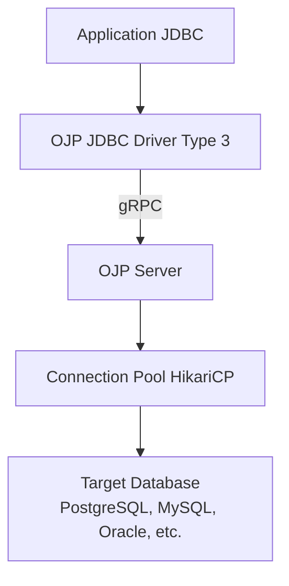
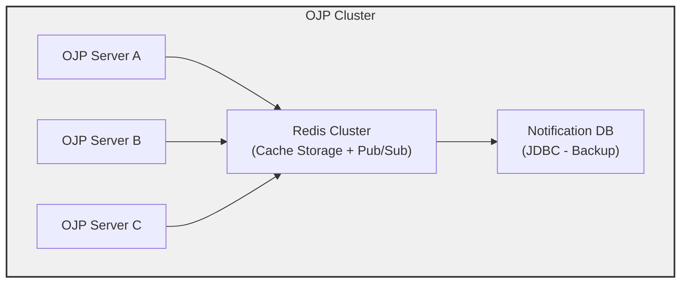

# OJP Query Result Caching Implementation Analysis

**Date:** February 11, 2026  
**Status:** Analysis and Recommendations  
**Scope:** SELECT statement result caching with distributed cache support

---

## Executive Summary

This document provides a comprehensive analysis of how query result caching could be implemented in Open J Proxy (OJP) specifically for SELECT statements. It explores various approaches for marking queries as cacheable, cache invalidation strategies, and examines the feasibility of using JDBC drivers to replicate cache data across multiple OJP server instances.

**Key Findings:**
- ✅ OJP's existing architecture has excellent extension points for adding caching
- ✅ Multiple viable approaches exist for marking queries as cacheable
- ✅ JDBC drivers can be used for cache replication, with tradeoffs
- ⚠️ Distributed caching requires careful consideration of consistency guarantees

---

## 1. Background: OJP Architecture

### 1.1 Current Query Flow



### 1.2 Existing Caching Mechanisms

OJP already implements caching in specific areas:

#### SqlEnhancerEngine Cache
- **Location:** `ojp-server/src/main/java/org/openjproxy/grpc/server/sql/SqlEnhancerEngine.java`
- **Purpose:** Caches SQL enhancement results (parsing, validation, optimization)
- **Implementation:** `ConcurrentHashMap<String, SqlEnhancementResult>`
- **Key:** Original SQL string
- **Thread-Safety:** Fully concurrent, lock-free reads

```java
private final ConcurrentHashMap<String, SqlEnhancementResult> cache;
```

#### SchemaCache
- **Location:** `ojp-server/src/main/java/org/openjproxy/grpc/server/sql/SchemaCache.java`
- **Purpose:** Caches database schema metadata for SQL enhancement
- **Implementation:** Volatile reference with atomic refresh locking
- **Thread-Safety:** Thread-safe via volatile semantics and AtomicBoolean

```java
private volatile SchemaMetadata currentSchema;
private final AtomicBoolean refreshInProgress = new AtomicBoolean(false);
```

### 1.3 Key Extension Points

OJP's architecture provides several excellent extension points for caching:

1. **Action Pattern** - Modular request handlers in StatementServiceImpl
2. **SQL Enhancement Pipeline** - Already intercepts and analyzes all SQL
3. **gRPC Protocol** - Metadata can be passed via request/response headers
4. **Multinode Architecture** - Existing infrastructure for server-to-server communication

---

## 2. Caching Strategy Options

### 2.1 Option 1: SQL String-Based Caching

**Approach:** Cache query results using the SQL string + parameter values as the cache key.

#### Implementation Overview

```java
// Cache structure
public class QueryResultCache {
    private final ConcurrentHashMap<QueryCacheKey, CachedResult> cache;
    
    static class QueryCacheKey {
        private final String sql;
        private final List<Object> parameters;
        private final int hashCode;
        
        @Override
        public boolean equals(Object o) {
            // Compare SQL and parameters
        }
        
        @Override
        public int hashCode() {
            return hashCode; // Pre-computed
        }
    }
    
    static class CachedResult {
        private final List<List<Object>> rows;      // Result data
        private final ResultSetMetaData metadata;    // Column info
        private final long timestamp;                // Cache time
        private final long ttl;                      // Time-to-live
        
        boolean isExpired() {
            return System.currentTimeMillis() - timestamp > ttl;
        }
    }
}
```

#### Integration Point: ExecuteQueryAction

```java
// ojp-server/src/main/java/org/openjproxy/grpc/server/action/statement/ExecuteQueryAction.java
public class ExecuteQueryAction implements Action {
    
    private final QueryResultCache resultCache;
    
    @Override
    public OpResult execute(StatementRequest request, SessionManager sessionManager) {
        String sql = request.getSql();
        List<Object> params = extractParameters(request);
        
        // Check if query is marked as cacheable
        if (isCacheable(request)) {
            QueryCacheKey key = new QueryCacheKey(sql, params);
            
            // Try to get from cache
            CachedResult cached = resultCache.get(key);
            if (cached != null && !cached.isExpired()) {
                log.debug("Cache HIT for query: {}", sql);
                return buildOpResultFromCache(cached);
            }
            
            // Cache MISS - execute query
            OpResult result = executeQueryOnDatabase(request, sessionManager);
            
            // Store in cache if successful
            if (result.getSuccess()) {
                resultCache.put(key, extractResultForCache(result));
            }
            
            return result;
        }
        
        // Non-cacheable query - execute normally
        return executeQueryOnDatabase(request, sessionManager);
    }
}
```

#### Advantages
- ✅ Simple and straightforward implementation
- ✅ Works with parameterized queries
- ✅ No application code changes needed
- ✅ Automatic cache key generation

#### Disadvantages
- ⚠️ Cannot handle semantically equivalent queries with different SQL text
  - Example: `SELECT * FROM users WHERE id=1` vs `SELECT * FROM users WHERE 1=id`
- ⚠️ Parameter order matters (could be normalized)
- ⚠️ No semantic understanding of query dependencies

#### Best For
- Read-heavy workloads with repeated identical queries
- Parameterized prepared statements
- Simple caching with minimal configuration

---

### 2.2 Option 2: Semantic Query Analysis with Apache Calcite

**Approach:** Use OJP's existing SqlEnhancerEngine to analyze queries semantically and create normalized cache keys.

#### Implementation Overview

```java
public class SemanticQueryCache {
    private final ConcurrentHashMap<NormalizedQuery, CachedResult> cache;
    private final SqlEnhancerEngine enhancer;
    
    static class NormalizedQuery {
        private final RelNode relationalAlgebra;  // Calcite's RelNode
        private final List<Object> parameters;
        
        @Override
        public boolean equals(Object o) {
            // Compare RelNode structure (normalized)
            return RelOptUtil.eq(this.relationalAlgebra, 
                                 ((NormalizedQuery)o).relationalAlgebra)
                && Objects.equals(this.parameters, 
                                 ((NormalizedQuery)o).parameters);
        }
    }
    
    public CachedResult lookup(String sql, List<Object> params) {
        // Parse SQL to RelNode using SqlEnhancerEngine
        RelNode normalized = enhancer.parseAndNormalize(sql);
        
        if (normalized == null) {
            return null; // Parsing failed
        }
        
        NormalizedQuery key = new NormalizedQuery(normalized, params);
        return cache.get(key);
    }
}
```

#### Integration with Existing SqlEnhancerEngine

The SqlEnhancerEngine already converts SQL to RelNode:

```java
// Existing code in SqlEnhancerEngine.java
private RelNode convertToRelNode(SqlNode validatedNode, SchemaMetadata schema) {
    // ... existing implementation ...
    // Returns normalized relational algebra representation
}
```

#### Advantages
- ✅ Handles semantically equivalent queries
  - `SELECT * FROM users WHERE id=1` ≡ `SELECT * FROM users WHERE 1=id`
- ✅ Leverages existing SqlEnhancerEngine infrastructure
- ✅ Can detect query dependencies (table access patterns)
- ✅ Enables intelligent cache invalidation

#### Disadvantages
- ⚠️ Requires SqlEnhancerEngine to be enabled
- ⚠️ Higher CPU overhead for cache key generation
- ⚠️ May encounter type system issues (as documented in INVESTIGATION_SQL_ENHANCER.md)
- ⚠️ Complex implementation

#### Best For
- Environments already using SQL enhancement
- Applications with varying query patterns
- Scenarios requiring sophisticated cache invalidation

---

### 2.3 Option 3: Hybrid Approach

**Approach:** Combine simple string-based caching with optional semantic analysis.

```java
public class HybridQueryCache {
    private final QueryResultCache stringCache;      // Fast path
    private final SemanticQueryCache semanticCache;  // Slow path
    private final boolean semanticEnabled;
    
    public CachedResult lookup(String sql, List<Object> params) {
        // Try fast string-based cache first
        CachedResult result = stringCache.get(sql, params);
        if (result != null) {
            return result;
        }
        
        // Fall back to semantic cache if enabled
        if (semanticEnabled) {
            return semanticCache.lookup(sql, params);
        }
        
        return null;
    }
}
```

---

## 3. Marking Queries as Cacheable

### 3.1 SQL Comment Hints

**Approach:** Use SQL comments to mark queries as cacheable.

#### Syntax Options

**Option A: Standard SQL Comments**
```sql
-- @cache ttl=300s
SELECT * FROM products WHERE category = 'electronics';

/* @cache ttl=5m invalidate_on=products */
SELECT id, name, price FROM products WHERE active = true;
```

**Option B: Hint-Style Comments**
```sql
SELECT /*+ CACHE(ttl=300) */ * FROM products;

SELECT /*+ CACHE(ttl=5m, key=product_list) */ 
  id, name, price 
FROM products;
```

#### Implementation

```java
public class CacheHintParser {
    private static final Pattern CACHE_HINT_PATTERN = 
        Pattern.compile("/\\*\\+\\s*CACHE\\(([^)]+)\\)\\s*\\*/");
    
    private static final Pattern COMMENT_HINT_PATTERN = 
        Pattern.compile("--\\s*@cache\\s+(.+)");
    
    public static CacheDirective parseCacheHint(String sql) {
        // Try hint-style comment
        Matcher m1 = CACHE_HINT_PATTERN.matcher(sql);
        if (m1.find()) {
            return parseCacheParams(m1.group(1));
        }
        
        // Try standard comment
        Matcher m2 = COMMENT_HINT_PATTERN.matcher(sql);
        if (m2.find()) {
            return parseCacheParams(m2.group(1));
        }
        
        return null; // Not cacheable
    }
    
    private static CacheDirective parseCacheParams(String params) {
        // Parse: ttl=300s, key=mykey, invalidate_on=table1,table2
        // Returns CacheDirective object
    }
}

public class CacheDirective {
    private final Duration ttl;
    private final String key;  // Optional explicit cache key
    private final Set<String> invalidateOnTables;
}
```

#### Integration in ExecuteQueryAction

```java
@Override
public OpResult execute(StatementRequest request, SessionManager sessionManager) {
    String sql = request.getSql();
    
    // Parse cache directive from SQL
    CacheDirective directive = CacheHintParser.parseCacheHint(sql);
    
    if (directive != null) {
        // Query is cacheable with specified settings
        return executeCachedQuery(request, directive, sessionManager);
    }
    
    // Not cacheable - execute normally
    return executeQueryOnDatabase(request, sessionManager);
}
```

#### Advantages
- ✅ Simple and explicit control
- ✅ No application code changes (just SQL modification)
- ✅ Works with any programming language/framework
- ✅ Human-readable and self-documenting
- ✅ Supports per-query TTL and invalidation rules

#### Disadvantages
- ⚠️ Requires SQL modification
- ⚠️ Can clutter SQL with comments
- ⚠️ Hint parsing adds slight overhead

#### Best For
- Applications with full control over SQL
- Scenarios requiring fine-grained cache control
- Teams comfortable with SQL hints (similar to Oracle hints)

---

### 3.2 JDBC Connection Properties

**Approach:** Configure caching behavior via JDBC connection URL or properties.

#### URL-Based Configuration

```java
// Enable caching for all SELECT statements
jdbc:ojp[localhost:1059]_postgresql://db:5432/mydb?cacheEnabled=true&cacheTtl=300

// Regex pattern for cacheable queries
jdbc:ojp[localhost:1059]_postgresql://db:5432/mydb
  ?cacheEnabled=true
  &cachePattern=SELECT.*FROM products.*
  &cacheTtl=300
```

#### Properties-Based Configuration

```java
Properties props = new Properties();
props.setProperty("user", "dbuser");
props.setProperty("password", "dbpass");

// Cache configuration
props.setProperty("ojp.cache.enabled", "true");
props.setProperty("ojp.cache.ttl.default", "300");
props.setProperty("ojp.cache.patterns", "SELECT.*FROM products.*,SELECT.*FROM users WHERE id=.*");
props.setProperty("ojp.cache.maxSize", "10000");

Connection conn = DriverManager.getConnection(url, props);
```

#### Implementation: Session-Level Cache Configuration

```java
// In ConnectionAction.java
public class ConnectionAction implements Action {
    
    @Override
    public OpResult execute(StatementRequest request, SessionManager sessionManager) {
        Properties props = extractProperties(request);
        
        // Parse cache configuration
        CacheConfiguration config = CacheConfiguration.fromProperties(props);
        
        // Store in session
        Session session = sessionManager.createSession(request.getConnectionDetails());
        session.setCacheConfiguration(config);
        
        // Return session info with cache configuration
        return buildConnectionResult(session);
    }
}

public class Session {
    private final CacheConfiguration cacheConfig;
    
    public boolean isCacheable(String sql) {
        if (!cacheConfig.isEnabled()) {
            return false;
        }
        
        // Check against patterns
        for (Pattern pattern : cacheConfig.getPatterns()) {
            if (pattern.matcher(sql).matches()) {
                return true;
            }
        }
        
        return false;
    }
}
```

#### Advantages
- ✅ No SQL modification required
- ✅ Connection-level configuration
- ✅ Can be configured per application/environment
- ✅ Supports regex patterns for flexible matching

#### Disadvantages
- ⚠️ Less granular than per-query control
- ⚠️ Pattern matching can be expensive
- ⚠️ Harder to understand which queries are cached

#### Best For
- Applications without control over SQL
- Global caching policies
- Environment-specific cache configuration

---

### 3.3 Server-Side Configuration

**Approach:** Configure caching rules on the OJP server side.

#### Configuration File: ojp-cache-rules.yml

```yaml
cache:
  enabled: true
  defaultTtl: 300s
  maxSize: 10000
  
  rules:
    - name: product_catalog
      pattern: "SELECT .* FROM products WHERE .*"
      ttl: 600s
      invalidateOn:
        - products
        - product_categories
      
    - name: user_profile
      pattern: "SELECT .* FROM users WHERE id = ?"
      ttl: 300s
      invalidateOn:
        - users
      
    - name: static_reference_data
      pattern: "SELECT .* FROM (countries|currencies|timezones)"
      ttl: 3600s
      invalidateOn:
        - countries
        - currencies
        - timezones
```

#### Implementation: ServerConfiguration

```java
// In ServerConfiguration.java
public class ServerConfiguration {
    
    private final CacheRuleEngine cacheRuleEngine;
    
    public void loadConfiguration() {
        // ... existing configuration loading ...
        
        // Load cache rules
        String cacheRulesFile = System.getProperty("ojp.cache.rules.file", 
                                                   "ojp-cache-rules.yml");
        if (new File(cacheRulesFile).exists()) {
            cacheRuleEngine = CacheRuleEngine.fromYaml(cacheRulesFile);
            log.info("Loaded cache rules from {}", cacheRulesFile);
        }
    }
}

public class CacheRuleEngine {
    private final List<CacheRule> rules;
    
    public CacheRule matchRule(String sql) {
        for (CacheRule rule : rules) {
            if (rule.matches(sql)) {
                return rule;
            }
        }
        return null;
    }
}
```

#### Advantages
- ✅ Centralized cache policy management
- ✅ No application or SQL changes needed
- ✅ Can be updated without redeploying applications
- ✅ Supports complex matching rules
- ✅ Declarative and version-controlled

#### Disadvantages
- ⚠️ Requires server restart or hot-reload mechanism
- ⚠️ Less visible to developers
- ⚠️ Can be out of sync with application expectations

#### Best For
- Production environments with DBAs/DevOps teams
- Multi-tenant scenarios with different cache policies
- Organizations with strict change control processes

---

### 3.4 Recommendation: Hybrid Multi-Level Approach

**Best Practice:** Support all three methods with a clear precedence order:

```
1. SQL Comment Hints (highest priority)
   ↓
2. JDBC Connection Properties
   ↓
3. Server-Side Configuration (lowest priority)
```

This provides maximum flexibility:
- Developers can override with SQL hints for specific queries
- Applications can set connection-level defaults
- Ops teams can configure server-side defaults and policies

---

## 4. Cache Invalidation Strategies

### 4.1 Time-Based Invalidation (TTL)

**Approach:** Simplest strategy - cache entries expire after a fixed duration.

```java
public class CachedResult {
    private final long timestamp;
    private final Duration ttl;
    
    public boolean isExpired() {
        return Duration.between(
            Instant.ofEpochMilli(timestamp),
            Instant.now()
        ).compareTo(ttl) > 0;
    }
}
```

**Advantages:**
- ✅ Simple and predictable
- ✅ No coordination needed in distributed setups
- ✅ Works for all query types

**Disadvantages:**
- ⚠️ May serve stale data
- ⚠️ Requires tuning TTL values
- ⚠️ Trade-off between freshness and cache hit rate

---

### 4.2 Write-Through Invalidation

**Approach:** Invalidate cache entries when related data is modified.

#### Implementation: Intercept DML Statements

```java
// In ExecuteUpdateAction.java
public class ExecuteUpdateAction implements Action {
    
    private final QueryResultCache cache;
    private final TableDependencyAnalyzer analyzer;
    
    @Override
    public OpResult execute(StatementRequest request, SessionManager sessionManager) {
        String sql = request.getSql();
        
        // Execute the UPDATE/INSERT/DELETE
        OpResult result = executeUpdateOnDatabase(request, sessionManager);
        
        if (result.getSuccess()) {
            // Analyze which tables were modified
            Set<String> affectedTables = analyzer.extractTables(sql);
            
            // Invalidate cache entries that depend on these tables
            cache.invalidateByTables(affectedTables);
            
            log.info("Invalidated cache entries for tables: {}", affectedTables);
        }
        
        return result;
    }
}
```

#### Table Dependency Tracking

```java
public class QueryResultCache {
    
    // Map from table name to cache keys that query that table
    private final ConcurrentHashMap<String, Set<QueryCacheKey>> tableDependencies;
    
    public void put(QueryCacheKey key, CachedResult result, Set<String> tables) {
        cache.put(key, result);
        
        // Track table dependencies
        for (String table : tables) {
            tableDependencies
                .computeIfAbsent(table, k -> ConcurrentHashMap.newKeySet())
                .add(key);
        }
    }
    
    public void invalidateByTables(Set<String> tables) {
        for (String table : tables) {
            Set<QueryCacheKey> keys = tableDependencies.get(table);
            if (keys != null) {
                for (QueryCacheKey key : keys) {
                    cache.remove(key);
                }
                tableDependencies.remove(table);
            }
        }
    }
}
```

#### Using SqlEnhancerEngine for Table Extraction

OJP's SqlEnhancerEngine with Calcite can extract table references:

```java
public class TableDependencyAnalyzer {
    
    private final SqlEnhancerEngine enhancer;
    
    public Set<String> extractTables(String sql) {
        try {
            // Parse SQL
            SqlNode parsed = enhancer.parse(sql);
            
            // Extract table references using Calcite visitor
            TableNameVisitor visitor = new TableNameVisitor();
            parsed.accept(visitor);
            
            return visitor.getTables();
            
        } catch (Exception e) {
            // Fallback: regex-based extraction
            return extractTablesUsingRegex(sql);
        }
    }
    
    // Fallback regex-based extraction
    private Set<String> extractTablesUsingRegex(String sql) {
        Set<String> tables = new HashSet<>();
        
        // Match: FROM/JOIN table_name or UPDATE table_name
        Pattern pattern = Pattern.compile(
            "(?:FROM|JOIN|UPDATE|INSERT INTO)\\s+([\\w.]+)",
            Pattern.CASE_INSENSITIVE
        );
        
        Matcher matcher = pattern.matcher(sql);
        while (matcher.find()) {
            tables.add(matcher.group(1).toLowerCase());
        }
        
        return tables;
    }
}
```

**Advantages:**
- ✅ Ensures cache consistency
- ✅ Automatic invalidation on writes
- ✅ Works well for read-heavy workloads

**Disadvantages:**
- ⚠️ Requires accurate table dependency tracking
- ⚠️ Can invalidate more than necessary (over-invalidation)
- ⚠️ Doesn't handle external database modifications

---

### 4.3 Hybrid TTL + Write-Through

**Recommended Approach:** Combine both strategies for optimal results.

```java
public class CachedResult {
    private final long timestamp;
    private final Duration ttl;
    private final Set<String> tableDependencies;
    
    public boolean isExpired() {
        // Check TTL first (fast)
        if (Duration.between(
                Instant.ofEpochMilli(timestamp),
                Instant.now()
            ).compareTo(ttl) > 0) {
            return true;
        }
        
        // Still valid by TTL
        return false;
    }
}

// Cache invalidation on writes
cache.invalidateByTables(affectedTables);  // Immediate

// Plus background TTL expiration
scheduler.scheduleAtFixedRate(() -> {
    cache.evictExpired();
}, 60, 60, TimeUnit.SECONDS);
```

**This provides:**
- Immediate invalidation on writes through OJP
- Safety net for external modifications via TTL
- Best of both worlds

---

## 5. Distributed Cache Replication Using JDBC Drivers

### 5.1 Challenge: Cache Consistency Across OJP Servers

In a multinode OJP deployment, each server maintains its own cache. This creates consistency challenges:

```
Client 1 → OJP Server A (has cached results for query Q)
Client 2 → OJP Server B (no cache for query Q)
Client 3 → OJP Server C (no cache for query Q)

Client 4 writes to database through Server A
  → Server A invalidates cache
  → Servers B & C still have stale cache ❌
```

**Problem:** Cache invalidation doesn't propagate across servers.

---

### 5.2 Approach 1: JDBC-Based Notification Table

**Concept:** Use a database table to coordinate cache invalidation across OJP servers.

#### Schema

```sql
CREATE TABLE ojp_cache_notifications (
    notification_id BIGSERIAL PRIMARY KEY,
    server_id VARCHAR(255) NOT NULL,       -- Which server sent notification
    operation VARCHAR(50) NOT NULL,         -- 'INVALIDATE', 'CLEAR_ALL'
    affected_tables TEXT[],                 -- Tables modified
    cache_keys TEXT[],                      -- Optional: specific keys
    timestamp TIMESTAMP DEFAULT NOW(),
    processed_by TEXT[]                     -- List of servers that processed this
);

CREATE INDEX idx_cache_notif_timestamp ON ojp_cache_notifications(timestamp);
CREATE INDEX idx_cache_notif_processed ON ojp_cache_notifications(processed_by);
```

#### Implementation

```java
public class JdbcCacheNotificationService {
    
    private final DataSource notificationDataSource;
    private final String serverId;
    private final QueryResultCache localCache;
    private final ScheduledExecutorService scheduler;
    
    public JdbcCacheNotificationService(
            DataSource dataSource,
            String serverId,
            QueryResultCache cache) {
        this.notificationDataSource = dataSource;
        this.serverId = serverId;
        this.localCache = cache;
        this.scheduler = Executors.newScheduledThreadPool(1);
    }
    
    public void start() {
        // Poll for notifications every 1 second
        scheduler.scheduleAtFixedRate(() -> {
            processNotifications();
        }, 0, 1, TimeUnit.SECONDS);
        
        log.info("Started JDBC cache notification service for server: {}", serverId);
    }
    
    /**
     * Send notification when cache should be invalidated
     */
    public void notifyInvalidation(Set<String> affectedTables) {
        try (Connection conn = notificationDataSource.getConnection();
             PreparedStatement stmt = conn.prepareStatement(
                 "INSERT INTO ojp_cache_notifications " +
                 "(server_id, operation, affected_tables, timestamp) " +
                 "VALUES (?, ?, ?, NOW())")) {
            
            stmt.setString(1, serverId);
            stmt.setString(2, "INVALIDATE");
            
            // Convert Set to JDBC array
            Array tablesArray = conn.createArrayOf("VARCHAR", 
                                                    affectedTables.toArray());
            stmt.setArray(3, tablesArray);
            
            stmt.executeUpdate();
            
            log.debug("Sent cache invalidation notification for tables: {}", 
                     affectedTables);
            
        } catch (SQLException e) {
            log.error("Failed to send cache invalidation notification", e);
        }
    }
    
    /**
     * Process notifications from other servers
     */
    private void processNotifications() {
        try (Connection conn = notificationDataSource.getConnection();
             PreparedStatement stmt = conn.prepareStatement(
                 "SELECT notification_id, server_id, operation, affected_tables " +
                 "FROM ojp_cache_notifications " +
                 "WHERE timestamp > NOW() - INTERVAL '5 minutes' " +
                 "  AND (processed_by IS NULL OR NOT (? = ANY(processed_by))) " +
                 "ORDER BY notification_id")) {
            
            stmt.setString(1, serverId);
            
            try (ResultSet rs = stmt.executeQuery()) {
                while (rs.next()) {
                    long notificationId = rs.getLong("notification_id");
                    String sourceServer = rs.getString("server_id");
                    String operation = rs.getString("operation");
                    Array tablesArray = rs.getArray("affected_tables");
                    
                    // Skip our own notifications
                    if (serverId.equals(sourceServer)) {
                        markAsProcessed(notificationId);
                        continue;
                    }
                    
                    // Process notification
                    if ("INVALIDATE".equals(operation)) {
                        String[] tables = (String[]) tablesArray.getArray();
                        Set<String> tableSet = new HashSet<>(Arrays.asList(tables));
                        
                        localCache.invalidateByTables(tableSet);
                        
                        log.info("Processed invalidation from server {} for tables: {}", 
                                sourceServer, tableSet);
                    }
                    
                    // Mark as processed
                    markAsProcessed(notificationId);
                }
            }
            
        } catch (SQLException e) {
            log.error("Failed to process cache notifications", e);
        }
    }
    
    private void markAsProcessed(long notificationId) {
        try (Connection conn = notificationDataSource.getConnection();
             PreparedStatement stmt = conn.prepareStatement(
                 "UPDATE ojp_cache_notifications " +
                 "SET processed_by = array_append(processed_by, ?) " +
                 "WHERE notification_id = ?")) {
            
            stmt.setString(1, serverId);
            stmt.setLong(2, notificationId);
            stmt.executeUpdate();
            
        } catch (SQLException e) {
            log.error("Failed to mark notification as processed", e);
        }
    }
    
    /**
     * Cleanup old notifications (called periodically)
     */
    public void cleanupOldNotifications() {
        try (Connection conn = notificationDataSource.getConnection();
             Statement stmt = conn.createStatement()) {
            
            int deleted = stmt.executeUpdate(
                "DELETE FROM ojp_cache_notifications " +
                "WHERE timestamp < NOW() - INTERVAL '1 hour'"
            );
            
            log.debug("Cleaned up {} old cache notifications", deleted);
            
        } catch (SQLException e) {
            log.error("Failed to cleanup old notifications", e);
        }
    }
}
```

#### Integration with ExecuteUpdateAction

```java
public class ExecuteUpdateAction implements Action {
    
    private final JdbcCacheNotificationService notificationService;
    
    @Override
    public OpResult execute(StatementRequest request, SessionManager sessionManager) {
        String sql = request.getSql();
        
        // Execute the update
        OpResult result = executeUpdateOnDatabase(request, sessionManager);
        
        if (result.getSuccess()) {
            // Extract affected tables
            Set<String> affectedTables = extractTables(sql);
            
            // Invalidate local cache
            cache.invalidateByTables(affectedTables);
            
            // Notify other OJP servers
            notificationService.notifyInvalidation(affectedTables);
        }
        
        return result;
    }
}
```

#### Configuration

```yaml
# ojp-server.yml
cache:
  replication:
    enabled: true
    mode: jdbc
    jdbc:
      url: jdbc:postgresql://cache-db:5432/ojp_cache
      username: ojp_cache_user
      password: ${OJP_CACHE_PASSWORD}
      pollIntervalSeconds: 1
      cleanupIntervalMinutes: 60
```

#### Advantages
- ✅ No additional infrastructure required (uses existing JDBC)
- ✅ Reliable and persistent
- ✅ Simple implementation
- ✅ Works across network partitions (eventually consistent)
- ✅ Audit trail of cache operations

#### Disadvantages
- ⚠️ Polling introduces latency (1-2 seconds typical)
- ⚠️ Additional database load (though minimal)
- ⚠️ Requires dedicated database or schema
- ⚠️ Not real-time (eventual consistency)

#### Best For
- Environments that prefer database-based coordination
- Scenarios where 1-2 second invalidation latency is acceptable
- Teams familiar with JDBC and SQL
- Deployments that want to avoid additional services

---

### 5.3 Approach 2: JDBC with LISTEN/NOTIFY (PostgreSQL)

**Concept:** Use PostgreSQL's LISTEN/NOTIFY for real-time cache invalidation.

#### Implementation

```java
public class PostgresListenNotifyCache {
    
    private final DataSource dataSource;
    private final String serverId;
    private final QueryResultCache localCache;
    private volatile Connection listenerConnection;
    private final ExecutorService listenerExecutor;
    
    public void start() throws SQLException {
        // Create dedicated connection for LISTEN
        listenerConnection = dataSource.getConnection();
        
        // Create notification function and trigger (one-time setup)
        setupNotificationTrigger();
        
        // Start listening
        try (Statement stmt = listenerConnection.createStatement()) {
            stmt.execute("LISTEN ojp_cache_invalidation");
        }
        
        // Start listener thread
        listenerExecutor.submit(this::listenForNotifications);
        
        log.info("Started PostgreSQL LISTEN/NOTIFY cache synchronization");
    }
    
    private void setupNotificationTrigger() throws SQLException {
        try (Connection conn = dataSource.getConnection();
             Statement stmt = conn.createStatement()) {
            
            // Create notification function
            stmt.execute(
                "CREATE OR REPLACE FUNCTION notify_cache_invalidation() " +
                "RETURNS TRIGGER AS $$ " +
                "BEGIN " +
                "  PERFORM pg_notify('ojp_cache_invalidation', " +
                "    json_build_object(" +
                "      'table', TG_TABLE_NAME, " +
                "      'operation', TG_OP" +
                "    )::text" +
                "  ); " +
                "  RETURN NEW; " +
                "END; " +
                "$$ LANGUAGE plpgsql;"
            );
            
            // Create triggers on monitored tables
            for (String table : getMonitoredTables()) {
                stmt.execute(
                    "DROP TRIGGER IF EXISTS cache_invalidation_trigger ON " + table + ";" +
                    "CREATE TRIGGER cache_invalidation_trigger " +
                    "AFTER INSERT OR UPDATE OR DELETE ON " + table + " " +
                    "FOR EACH STATEMENT " +
                    "EXECUTE FUNCTION notify_cache_invalidation();"
                );
            }
            
            log.info("Setup cache invalidation triggers for tables: {}", 
                    getMonitoredTables());
        }
    }
    
    private void listenForNotifications() {
        PGConnection pgConn = listenerConnection.unwrap(PGConnection.class);
        
        while (!Thread.currentThread().isInterrupted()) {
            try {
                // Get notifications (blocks until available)
                PGNotification[] notifications = pgConn.getNotifications(1000);
                
                if (notifications != null) {
                    for (PGNotification notification : notifications) {
                        processNotification(notification);
                    }
                }
                
            } catch (SQLException e) {
                log.error("Error receiving notifications", e);
                try {
                    Thread.sleep(5000);  // Back off before retry
                } catch (InterruptedException ie) {
                    break;
                }
            }
        }
    }
    
    private void processNotification(PGNotification notification) {
        String channel = notification.getName();
        String payload = notification.getParameter();
        
        if ("ojp_cache_invalidation".equals(channel)) {
            try {
                // Parse JSON payload
                JsonObject json = JsonParser.parseString(payload).getAsJsonObject();
                String table = json.get("table").getAsString();
                String operation = json.get("operation").getAsString();
                
                // Invalidate cache
                localCache.invalidateByTables(Collections.singleton(table));
                
                log.debug("Invalidated cache for table {} due to {}", table, operation);
                
            } catch (Exception e) {
                log.error("Failed to process notification: {}", payload, e);
            }
        }
    }
}
```

#### Advantages
- ✅ Real-time invalidation (sub-second latency)
- ✅ No polling overhead
- ✅ Minimal database impact
- ✅ Simple and elegant for PostgreSQL

#### Disadvantages
- ⚠️ PostgreSQL-specific (not portable)
- ⚠️ Requires database-level trigger setup
- ⚠️ Doesn't work for external database modifications through other apps
- ⚠️ Requires maintaining a persistent connection

#### Best For
- PostgreSQL-only deployments
- Real-time cache consistency requirements
- Low-latency applications

---

### 5.4 Approach 3: Hybrid JDBC + External Cache

**Concept:** Use JDBC for coordination + external distributed cache (Redis, Hazelcast).



#### Implementation

```java
public class HybridCacheService {
    
    private final RedisClient redisClient;
    private final JdbcCacheNotificationService jdbcNotification;
    private final String serverId;
    
    public void start() {
        // Start Redis pub/sub
        redisClient.subscribe("ojp:cache:invalidate", this::handleRedisNotification);
        
        // Start JDBC polling as backup
        jdbcNotification.start();
        
        log.info("Started hybrid cache service (Redis + JDBC)");
    }
    
    public void invalidateCache(Set<String> tables) {
        try {
            // Try Redis first (fast path)
            redisClient.publish("ojp:cache:invalidate", 
                              serializeInvalidation(tables));
            
        } catch (Exception e) {
            log.warn("Redis publish failed, falling back to JDBC", e);
            
            // Fallback to JDBC (reliable path)
            jdbcNotification.notifyInvalidation(tables);
        }
    }
    
    private void handleRedisNotification(String message) {
        Set<String> tables = deserializeInvalidation(message);
        localCache.invalidateByTables(tables);
        
        log.debug("Processed Redis invalidation for tables: {}", tables);
    }
}
```

#### Advantages
- ✅ Fast invalidation via Redis pub/sub
- ✅ Reliable fallback via JDBC
- ✅ Scalable with dedicated cache infrastructure
- ✅ Best of both worlds

#### Disadvantages
- ⚠️ Requires additional infrastructure (Redis)
- ⚠️ More complex setup and operation
- ⚠️ Additional dependencies

#### Best For
- Large-scale production deployments
- High-throughput applications
- Organizations already using Redis/Hazelcast

---

### 5.5 Recommendation Matrix

| Scenario | Recommended Approach | Reason |
|----------|---------------------|--------|
| Small deployment (1-3 servers) | JDBC Polling | Simple, no extra infrastructure |
| PostgreSQL-only | LISTEN/NOTIFY | Real-time, native support |
| Large scale (10+ servers) | Redis + JDBC backup | Performance and reliability |
| Multi-database support | JDBC Polling | Works with any database |
| Real-time requirements | LISTEN/NOTIFY or Redis | Sub-second invalidation |
| High availability critical | Hybrid (Redis + JDBC) | Redundant notification paths |

---

## 6. Implementation Roadmap

### Phase 1: Local Caching (Single Server)
**Goal:** Implement basic query result caching on a single OJP server.

**Tasks:**
1. ✅ Design QueryResultCache with TTL support
2. ✅ Implement CacheHintParser for SQL comment hints
3. ✅ Modify ExecuteQueryAction to check cache
4. ✅ Add cache metrics and monitoring
5. ✅ Create configuration options
6. ✅ Write unit tests

**Deliverables:**
- Working cache on single OJP server
- Documentation for SQL hint syntax
- Performance benchmarks

---

### Phase 2: Write-Through Invalidation
**Goal:** Implement automatic cache invalidation on DML operations.

**Tasks:**
1. ✅ Implement TableDependencyAnalyzer
2. ✅ Track table dependencies in cache
3. ✅ Modify ExecuteUpdateAction to invalidate cache
4. ✅ Add integration tests for invalidation
5. ✅ Document invalidation behavior

**Deliverables:**
- Automatic invalidation on writes
- Documentation of invalidation semantics
- Test suite for invalidation scenarios

---

### Phase 3: Distributed Cache (JDBC-Based)
**Goal:** Enable cache coordination across multiple OJP servers.

**Tasks:**
1. ✅ Design notification table schema
2. ✅ Implement JdbcCacheNotificationService
3. ✅ Add configuration for notification DataSource
4. ✅ Implement notification polling and processing
5. ✅ Add cleanup job for old notifications
6. ✅ Create multinode integration tests
7. ✅ Document multinode setup

**Deliverables:**
- Working distributed cache coordination
- Multinode deployment guide
- Performance characteristics documentation

---

### Phase 4: Advanced Features (Optional)
**Goal:** Add sophisticated caching features.

**Tasks:**
1. Semantic query analysis with Calcite
2. PostgreSQL LISTEN/NOTIFY support
3. Redis integration option
4. Cache warming/preloading
5. Query result compression
6. Cache statistics dashboard

---

## 7. Configuration Examples

### 7.1 Enable Basic Caching

```yaml
# ojp-server.yml
cache:
  enabled: true
  defaultTtl: 300s
  maxSize: 10000
  evictionPolicy: LRU  # Least Recently Used
```

### 7.2 Enable Distributed Caching (JDBC)

```yaml
# ojp-server.yml
cache:
  enabled: true
  defaultTtl: 300s
  maxSize: 10000
  
  replication:
    enabled: true
    mode: jdbc
    serverId: ojp-server-1  # Unique per server
    
    jdbc:
      url: jdbc:postgresql://cache-db:5432/ojp_cache
      username: ojp_cache_user
      password: ${OJP_CACHE_PASSWORD}
      pollIntervalSeconds: 1
      cleanupIntervalMinutes: 60
```

### 7.3 Enable PostgreSQL LISTEN/NOTIFY

```yaml
# ojp-server.yml (PostgreSQL only)
cache:
  enabled: true
  
  replication:
    enabled: true
    mode: postgres-notify
    
    monitoredTables:
      - products
      - users
      - orders
```

---

## 8. Code Integration Points

### 8.1 Files to Modify

1. **ojp-server/src/main/java/org/openjproxy/grpc/server/action/statement/ExecuteQueryAction.java**
   - Add cache lookup before query execution
   - Store results in cache after execution

2. **ojp-server/src/main/java/org/openjproxy/grpc/server/action/statement/ExecuteUpdateAction.java**
   - Add cache invalidation after successful DML

3. **ojp-server/src/main/java/org/openjproxy/grpc/server/ServerConfiguration.java**
   - Add cache configuration loading
   - Initialize cache services

4. **ojp-server/src/main/java/org/openjproxy/grpc/server/StatementServiceImpl.java**
   - Wire up cache services to actions

### 8.2 New Files to Create

1. **ojp-server/src/main/java/org/openjproxy/grpc/server/cache/QueryResultCache.java**
   - Main cache implementation

2. **ojp-server/src/main/java/org/openjproxy/grpc/server/cache/CacheHintParser.java**
   - Parse SQL comments for cache directives

3. **ojp-server/src/main/java/org/openjproxy/grpc/server/cache/JdbcCacheNotificationService.java**
   - JDBC-based distributed cache coordination

4. **ojp-server/src/main/java/org/openjproxy/grpc/server/cache/TableDependencyAnalyzer.java**
   - Extract table dependencies from SQL

5. **ojp-server/src/main/java/org/openjproxy/grpc/server/cache/CacheConfiguration.java**
   - Cache configuration POJO

---

## 9. Performance Considerations

### 9.1 Memory Management

**Issue:** Cached query results consume heap memory.

**Solutions:**
1. **Size-based eviction** - Limit total cache size (e.g., 1GB max)
2. **Entry count limit** - Maximum number of cached queries (e.g., 10,000)
3. **LRU eviction** - Evict least recently used entries
4. **Off-heap storage** - Use direct ByteBuffers for large result sets
5. **Result set compression** - Compress cached data (GZIP, LZ4)

```java
public class QueryResultCache {
    private final long maxSizeBytes;
    private final AtomicLong currentSizeBytes = new AtomicLong(0);
    
    public void put(QueryCacheKey key, CachedResult result) {
        long resultSize = result.estimateSize();
        
        // Check if adding this result would exceed max size
        while (currentSizeBytes.get() + resultSize > maxSizeBytes) {
            evictLRU();  // Evict until there's space
        }
        
        cache.put(key, result);
        currentSizeBytes.addAndGet(resultSize);
    }
}
```

### 9.2 Cache Key Computation

**Issue:** Computing hash codes for cache keys can be expensive.

**Optimization:** Pre-compute and store hash codes.

```java
public class QueryCacheKey {
    private final String sql;
    private final List<Object> parameters;
    private final int hashCode;  // Pre-computed
    
    public QueryCacheKey(String sql, List<Object> parameters) {
        this.sql = sql;
        this.parameters = parameters;
        this.hashCode = computeHashCode();  // Compute once
    }
    
    private int computeHashCode() {
        int result = sql.hashCode();
        result = 31 * result + Objects.hashCode(parameters);
        return result;
    }
    
    @Override
    public int hashCode() {
        return hashCode;  // O(1) lookup
    }
}
```

### 9.3 Monitoring and Metrics

**Key Metrics to Track:**

```java
public class CacheMetrics {
    private final AtomicLong hits = new AtomicLong(0);
    private final AtomicLong misses = new AtomicLong(0);
    private final AtomicLong evictions = new AtomicLong(0);
    private final AtomicLong invalidations = new AtomicLong(0);
    
    public double getHitRate() {
        long h = hits.get();
        long m = misses.get();
        return (h + m == 0) ? 0.0 : (double) h / (h + m);
    }
    
    // Expose as Prometheus metrics
    public void registerPrometheusMetrics(CollectorRegistry registry) {
        Gauge.build()
            .name("ojp_cache_hit_rate")
            .help("Query cache hit rate")
            .register(registry)
            .set(this::getHitRate);
        
        Counter.build()
            .name("ojp_cache_operations_total")
            .labelNames("type")  // hit, miss, eviction, invalidation
            .help("Total cache operations by type")
            .register(registry);
    }
}
```

---

## 10. Security Considerations

### 10.1 Cache Isolation

**Issue:** Multi-tenant environments need isolated caches.

**Solution:** Namespace cache keys by connection properties.

```java
public class QueryCacheKey {
    private final String tenant;        // Add tenant identifier
    private final String databaseUrl;   // Isolate by database
    private final String username;      // Isolate by user
    private final String sql;
    private final List<Object> parameters;
    
    // Prevents cross-tenant cache pollution
}
```

### 10.2 Sensitive Data in Cache

**Issue:** Cached results may contain PII or sensitive data.

**Mitigation:**
1. **Encryption at rest** - Encrypt cached data
2. **Selective caching** - Don't cache queries with sensitive columns
3. **Cache access control** - Verify user permissions on cache hits
4. **Audit logging** - Log cache access for sensitive data

```java
public class SensitiveDataFilter {
    
    private final Set<String> sensitiveColumns = Set.of(
        "password", "ssn", "credit_card", "api_key"
    );
    
    public boolean isCacheable(String sql) {
        // Don't cache queries that select sensitive columns
        for (String col : sensitiveColumns) {
            if (sql.toLowerCase().contains(col)) {
                return false;
            }
        }
        return true;
    }
}
```

### 10.3 Cache Poisoning Prevention

**Issue:** Malicious users could flood cache with junk queries.

**Mitigation:**
1. **Rate limiting** - Limit cache insertions per connection
2. **Query complexity limits** - Don't cache excessively complex queries
3. **Size limits** - Reject results larger than threshold
4. **Permission checks** - Verify user has SELECT permission before caching

---

## 11. Testing Strategy

### 11.1 Unit Tests

```java
@Test
public void testCacheHitReturnsExactResults() {
    // Given: A cached query result
    QueryCacheKey key = new QueryCacheKey("SELECT * FROM users WHERE id = ?", 
                                          List.of(123));
    CachedResult cached = createTestResult();
    cache.put(key, cached);
    
    // When: Same query is executed
    CachedResult result = cache.get(key);
    
    // Then: Returns cached result
    assertNotNull(result);
    assertEquals(cached, result);
}

@Test
public void testCacheInvalidationRemovesEntries() {
    // Given: Cached queries for multiple tables
    cache.put(keyForUsersTable, resultA);
    cache.put(keyForOrdersTable, resultB);
    
    // When: Invalidate users table
    cache.invalidateByTables(Set.of("users"));
    
    // Then: Only users queries are removed
    assertNull(cache.get(keyForUsersTable));
    assertNotNull(cache.get(keyForOrdersTable));
}
```

### 11.2 Integration Tests

```java
@Test
public void testDistributedCacheInvalidation() throws Exception {
    // Given: Two OJP servers with distributed cache
    OjpServer server1 = startServer(1059, "server-1");
    OjpServer server2 = startServer(1060, "server-2");
    
    Connection conn1 = connectTo(server1);
    Connection conn2 = connectTo(server2);
    
    // When: Execute cacheable query on server 1
    ResultSet rs1 = conn1.createStatement()
        .executeQuery("/* @cache ttl=300s */ SELECT * FROM users WHERE id = 1");
    rs1.next();
    int value1 = rs1.getInt("value");
    
    // And: Update data through server 1
    conn1.createStatement()
        .executeUpdate("UPDATE users SET value = 999 WHERE id = 1");
    
    // Then: Server 2's cache should be invalidated
    Thread.sleep(2000);  // Wait for notification propagation
    
    ResultSet rs2 = conn2.createStatement()
        .executeQuery("/* @cache ttl=300s */ SELECT * FROM users WHERE id = 1");
    rs2.next();
    int value2 = rs2.getInt("value");
    
    assertEquals(999, value2);  // Should see updated value
}
```

### 11.3 Performance Tests

```java
@Test
public void testCachePerformanceImprovement() {
    // Measure baseline (no cache)
    long baselineTime = measureQueryTime(() -> {
        for (int i = 0; i < 1000; i++) {
            executeQuery("SELECT * FROM large_table WHERE category = 'test'");
        }
    });
    
    // Enable cache and warm up
    enableCache();
    executeQuery("/* @cache */ SELECT * FROM large_table WHERE category = 'test'");
    
    // Measure with cache
    long cachedTime = measureQueryTime(() -> {
        for (int i = 0; i < 1000; i++) {
            executeQuery("/* @cache */ SELECT * FROM large_table WHERE category = 'test'");
        }
    });
    
    // Verify improvement
    double improvement = (double) (baselineTime - cachedTime) / baselineTime;
    assertTrue(improvement > 0.80,  // Expect >80% improvement
               "Cache should improve performance significantly");
}
```

---

## 12. Comparison with Alternative Solutions

### 12.1 Application-Level Caching (e.g., Spring Cache)

**Pros:**
- More control in application code
- Easier debugging
- Type-safe

**Cons:**
- Must implement in every application
- Not transparent to existing code
- Doesn't work across different applications

**OJP Advantage:** Transparent caching at JDBC layer works for ALL applications.

---

### 12.2 Database Query Result Cache (e.g., PostgreSQL Shared Buffers)

**Pros:**
- Automatic and transparent
- Managed by database

**Cons:**
- Caches pages, not query results
- Shared across all queries (no selective caching)
- Limited by database server resources

**OJP Advantage:** Application-aware caching with fine-grained control and offloaded from database.

---

### 12.3 Redis/Memcached as External Cache

**Pros:**
- Dedicated cache infrastructure
- Scalable
- Rich feature set

**Cons:**
- Requires application code changes
- Network latency for cache lookups
- Additional infrastructure to manage

**OJP Advantage:** Transparent caching without application changes, can optionally use Redis for distribution.

---

## 13. Summary and Recommendations

### 13.1 Recommended Approach

**For Most Deployments:**

1. **Query Marking:** SQL comment hints (flexible, explicit, works everywhere)
   ```sql
   /* @cache ttl=300s */ SELECT * FROM products WHERE active = true
   ```

2. **Local Caching:** TTL-based with write-through invalidation
   - Simple and effective
   - No complex consistency protocols
   - Good for most workloads

3. **Distributed Caching:** JDBC notification table for multinode
   - Simple implementation
   - Uses existing infrastructure
   - 1-2 second eventual consistency is acceptable for most use cases

**For High-Scale Deployments:**

1. **Query Marking:** Hybrid (SQL hints + server-side rules)
2. **Local Caching:** Same as above
3. **Distributed Caching:** Redis pub/sub with JDBC fallback
   - Real-time invalidation
   - Reliable fallback
   - Best for high-throughput scenarios

### 13.2 Implementation Priority

**Phase 1 (Immediate Value):**
- ✅ SQL hint parsing
- ✅ Local query result cache with TTL
- ✅ Basic metrics and monitoring

**Phase 2 (Enhanced):**
- ✅ Write-through invalidation
- ✅ Table dependency tracking
- ✅ Configuration options

**Phase 3 (Distributed):**
- ✅ JDBC notification table
- ✅ Multinode coordination
- ✅ Comprehensive testing

**Phase 4 (Advanced - Optional):**
- Semantic query analysis with Calcite
- Redis integration
- Query result compression
- Cache warming

### 13.3 Key Takeaways

1. **OJP's architecture is well-suited for caching**
   - Existing extension points (Action pattern, SQL enhancement pipeline)
   - Already has some caching infrastructure (SqlEnhancerEngine)
   - Multinode architecture supports distributed coordination

2. **JDBC can effectively coordinate cache across servers**
   - Notification table approach is simple and reliable
   - PostgreSQL LISTEN/NOTIFY offers real-time option
   - Hybrid approach provides best of both worlds

3. **SQL comment hints are the most practical marking approach**
   - No application code changes
   - Explicit and visible
   - Works with any framework/language

4. **Start simple, add complexity as needed**
   - Begin with local caching + TTL
   - Add write-through invalidation
   - Expand to distributed coordination
   - Consider advanced features only if needed

---

## 14. References and Further Reading

### OJP Documentation
- [OJP Architecture](documents/ebook/part1-chapter2-architecture.md)
- [Multinode Configuration](documents/multinode/README.md)
- [SQL Enhancer](INVESTIGATION_SQL_ENHANCER.md)

### Apache Calcite
- [Calcite Documentation](https://calcite.apache.org/)
- [SQL Parser](https://calcite.apache.org/docs/reference.html)
- [Optimization Rules](https://calcite.apache.org/docs/adapter.html)

### Distributed Caching
- [Cache Consistency Patterns](https://martinfowler.com/bliki/TwoHardThings.html)
- [Redis Pub/Sub](https://redis.io/topics/pubsub)
- [PostgreSQL LISTEN/NOTIFY](https://www.postgresql.org/docs/current/sql-notify.html)

### JDBC Specifications
- [JDBC 4.3 Specification](https://jcp.org/en/jsr/detail?id=221)
- [Connection Pooling](https://docs.oracle.com/javase/tutorial/jdbc/basics/connection-pooling.html)

---

## Appendix A: Example SQL Hint Syntax

### Basic Cache Hint
```sql
/* @cache ttl=300s */
SELECT * FROM products WHERE category = 'electronics';
```

### Cache with Explicit Key
```sql
/* @cache ttl=600s key=product_catalog */
SELECT id, name, price FROM products WHERE active = true;
```

### Cache with Table Dependencies
```sql
/* @cache ttl=900s invalidate_on=products,categories */
SELECT p.name, c.name 
FROM products p 
JOIN categories c ON p.category_id = c.id;
```

### Cache with Size Limit
```sql
/* @cache ttl=300s maxSize=1000 */
SELECT * FROM users WHERE region = 'US';
```

### Disable Caching for Specific Query
```sql
/* @cache disabled */
SELECT * FROM sensitive_data WHERE user_id = ?;
```

---

## Appendix B: Database Schema for JDBC Notifications

```sql
-- PostgreSQL schema
CREATE SCHEMA IF NOT EXISTS ojp_cache;

CREATE TABLE ojp_cache.notifications (
    notification_id BIGSERIAL PRIMARY KEY,
    server_id VARCHAR(255) NOT NULL,
    operation VARCHAR(50) NOT NULL,
    affected_tables TEXT[],
    cache_keys TEXT[],
    timestamp TIMESTAMP DEFAULT NOW(),
    processed_by TEXT[],
    metadata JSONB
);

CREATE INDEX idx_notif_timestamp 
    ON ojp_cache.notifications(timestamp);

CREATE INDEX idx_notif_processed 
    ON ojp_cache.notifications 
    USING GIN(processed_by);

-- Automatic cleanup of old notifications
CREATE OR REPLACE FUNCTION ojp_cache.cleanup_old_notifications()
RETURNS void AS $$
BEGIN
    DELETE FROM ojp_cache.notifications
    WHERE timestamp < NOW() - INTERVAL '1 hour';
END;
$$ LANGUAGE plpgsql;

-- Schedule cleanup (requires pg_cron extension)
-- SELECT cron.schedule('cleanup-cache-notifications', 
--                      '*/30 * * * *',  -- Every 30 minutes
--                      'SELECT ojp_cache.cleanup_old_notifications()');
```

---

**End of Analysis Document**
