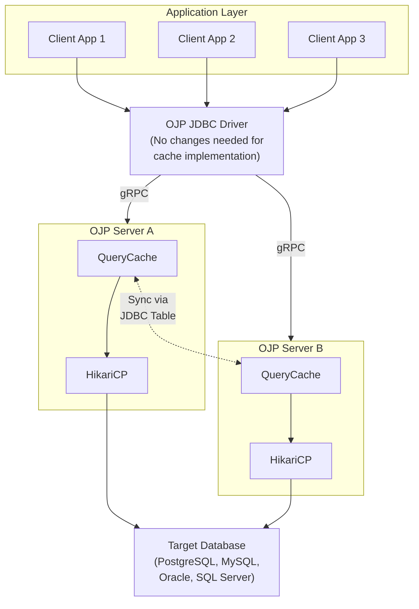

# OJP Caching Implementation - Quick Reference (REVISED)

**Full Analysis:** [CACHING_IMPLEMENTATION_ANALYSIS.md](../../CACHING_IMPLEMENTATION_ANALYSIS.md)

---

## Quick Answers to Key Questions

### Q1: How can queries for caching be marked?

**IMPORTANT**: Most real-world applications use ORMs (Hibernate, Spring Data, MyBatis), not raw JDBC. This impacts the practicality of different approaches.

**Four approaches ranked by real-world practicality:**

1. **Server-Side Configuration** ⭐ MOST PRACTICAL
   ```yaml
   # ojp-cache-rules.yml
   cache:
     rules:
       - pattern: "SELECT .* FROM products WHERE .*"
         ttl: 600s
   ```
   - ✅ Works with ANY framework (Hibernate, Spring Data, MyBatis, jOOQ)
   - ✅ No application code changes
   - ✅ Centralized management
   - ✅ Pattern matching works for ORM-generated queries

2. **Client-Side Configuration**
   ```yaml
   # ojp-cache-client.yaml
   queries:
     - sql: "SELECT * FROM users WHERE id = ?"
       ttl: 300s
   ```
   - ✅ Per-application policies
   - ✅ Works with ORMs
   - ✅ Version-controlled with application code

3. **JDBC Connection Properties**
   ```java
   jdbc:ojp[localhost:1059]_postgresql://db:5432/mydb
     ?cacheEnabled=true&cacheDefaultTtl=300
   ```
   - ✅ Environment-specific configuration
   - ✅ Works with any ORM

4. **SQL Comment Hints**
   ```sql
   /* @cache ttl=300s */
   SELECT * FROM products WHERE category = 'electronics';
   ```
   - ⚠️ IMPRACTICAL with ORMs (Hibernate, Spring Data)
   - ✅ Good for raw JDBC applications only

### Q2: Can JDBC drivers replicate cache across OJP servers?

**YES - Multiple options, REVISED RECOMMENDATION:**

#### Option 1: JDBC Driver as Active Relay ⭐ RECOMMENDED FOR MOST

**Key Insight**: Data is already in driver memory when returned to application!

```
Database → OJP Server → JDBC Driver (data here!) → Stream to other servers
```

**How it works:**
1. Query executes, result flows through driver to application
2. Driver spawns virtual thread to stream data to other OJP servers
3. Other servers cache the result locally
4. Next query on any server hits cache (no database query)

**Characteristics:**
- ✅ Data already in memory (no serialization cost)
- ✅ Real-time propagation (immediate)
- ✅ Zero database overhead (no polling)
- ✅ Saves N-1 database queries (the whole point!)
- ✅ Efficient with virtual threads (Java 21+)
- ⚠️ Use smart distribution policy (< 200KB, TTL > 60s)

**Smart Distribution Policy:**
```java
// Only distribute beneficial results
- Skip very large results (> 200KB)
- Skip very short TTL (< 60s)
- Skip single-row results
```

#### Option 2: JDBC Notification Table (Fallback)

```sql
CREATE TABLE ojp_cache_notifications (
    notification_id BIGSERIAL PRIMARY KEY,
    server_id VARCHAR(255),
    affected_tables TEXT[],
    timestamp TIMESTAMP
);
```

**Characteristics:**
- ✅ Simple, reliable
- ✅ Works with any database
- ⚠️ 1-2 second polling latency
- ⚠️ Additional database overhead (polling queries)

**When to use**: Large result sets, legacy Java environments
- ✅ Minimal overhead
- ⚠️ PostgreSQL-specific

#### Option 3: Hybrid (Redis + JDBC)

**For high-scale deployments:**
```
Redis Pub/Sub (fast path) + JDBC notifications (reliable fallback)
```

**Characteristics:**
- ✅ Best performance and reliability
- ⚠️ Requires Redis infrastructure

---

## Recommended Implementation Strategy

### Phase 1: Local Caching (Single Server)
```java
// 1. Parse SQL for cache hints
CacheDirective directive = CacheHintParser.parseCacheHint(sql);

// 2. Check cache
if (directive != null) {
    CachedResult cached = cache.get(sql, params);
    if (cached != null && !cached.isExpired()) {
        return cached;  // Cache HIT
    }
}

// 3. Execute query
OpResult result = executeQueryOnDatabase(request);

// 4. Store in cache
if (directive != null) {
    cache.put(sql, params, result, directive.getTtl());
}
```

### Phase 2: Write-Through Invalidation
```java
// On UPDATE/INSERT/DELETE:
executeUpdateOnDatabase(sql);

// Extract affected tables
Set<String> tables = extractTablesFromSQL(sql);

// Invalidate cache entries that depend on these tables
cache.invalidateByTables(tables);
```

### Phase 3: Distributed Coordination
```java
// After local invalidation:
notificationService.notifyOtherServers(tables);

// Other servers receive notification:
cache.invalidateByTables(tables);
```

---

## Architecture Diagram



---

## Cache Key Structure

```java
public class QueryCacheKey {
    private final String sql;               // Normalized SQL
    private final List<Object> parameters;  // Parameter values
    private final String tenant;            // Multi-tenant isolation
    private final String username;          // User-level isolation
    
    @Override
    public int hashCode() {
        // Pre-computed for O(1) lookup
    }
    
    @Override
    public boolean equals(Object obj) {
        // Exact match on SQL + parameters
    }
}
```

---

## Configuration Example

```yaml
# ojp-server.yml
cache:
  enabled: true
  defaultTtl: 300s
  maxSize: 10000
  evictionPolicy: LRU
  
  # Distributed cache coordination
  replication:
    enabled: true
    mode: jdbc  # or 'postgres-notify' or 'redis'
    serverId: ojp-server-1
    
    jdbc:
      url: jdbc:postgresql://cache-db:5432/ojp_cache
      username: ojp_cache
      password: ${OJP_CACHE_PASSWORD}
      pollIntervalSeconds: 1
      cleanupIntervalMinutes: 60
```

---

## Performance Benefits

**Expected Cache Hit Scenarios:**
- Dashboards with repeated queries: **80-95% hit rate**
- Read-heavy CRUD operations: **60-80% hit rate**
- Reference data lookups: **95%+ hit rate**

**Performance Improvement:**
- Cache HIT: **<1ms** response time
- Cache MISS: Normal database query time + cache storage (~5-10ms overhead)
- Write operations: ~10-20ms overhead for invalidation

**Resource Usage:**
- Memory: ~10-100MB per 10,000 cached queries (depends on result size)
- CPU: <5% overhead for cache management
- Database: Minimal (notification table is small and indexed)

---

## Security Considerations

### 1. Multi-Tenant Isolation
```java
// Cache keys include tenant ID
QueryCacheKey key = new QueryCacheKey(
    tenant: "tenant-123",
    sql: "SELECT * FROM users",
    params: []
);
```

### 2. Sensitive Data Protection
```java
// Don't cache queries with sensitive columns
Set<String> sensitiveColumns = Set.of(
    "password", "ssn", "credit_card", "api_key"
);

if (containsSensitiveColumns(sql, sensitiveColumns)) {
    return false;  // Not cacheable
}
```

### 3. Permission Checks
```java
// Verify user still has permission on cache hit
if (cached != null && !userHasPermission(session, cached.getTables())) {
    cache.invalidate(key);
    return null;  // Re-execute with permission check
}
```

---

## Testing Checklist

- [ ] Cache hit returns exact same results as database query
- [ ] Cache miss executes query and stores result
- [ ] TTL expiration removes stale entries
- [ ] Write-through invalidation clears affected entries
- [ ] Distributed invalidation propagates to all servers (within SLA)
- [ ] Memory limits trigger LRU eviction
- [ ] Concurrent access is thread-safe
- [ ] Multi-tenant isolation prevents cross-tenant cache pollution
- [ ] Sensitive data is not cached inappropriately
- [ ] Metrics accurately reflect cache hit rate and operations

---

## Migration Path

### For Existing OJP Users

**Zero Breaking Changes:**
1. Caching is **opt-in** - disabled by default
2. No JDBC driver changes required
3. No application code changes needed
4. Add SQL hints only to queries you want cached

**Migration Steps:**
1. Deploy new OJP server version with cache support
2. Monitor baseline performance
3. Enable caching for specific queries using SQL hints
4. Monitor cache hit rates and performance improvement
5. Gradually expand cache coverage
6. Enable distributed cache coordination if using multinode

---

## Frequently Asked Questions

### Q: Does caching work with parameterized queries?
**A:** Yes! Parameters are part of the cache key.
```sql
/* @cache ttl=300s */
SELECT * FROM users WHERE id = ?  -- Cached per ID value
```

### Q: What happens if data changes outside of OJP?
**A:** TTL expiration provides safety net. For real-time needs, use shorter TTLs or external cache invalidation triggers.

### Q: Can I cache JOINs?
**A:** Yes! The cache tracks all tables involved and invalidates when any are modified.
```sql
/* @cache ttl=600s invalidate_on=products,categories */
SELECT p.*, c.name 
FROM products p 
JOIN categories c ON p.category_id = c.id
```

### Q: How do I monitor cache performance?
**A:** Prometheus metrics are automatically exposed:
- `ojp_cache_hit_rate` - Cache hit rate
- `ojp_cache_operations_total{type="hit|miss|eviction"}` - Operation counts
- `ojp_cache_size_bytes` - Memory usage

### Q: What's the overhead of caching?
**A:** Minimal:
- Cache HIT: ~0.5ms overhead (in-memory lookup)
- Cache MISS: ~5-10ms overhead (store result)
- Memory: ~1-10KB per cached query result (depends on result size)

---

## Next Steps

1. **Review full analysis:** [CACHING_IMPLEMENTATION_ANALYSIS.md](../../CACHING_IMPLEMENTATION_ANALYSIS.md)
2. **Provide feedback:** Create GitHub issue with questions/suggestions
3. **Implementation:** Follow the phased roadmap in the full document

---

**Document Version:** 1.0  
**Last Updated:** February 11, 2026  
**Status:** Analysis Complete - Ready for Implementation Discussion
