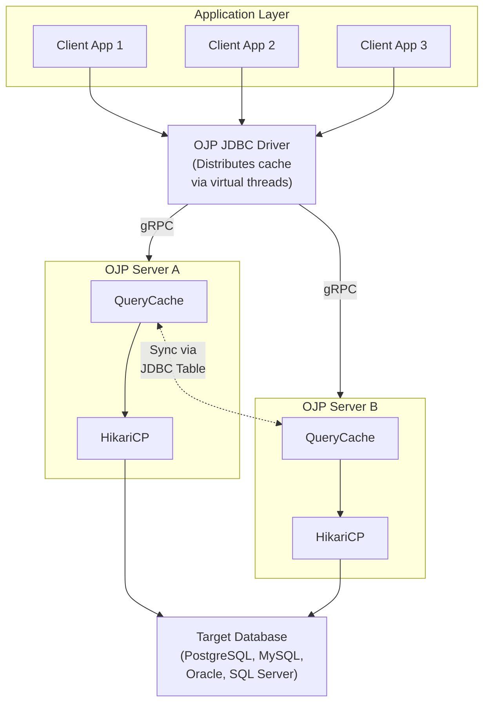

# OJP Caching Implementation - Quick Reference

**Full Analysis:** [CACHING_IMPLEMENTATION_ANALYSIS.md](../../CACHING_IMPLEMENTATION_ANALYSIS.md)

---

## ⭐ FINAL DESIGN DECISION (GO-TO APPROACH)

### Query Marking: Client-Side `ojp.properties` Configuration ✅

**Configuration in the same file as connection pools:**

```properties
# In ojp.properties
postgres_prod.ojp.cache.enabled=true
postgres_prod.ojp.cache.distribute=true  # Optional: enable driver relay (default: false)
postgres_prod.ojp.cache.queries.1.pattern=SELECT .* FROM products WHERE .*
postgres_prod.ojp.cache.queries.1.ttl=600s
postgres_prod.ojp.cache.queries.1.invalidateOn=products

postgres_prod.ojp.cache.queries.2.pattern=SELECT .* FROM users WHERE id = ?
postgres_prod.ojp.cache.queries.2.ttl=300s
postgres_prod.ojp.cache.queries.2.invalidateOn=users
```

**Why:** Follows existing OJP patterns, simple, each datasource independent, no OJP restart needed.

### Cache Distribution: JDBC Driver as Active Relay (Optional) ✅

**Distribution is OPTIONAL** per datasource via `ojp.cache.distribute` property:
- `distribute=true` - Enable driver relay to other OJP servers
- `distribute=false` - Cache only maintained locally (default)

**When distribution is enabled**, driver distributes cache when returning results (data already in memory):
- Uses virtual threads (Java 21+) to stream to other servers
- Smart policy: Only distribute < 200KB, TTL > 60s, > 1 row
- Real-time, zero database overhead

**Why:** Data already in driver memory, saves N-1 database queries, real-time propagation. Optional for flexibility.

### Fallbacks for Special Cases

- **Legacy Java (<21)**: JDBC Notification Table (polling)
- **PostgreSQL-only**: LISTEN/NOTIFY
- **Very large clusters (20+)**: Redis + JDBC

---

## Detailed Answers (Other Approaches Considered)

## Detailed Answers (Other Approaches Considered)

### Q1: How can queries for caching be marked?

**⭐ RECOMMENDED: Client-Side `ojp.properties` Configuration** (see above)

**Other approaches analyzed (not recommended):**

**IMPORTANT**: Most real-world applications use ORMs (Hibernate, Spring Data, MyBatis), not raw JDBC. This impacts the practicality of different approaches.

1. **Server-Side Configuration** ❌ Too Complex
   ```yaml
   # ojp-cache-rules.yml
   cache:
     rules:
       - pattern: "SELECT .* FROM products WHERE .*"
         ttl: 600s
   ```
   - ❌ Requires hot-reload, admin API
   - ❌ Doesn't follow existing OJP patterns
   - ❌ Restart affects all apps

2. **SQL Comment Hints** ❌ Doesn't Work with ORMs
   ```sql
   /* @cache ttl=300s */
   SELECT * FROM products WHERE category = 'electronics';
   ```
   - ❌ IMPRACTICAL with ORMs (Hibernate, Spring Data)
   - ✅ Only for raw JDBC applications

3. **JDBC Connection Properties** ⚠️ Too Coarse-Grained
   ```java
   jdbc:ojp[localhost:1059]_postgresql://db:5432/mydb
     ?cacheEnabled=true&cacheDefaultTtl=300
   ```
   - ⚠️ All-or-nothing caching
   - ⚠️ No per-query control

### Q2: Can JDBC drivers replicate cache across OJP servers?

**⭐ RECOMMENDED: JDBC Driver as Active Relay** (see above)

**YES - Other options analyzed (not recommended for most cases):**

#### Option 1: JDBC Notification Table ⚠️ Fallback Only

Polling-based approach using database table:

```sql
CREATE TABLE ojp_cache_notifications (
    notification_id BIGSERIAL PRIMARY KEY,
    server_id VARCHAR(255),
    affected_tables TEXT[],
    timestamp TIMESTAMP
);
```

**Characteristics:**
- ✅ Simple, works with any database
- ⚠️ 1-2 second polling latency
- ⚠️ Additional database overhead
- **Use when:** Legacy Java (<21) or very large result sets

#### Option 2: PostgreSQL LISTEN/NOTIFY ⚠️ PostgreSQL-Only

```sql
LISTEN cache_invalidation;
NOTIFY cache_invalidation, '{"tables": ["products"]}';
```

**Characteristics:**
- ✅ Real-time, PostgreSQL-native
- ❌ PostgreSQL-only
- **Use when:** PostgreSQL-only deployment

#### Option 3: Redis + JDBC ⚠️ High-Scale Only

```java
redisTemplate.convertAndSend("cache:invalidation", notification);
```

**Characteristics:**
- ✅ Fast, scalable
- ❌ Additional infrastructure (Redis cluster)
- **Use when:** Very large clusters (20+ servers)

---

## Implementation Strategy (Following Final Design Decision)

### Phase 1: Local Caching with Client-Side Config
```properties
# In ojp.properties
postgres_prod.ojp.cache.enabled=true
postgres_prod.ojp.cache.queries.1.pattern=SELECT .* FROM products WHERE .*
postgres_prod.ojp.cache.queries.1.ttl=600s
```

**Implementation:**
1. JDBC driver loads cache config from `ojp.properties`
2. Sends config to OJP server during connection
3. Server stores per-session cache rules
4. Matches queries against session's rules

### Phase 2: Write-Through Invalidation
```java
// On UPDATE/INSERT/DELETE:
executeUpdateOnDatabase(sql);

// Extract affected tables
Set<String> tables = extractTablesFromSQL(sql);

// Invalidate cache entries that depend on these tables
cache.invalidateByTables(tables);
```

### Phase 3: Distributed Coordination via Driver Relay
```java
// After query execution, if cacheable:
if (shouldCache && shouldDistribute(result)) {
    // Data already in driver memory
    virtualThread.submit(() -> {
        for (OjpServer otherServer : otherServers) {
            otherServer.cacheResult(key, result);
        }
    });
}
```

---

## Architecture Diagram



---

## Cache Key Structure

```java
public class QueryCacheKey {
    private final String sql;               // Normalized SQL
    private final List<Object> parameters;  // Parameter values
    private final String tenant;            // Multi-tenant isolation
    private final String username;          // User-level isolation
    
    @Override
    public int hashCode() {
        // Pre-computed for O(1) lookup
    }
    
    @Override
    public boolean equals(Object obj) {
        // Exact match on SQL + parameters
    }
}
```

---

## Configuration Example (Final Design)

```properties
# In ojp.properties - Client-side configuration
postgres_prod.ojp.cache.enabled=true

# Cache products table queries for 10 minutes
postgres_prod.ojp.cache.queries.1.pattern=SELECT .* FROM products WHERE .*
postgres_prod.ojp.cache.queries.1.ttl=600s
postgres_prod.ojp.cache.queries.1.invalidateOn=products,product_categories

# Cache user lookups for 5 minutes
postgres_prod.ojp.cache.queries.2.pattern=SELECT .* FROM users WHERE id = ?
postgres_prod.ojp.cache.queries.2.ttl=300s
postgres_prod.ojp.cache.queries.2.invalidateOn=users

# MySQL analytics datasource - longer TTL
mysql_analytics.ojp.cache.enabled=true
mysql_analytics.ojp.cache.queries.1.pattern=SELECT .* FROM report_.*
mysql_analytics.ojp.cache.queries.1.ttl=1800s
mysql_analytics.ojp.cache.queries.1.invalidateOn=report_tables
```

---

## Performance Benefits

**Expected Cache Hit Scenarios:**
- Dashboards with repeated queries: **80-95% hit rate**
- Read-heavy CRUD operations: **60-80% hit rate**
- Reference data lookups: **95%+ hit rate**

**Performance Improvement:**
- Cache HIT: **<1ms** response time
- Cache MISS: Normal database query time + cache storage (~5-10ms overhead)
- Write operations: ~10-20ms overhead for invalidation

**Resource Usage:**
- Memory: ~10-100MB per 10,000 cached queries (depends on result size)
- CPU: <5% overhead for cache management
- Database: Minimal (notification table is small and indexed)

---

## Security Considerations

### 1. Multi-Tenant Isolation
```java
// Cache keys include tenant ID
QueryCacheKey key = new QueryCacheKey(
    tenant: "tenant-123",
    sql: "SELECT * FROM users",
    params: []
);
```

### 2. Sensitive Data Protection
```java
// Don't cache queries with sensitive columns
Set<String> sensitiveColumns = Set.of(
    "password", "ssn", "credit_card", "api_key"
);

if (containsSensitiveColumns(sql, sensitiveColumns)) {
    return false;  // Not cacheable
}
```

### 3. Permission Checks
```java
// Verify user still has permission on cache hit
if (cached != null && !userHasPermission(session, cached.getTables())) {
    cache.invalidate(key);
    return null;  // Re-execute with permission check
}
```

---

## Testing Checklist

- [ ] Cache hit returns exact same results as database query
- [ ] Cache miss executes query and stores result
- [ ] TTL expiration removes stale entries
- [ ] Write-through invalidation clears affected entries
- [ ] Distributed invalidation propagates to all servers (within SLA)
- [ ] Memory limits trigger LRU eviction
- [ ] Concurrent access is thread-safe
- [ ] Multi-tenant isolation prevents cross-tenant cache pollution
- [ ] Sensitive data is not cached inappropriately
- [ ] Metrics accurately reflect cache hit rate and operations

---

## Migration Path (Following Final Design)

### For Existing OJP Users

**Zero Breaking Changes:**
1. Caching is **opt-in** - disabled by default
2. No JDBC driver changes for applications
3. No application code changes needed
4. Configure in `ojp.properties` only for queries you want cached

**Migration Steps:**
1. Deploy new OJP server version with cache support
2. Monitor baseline performance
3. Add cache configuration to client's `ojp.properties`:
   ```properties
   postgres_prod.ojp.cache.enabled=true
   postgres_prod.ojp.cache.queries.1.pattern=SELECT .* FROM products WHERE .*
   postgres_prod.ojp.cache.queries.1.ttl=600s
   ```
4. Restart affected application (not OJP server)
5. Monitor cache hit rates and performance improvement
5. Gradually expand cache coverage
6. Enable distributed cache coordination if using multinode

---

## Frequently Asked Questions

### Q: Does caching work with parameterized queries?
**A:** Yes! Parameters are part of the cache key.
```properties
# In ojp.properties
postgres_prod.ojp.cache.queries.1.pattern=SELECT .* FROM users WHERE id = ?
postgres_prod.ojp.cache.queries.1.ttl=300s
# Cached per ID value
```

### Q: What happens if data changes outside of OJP?
**A:** TTL expiration provides safety net. For real-time needs, use shorter TTLs.

### Q: Can I cache JOINs?
**A:** Yes! The cache tracks all tables involved and invalidates when any are modified.
```properties
postgres_prod.ojp.cache.queries.1.pattern=SELECT p.\*, c.name FROM products p JOIN categories c .*
postgres_prod.ojp.cache.queries.1.ttl=600s
postgres_prod.ojp.cache.queries.1.invalidateOn=products,categories
```

### Q: How do I monitor cache performance?
**A:** Prometheus metrics are automatically exposed:
- `ojp_cache_hit_rate` - Cache hit rate
- `ojp_cache_operations_total{type="hit|miss|eviction"}` - Operation counts
- `ojp_cache_size_bytes` - Memory usage

### Q: What's the overhead of caching?
**A:** Minimal:
- Cache HIT: ~0.5ms overhead (in-memory lookup)
- Cache MISS: ~5-10ms overhead (store result)
- Memory: ~1-10KB per cached query result (depends on result size)

### Q: Where do I configure cache rules?
**A:** In the same `ojp.properties` file where you configure connection pools:
```properties
postgres_prod.ojp.cache.enabled=true
postgres_prod.ojp.cache.queries.1.pattern=...
```

### Q: Does changing cache config require OJP server restart?
**A:** No! Only restart the affected application. OJP server is not affected.

---

## Next Steps

1. **Review full analysis:** [CACHING_IMPLEMENTATION_ANALYSIS.md](../../CACHING_IMPLEMENTATION_ANALYSIS.md)
2. **Provide feedback:** Create GitHub issue with questions/suggestions
3. **Implementation:** Follow the phased roadmap in the full document

---

**Document Version:** 1.0  
**Last Updated:** February 11, 2026  
**Status:** Analysis Complete - Ready for Implementation Discussion
