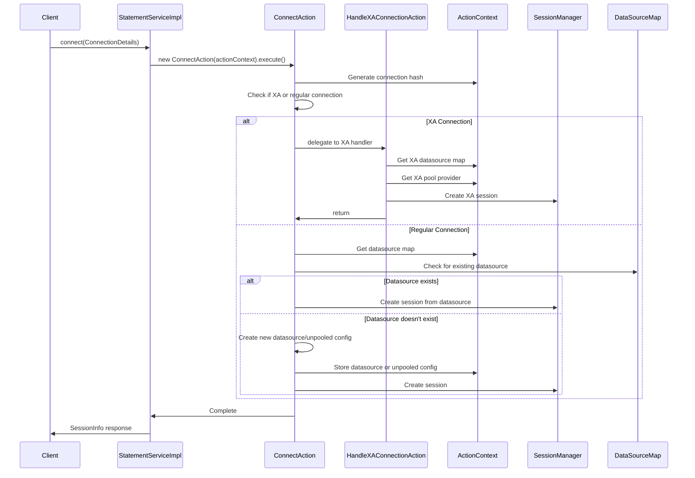

# StatementServiceImpl Action Pattern Refactoring Guide

## Overview

This guide documents the completed Action pattern refactoring of `StatementServiceImpl` and explains how to add new Action classes when extending OJP.

The migration is **complete**: all 21 public methods of `StatementServiceImpl` have been extracted into focused Action classes (PRs #214, #261–#284).

**Reference implementation**: [PR #214](https://github.com/Open-J-Proxy/ojp/pull/214) — `ConnectAction` is the canonical example.

## Why Refactor?

`StatementServiceImpl` was a 2,528-line God class with 21 public methods. The Action pattern splits this into:
- **StatementServiceImpl**: Thin orchestrator (~400 lines)
- **35+ Action classes**: Focused, testable units (~75 lines each)
- **ActionContext**: Centralized shared state holder

## Architecture Diagrams

### Class Diagram

```mermaid
classDiagram
    class StatementServiceImpl {
        -ActionContext actionContext
        +connect(ConnectionDetails, StreamObserver)
        +executeUpdate(StatementRequest, StreamObserver)
        +executeQuery(StatementRequest, StreamObserver)
        +startTransaction(SessionInfo, StreamObserver)
        +commitTransaction(SessionInfo, StreamObserver)
        +rollbackTransaction(SessionInfo, StreamObserver)
        +xaStart(XaStartRequest, StreamObserver)
        +createLob(StreamObserver) StreamObserver
        ...20+ more methods
    }

    class ActionContext {
        -Map~String,DataSource~ datasourceMap
        -Map~String,XADataSource~ xaDataSourceMap
        -Map~String,XATransactionRegistry~ xaRegistries
        -Map~String,UnpooledConnectionDetails~ unpooledConnectionDetailsMap
        -Map~String,DbName~ dbNameMap
        -Map~String,SlowQuerySegregationManager~ slowQuerySegregationManagers
        -XAConnectionPoolProvider xaPoolProvider
        -MultinodeXaCoordinator xaCoordinator
        -ClusterHealthTracker clusterHealthTracker
        -SessionManager sessionManager
        -CircuitBreaker circuitBreaker
        -ServerConfiguration serverConfiguration
        +getDatasourceMap() Map
        +getXaDataSourceMap() Map
        +getSessionManager() SessionManager
        ...getters for all fields
    }

    class Action~TRequest,TResponse~ {
        <<interface>>
        +execute(ActionContext, TRequest, StreamObserver~TResponse~) void
    }

    class StreamingAction~TRequest,TResponse~ {
        <<interface>>
        +execute(StreamObserver~TResponse~) StreamObserver~TRequest~
    }

    class InitAction {
        <<interface>>
        +execute() void
    }

    class ValueAction~TRequest,TResult~ {
        <<interface>>
        +execute(TRequest) TResult
    }

    class ConnectAction {
        -static INSTANCE ConnectAction
        +getInstance() ConnectAction
        +execute(ActionContext, ConnectionDetails, StreamObserver~SessionInfo~) void
        -handleXAConnection()
        -handleRegularConnection()
    }

    class ExecuteUpdateAction {
        -static INSTANCE ExecuteUpdateAction
        +getInstance() ExecuteUpdateAction
        +execute(ActionContext, StatementRequest, StreamObserver~OpResult~) void
    }

    class ExecuteQueryAction {
        -static INSTANCE ExecuteQueryAction
        +getInstance() ExecuteQueryAction
        +execute(ActionContext, StatementRequest, StreamObserver~OpResult~) void
    }

    class StartTransactionAction {
        -static INSTANCE StartTransactionAction
        +getInstance() StartTransactionAction
        +execute(ActionContext, SessionInfo, StreamObserver~SessionInfo~) void
    }

    class CreateLobAction {
        -static INSTANCE CreateLobAction
        +getInstance() CreateLobAction
        +execute(StreamObserver~LobReference~) StreamObserver~LobDataBlock~
    }

    class HandleXAConnectionWithPoolingAction {
        -static INSTANCE HandleXAConnectionWithPoolingAction
        +getInstance() HandleXAConnectionWithPoolingAction
        +execute(ActionContext, ConnectionDetails, StreamObserver~SessionInfo~) void
    }

    StatementServiceImpl --> ActionContext : uses
    StatementServiceImpl ..> ConnectAction : delegates
    StatementServiceImpl ..> ExecuteUpdateAction : delegates
    StatementServiceImpl ..> ExecuteQueryAction : delegates
    StatementServiceImpl ..> StartTransactionAction : delegates
    StatementServiceImpl ..> CreateLobAction : delegates
    
    ConnectAction ..|> Action : implements
    ExecuteUpdateAction ..|> Action : implements
    ExecuteQueryAction ..|> Action : implements
    StartTransactionAction ..|> Action : implements
    CreateLobAction ..|> StreamingAction : implements
    HandleXAConnectionWithPoolingAction ..|> Action : implements
    
    ConnectAction --> ActionContext : receives as param
    ExecuteUpdateAction --> ActionContext : receives as param
    ExecuteQueryAction --> ActionContext : receives as param
    StartTransactionAction --> ActionContext : receives as param
    CreateLobAction --> ActionContext : receives as param
    HandleXAConnectionWithPoolingAction --> ActionContext : receives as param
    
    ConnectAction --> HandleXAConnectionWithPoolingAction : uses
```



### Connect Method Flow (Reference Implementation)



## How It Works

### Action Interfaces

All actions MUST be implemented as singletons and MUST implement the appropriate action interface.

#### 1. Action<TRequest, TResponse>
For standard RPC methods (20 of 21 methods).

```java
public interface Action<TRequest, TResponse> {
    void execute(ActionContext context, TRequest request, StreamObserver<TResponse> responseObserver);
}
```

**Implementation Pattern:**
```java
@Slf4j
public class ConnectAction implements Action<ConnectionDetails, SessionInfo> {
    private static final ConnectAction INSTANCE = new ConnectAction();
    
    private ConnectAction() {
        // Private constructor prevents external instantiation
    }
    
    public static ConnectAction getInstance() {
        return INSTANCE;
    }
    
    @Override
    public void execute(ActionContext context, ConnectionDetails request, 
                       StreamObserver<SessionInfo> responseObserver) {
        // Action logic - stateless, all state via context parameter
    }
}
```

**Examples**: connect, executeUpdate, executeQuery, transactions, XA operations, etc.

#### 2. StreamingAction<TRequest, TResponse>
For bidirectional streaming (1 method: createLob).

```java
public interface StreamingAction<TRequest, TResponse> {
    StreamObserver<TRequest> execute(ActionContext context, StreamObserver<TResponse> responseObserver);
}
```

**Implementation Pattern:**
```java
@Slf4j
public class CreateLobAction implements StreamingAction<LobDataBlock, LobReference> {
    private static final CreateLobAction INSTANCE = new CreateLobAction();
    
    private CreateLobAction() {
        // Private constructor prevents external instantiation
    }
    
    public static CreateLobAction getInstance() {
        return INSTANCE;
    }
    
    @Override
    public StreamObserver<LobDataBlock> execute(ActionContext context,
                                                 StreamObserver<LobReference> responseObserver) {
        // Streaming action logic - stateless, returns StreamObserver for client streaming
        return new StreamObserver<LobDataBlock>() {
            // Implementation...
        };
    }
}
```

**Examples**: createLob

#### 3. InitAction
For initialization operations that don't take request/response parameters.

```java
public interface InitAction {
    void execute();
}
```

**Implementation Pattern:**
```java
@Slf4j
public class InitializeXAPoolProviderAction implements InitAction {
    private static final InitializeXAPoolProviderAction INSTANCE = new InitializeXAPoolProviderAction();
    
    private InitializeXAPoolProviderAction() {
        // Private constructor prevents external instantiation
    }
    
    public static InitializeXAPoolProviderAction getInstance() {
        return INSTANCE;
    }
    
    @Override
    public void execute() {
        // Initialization logic - stateless
    }
}
```

**Examples**: initializeXAPoolProvider

#### 4. ValueAction<TRequest, TResult>
For internal helper operations that return a value directly (not via StreamObserver).

```java
public interface ValueAction<TRequest, TResult> {
    TResult execute(TRequest request) throws Exception;
}
```

**Implementation Pattern:**
```java
@Slf4j
public class ExecuteUpdateInternalAction implements ValueAction<StatementRequest, OpResult> {
    private static final ExecuteUpdateInternalAction INSTANCE = new ExecuteUpdateInternalAction();
    
    private ExecuteUpdateInternalAction() {
        // Private constructor prevents external instantiation
    }
    
    public static ExecuteUpdateInternalAction getInstance() {
        return INSTANCE;
    }
    
    @Override
    public OpResult execute(StatementRequest request) throws Exception {
        // Internal action logic - stateless, returns value directly
        return OpResult.newBuilder().build();
    }
}
```

**Examples**: executeUpdateInternal, findLobContext, sessionConnection

### ActionContext

Holds all shared state (maps, services) used by actions. Thread-safe with ConcurrentHashMap.

**Key fields**:
- `datasourceMap`, `xaDataSourceMap` - Database connections
- `sessionManager` - Session/connection management  
- `circuitBreaker` - Failure protection
- `serverConfiguration` - Server config

Actions access via `context.getDatasourceMap()`, `context.getSessionManager()`, etc.

## Implementation Pattern

### Before: God Class (144 lines inline)
```java
public class StatementServiceImpl extends StatementServiceGrpc.StatementServiceImplBase {
    public void connect(ConnectionDetails details, StreamObserver<SessionInfo> observer) {
        // 144 lines of logic: health checks, hashing, XA branching,
        // multinode coordination, pool creation, session management...
    }
}
```

### After: Action Pattern (3 lines + focused action)

**⚠️ IMPORTANT: All actions MUST be implemented as singletons for thread-safety and memory efficiency.**

Actions are stateless, implement the Action interface, and receive the ActionContext as a parameter.

```java
// StatementServiceImpl - thin delegator
public class StatementServiceImpl extends StatementServiceGrpc.StatementServiceImplBase {
    private final ActionContext actionContext;
    
    public void connect(ConnectionDetails details, StreamObserver<SessionInfo> observer) {
        ConnectAction.getInstance().execute(actionContext, details, observer);
    }
}

// ConnectAction - focused logic (~150 lines) - SINGLETON PATTERN
@Slf4j
public class ConnectAction implements Action<ConnectionDetails, SessionInfo> {
    private static final ConnectAction INSTANCE = new ConnectAction();
    
    private ConnectAction() {
        // Private constructor prevents external instantiation
    }
    
    public static ConnectAction getInstance() {
        return INSTANCE;
    }
    
    @Override
    public void execute(ActionContext context, ConnectionDetails request, 
                       StreamObserver<SessionInfo> responseObserver) {
        // Connection handling logic - stateless, all state via context parameter
        // Access: context.getDatasourceMap(), context.getSessionManager(), etc.
        // Delegate to helper actions: HandleXAConnectionAction.getInstance().execute(context, ...)
    }
}
```

### Why Singletons?

All action classes MUST be implemented as singletons for the following reasons:

1. **Thread-Safety**: Actions implement the Action interface and are stateless - they receive all necessary state via parameters (ActionContext, request). This makes them inherently thread-safe and reusable across concurrent requests.

2. **Memory Efficiency**: Creating new action instances for every request would generate millions of short-lived objects per day in production. Singletons eliminate this overhead.

3. **Performance**: Singleton pattern avoids object allocation and garbage collection overhead on the hot path.

4. **Consistency**: All actions follow the same pattern, making the codebase easier to understand and maintain.

**Note**: Actions do NOT store ActionContext as an instance field. Instead, they receive it as a parameter to their execute() method via the Action interface, ensuring they remain truly stateless and thread-safe.

## Adding a New Action

The migration of all existing methods is complete. When a **new gRPC operation** is added to `StatementService.proto`, follow these steps to add its Action class.

### 1. Choose the right interface

| Use case | Interface |
|---|---|
| New gRPC unary/server-streaming method | `Action<TRequest, TResponse>` |
| New bidirectional streaming method | `StreamingAction<TRequest, TResponse>` |
| Server-startup initialisation | `InitAction` |
| Internal helper called by another Action | `ValueAction<TRequest, TResult>` |

### 2. Study the reference

Review [PR #214](https://github.com/Open-J-Proxy/ojp/pull/214) — especially `ConnectAction` and how it uses `ActionContext`.

### 3. Implementation steps

1. **Create action class** in the appropriate sub-package (e.g., `org.openjproxy.grpc.server.action.transaction`).
2. **Implement the interface**: `public class YourAction implements Action<RequestType, ResponseType>`.
3. **Add the singleton boilerplate**:
   - `private static final YourAction INSTANCE = new YourAction();`
   - `private YourAction() {}`
   - `public static YourAction getInstance() { return INSTANCE; }`
4. **Implement `execute`**: `@Override public void execute(ActionContext context, RequestType request, StreamObserver<ResponseType> observer)`.
5. **Access shared state via `context`**: e.g., `context.getDatasourceMap()`, `context.getSessionManager()`.
6. **Add the one-line delegation** in `StatementServiceImpl`: `YourAction.getInstance().execute(actionContext, request, observer);`.
7. **Write a unit test** (see [Unit Testing Actions](#unit-testing-actions) below).
8. **Verify compilation**: `mvn clean compile`.
9. **Submit a PR** with a clear description.

### Common Patterns

#### Simple Delegation (Singleton Pattern)
```java
// In StatementServiceImpl
public void methodName(Request request, StreamObserver<Response> observer) {
    MethodNameAction.getInstance().execute(actionContext, request, observer);
}

// In Action class (Singleton implementing Action interface)
@Slf4j
public class MethodNameAction implements Action<Request, Response> {
    private static final MethodNameAction INSTANCE = new MethodNameAction();
    
    private MethodNameAction() {}
    
    public static MethodNameAction getInstance() {
        return INSTANCE;
    }
    
    @Override
    public void execute(ActionContext context, Request request, StreamObserver<Response> observer) {
        // Action logic here - stateless, all state via context parameter
    }
}
```

#### Accessing Shared State
```java
// In Action class - context is passed as parameter
public void execute(ActionContext context, Request request, StreamObserver<Response> observer) {
    DataSource ds = context.getDatasourceMap().get(connHash);
    SessionManager sessionManager = context.getSessionManager();
}
```

#### Delegating to Other Actions
```java
// Singleton actions delegate to other singleton actions
HandleXAConnectionAction.getInstance().execute(context, connectionDetails, observer);
CreateSlowQuerySegregationManagerAction.getInstance().execute(context, connHash, maxPoolSize);
```

#### Error Handling
```java
try {
    // Action logic
    responseObserver.onNext(response);
    responseObserver.onCompleted();
} catch (SQLException e) {
    log.error("Error in action", e);
    sendSQLExceptionMetadata(e, responseObserver);
}
```

## Unit Testing Actions

One of the core benefits of the Action pattern is that each Action can be tested with a minimal mock of only the `ActionContext` fields it actually reads. There is no need to wire the full `StatementServiceImpl` with all its dependencies.

### Basic test skeleton (JUnit 5 + Mockito)

```java
import io.grpc.stub.StreamObserver;
import org.junit.jupiter.api.BeforeEach;
import org.junit.jupiter.api.Test;
import org.junit.jupiter.api.extension.ExtendWith;
import org.mockito.Mock;
import org.mockito.junit.jupiter.MockitoExtension;

import static org.mockito.ArgumentMatchers.any;
import static org.mockito.Mockito.*;

@ExtendWith(MockitoExtension.class)
class CommitTransactionActionTest {

    // Only mock the ActionContext fields that CommitTransactionAction actually uses
    @Mock private ActionContext context;
    @Mock private SessionManager sessionManager;
    @Mock private Connection connection;
    @Mock private StreamObserver<SessionInfo> responseObserver;

    @BeforeEach
    void setUp() throws Exception {
        when(context.getSessionManager()).thenReturn(sessionManager);
        when(sessionManager.getConnection(any())).thenReturn(connection);
    }

    @Test
    void shouldCommitTransactionAndRespond() throws Exception {
        SessionInfo session = SessionInfo.newBuilder().setSessionId("test-session").build();

        CommitTransactionAction.getInstance().execute(context, session, responseObserver);

        verify(connection).commit();
        verify(responseObserver).onNext(any(SessionInfo.class));
        verify(responseObserver).onCompleted();
        verify(responseObserver, never()).onError(any());
    }

    @Test
    void shouldPropagateExceptionOnCommitFailure() throws Exception {
        doThrow(new SQLException("connection lost")).when(connection).commit();
        SessionInfo session = SessionInfo.newBuilder().setSessionId("test-session").build();

        CommitTransactionAction.getInstance().execute(context, session, responseObserver);

        // GrpcExceptionHandler converts the SQLException into an onError call
        verify(responseObserver).onError(any());
        verify(responseObserver, never()).onCompleted();
    }
}
```

### Key points

- **`ActionContext` is injected per-call**, not stored by the Action. Mock only the fields the Action under test reads — all others can remain as uninitialised mocks.
- **The singleton instance is reused between tests** — which is safe because Actions are stateless. Do not replace `INSTANCE` or use reflection to reset it.
- **`StreamObserver` is a plain interface** and trivial to mock with Mockito.
- For Actions that delegate to other Actions (e.g., `ConnectAction` delegating to `HandleXAConnectionWithPoolingAction`), use `mockStatic` or extract the delegation call into a package-private helper method to allow substitution in tests.

## Package Structure

```
org.openjproxy.grpc.server.action/
├── connection/   ConnectAction, HandleXAConnectionWithPoolingAction,
│                 HandleUnpooledXAConnectionAction, CreateSlowQuerySegregationManagerAction
├── transaction/  ExecuteUpdateAction, ExecuteQueryAction, FetchNextRowsAction,
│                 StartTransactionAction, CommitTransactionAction, RollbackTransactionAction,
│                 XaForgetAction, XaIsSameRMAction, XaGetTransactionTimeoutAction,
│                 XaSetTransactionTimeoutAction
│                 (XA lifecycle helpers that complement standard transaction operations)
├── xa/           XaStartAction, XaEndAction, XaPrepareAction, XaCommitAction,
│                 XaRollbackAction, XaRecoverAction
│                 (core XA protocol operations: start/end/prepare/commit/rollback/recover)
├── streaming/    CreateLobAction (StreamingAction), ReadLobAction (Action)
├── session/      TerminateSessionAction
├── resource/     CallResourceAction
└── util/         ProcessClusterHealthAction
```

> **Note**: `ReadLobAction` lives in `streaming/` alongside `CreateLobAction` but implements `Action` (not `StreamingAction`) because it uses standard server-streaming, not bidirectional streaming.

## Benefits

- ✅ **Testability**: Each action independently testable (see [Unit Testing Actions](#unit-testing-actions))
- ✅ **Maintainability**: ~75–150 line focused classes vs 2,528 line God class
- ✅ **Code Review**: Smaller, focused PRs
- ✅ **Parallel Development**: Multiple contributors can work simultaneously without merge conflicts on `StatementServiceImpl`
- ✅ **Debugging**: Easier to trace specific operations

---

**Further reading**: [ADR-009](../ADRs/adr-009-action-pattern-for-statement-service.md) documents the architectural rationale, alternatives considered, and consequences of this design decision.
