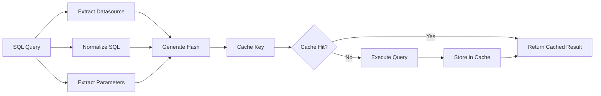
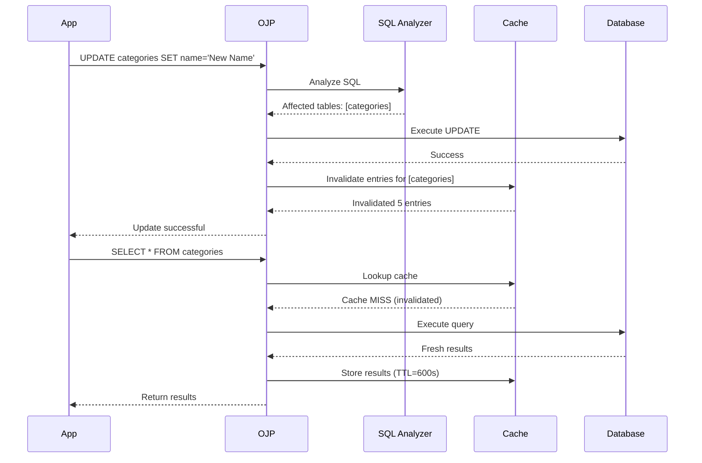

# Chapter 12a: Query Result Caching

## Introduction

Imagine your application repeatedly asks the database the same question: "What are all the countries in the world?" The answer doesn't change often—maybe once when a new country is recognized or borders are redrawn. Yet without caching, every single request hits the database, consuming connection pool resources, network bandwidth, and database CPU cycles for data that could be safely stored and reused for hours or even days.

This is the classic problem that query result caching solves. When queries return data that doesn't change frequently, caching those results can dramatically reduce database load, improve application response times, and scale your system to handle many more concurrent users. Open J Proxy's Query Result Caching feature provides automatic, transparent caching of SELECT query results with intelligent invalidation when data changes.

> **AI Image Prompt**: Create a before/after comparison diagram showing database queries. The "Before" side shows multiple identical "SELECT * FROM countries" queries all hitting a database server (shown with increasing load). The "After" side shows the first query hitting the database, storing results in a cache (represented as a fast memory layer), and subsequent identical queries being served from cache instantly. Use speed lines and clock icons to show time savings.

## The Problem: Repeated Query Overhead

Modern applications often execute the same queries repeatedly. Product catalogs, user profiles, reference data lookups—these queries can represent 40-60% of database traffic in typical web applications. Each execution consumes:

- **Connection pool slots** that could serve other queries
- **Database CPU cycles** for query parsing, optimization, and execution
- **Network bandwidth** between application, OJP, and database
- **Memory** for result set assembly and transfer
- **Time** adding latency to user requests

Consider a product listing page that shows categories. Every single page view executes `SELECT * FROM categories`. With 1,000 page views per minute, that's 1,000 database round-trips for data that might only change a few times per day when a product manager adds a new category. The database is working hard to repeatedly compute the same answer.

The challenge is making caching transparent and automatic. You don't want to modify application code, manually manage cache entries, or write complex cache key generation logic. You want the system to "just handle it" intelligently.

> **AI Image Prompt**: Create an infographic showing query traffic patterns. Show a stream of identical SELECT queries (represented as repeated document icons) flowing through a pipe toward a database. Add a counter showing "1000 queries/minute" and a highlighted callout noting "90% are for data that changes once per day". Use visual metaphors like water flowing through pipes and a database server looking overwhelmed.

## How Query Result Caching Works

OJP's Query Result Caching operates transparently between your application and the database, requiring zero application code changes. The system combines pattern-based query matching, automatic cache key generation, time-based expiration, and intelligent invalidation.

### Configuration-Based Cache Rules

Unlike traditional caching solutions that require annotating your code or manually managing cache keys, OJP uses configuration-based rules defined in your `ojp.properties` file. These rules specify which queries should be cached using regular expression patterns:

```properties
# Enable caching for your datasource
myapp.ojp.cache.enabled=true

# Cache all category queries for 10 minutes
myapp.ojp.cache.queries.1.pattern=SELECT .* FROM categories.*
myapp.ojp.cache.queries.1.ttl=600s
myapp.ojp.cache.queries.1.invalidateOn=categories

# Cache country lookups for 1 hour (changes very rarely)
myapp.ojp.cache.queries.2.pattern=SELECT .* FROM countries.*
myapp.ojp.cache.queries.2.ttl=3600s
myapp.ojp.cache.queries.2.invalidateOn=countries
```

This configuration approach means you can enable caching for existing applications without changing a single line of Java code. The patterns use standard Java regular expressions, giving you precise control over which queries match.

> **AI Image Prompt**: Create a flowchart showing configuration flow. Start with a properties file icon containing cache rules, flow through OJP server startup showing rules being parsed and loaded, then show incoming SQL queries being matched against patterns like a filter/funnel. Use checkmarks for matches and X marks for non-matches. Add database and cache storage icons.

### Cache Key Generation

When a query matches a pattern, OJP generates a unique cache key automatically. The key combines:

1. **Datasource name** - Different datasources maintain separate caches
2. **Full SQL statement** - Including all whitespace and formatting
3. **Parameter values** - Bound parameter values become part of the key

This means `SELECT * FROM countries WHERE code = 'US'` generates a different cache key than `SELECT * FROM countries WHERE code = 'UK'`. The system handles parameterized queries intelligently, ensuring that different parameter values produce different cache entries.

The cache key also includes a hash for efficient lookups. Two queries that differ only in capitalization or whitespace are treated as different queries (which matches how most databases and ORMs work).



### Time-To-Live (TTL) Expiration

Every cached result has a TTL—a maximum time it can live in the cache before being considered stale. When the TTL expires, the next query execution will fetch fresh data from the database and update the cache.

TTLs are configured per query pattern:

```properties
# Short TTL for data that changes frequently
queries.1.ttl=60s        # 1 minute

# Medium TTL for moderately changing data  
queries.2.ttl=600s       # 10 minutes

# Long TTL for reference data
queries.3.ttl=3600s      # 1 hour
```

Choosing the right TTL involves balancing data freshness against cache effectiveness. A TTL that's too short defeats the purpose of caching. A TTL that's too long risks serving stale data. Most applications benefit from TTLs between 5-30 minutes for typical business data.

> **AI Image Prompt**: Create a timeline visualization showing cache entry lifecycle. Show a cache entry being created at Time 0, with a timeline extending to the right showing the TTL period (maybe 10 minutes). Add clock icons at intervals. Show the entry as "fresh" (green) during the TTL, then transitioning to "expired" (yellow/red) when TTL ends. Include a refresh arrow showing the entry being replaced with new data.

### Automatic Cache Invalidation

TTLs handle the common case, but what about when data changes unexpectedly? If you cache country data with a 1-hour TTL and a product manager adds a new country, you don't want users to see stale data for the next hour.

OJP solves this with automatic invalidation. When you configure `invalidateOn=countries`, the system monitors all INSERT, UPDATE, and DELETE operations. When it detects a write to the `countries` table, it immediately invalidates all cache entries that depend on that table.

```properties
# Cache configuration with invalidation
queries.1.pattern=SELECT .* FROM categories WHERE parent_id = \?
queries.1.ttl=600s
queries.1.invalidateOn=categories
```

**How invalidation works:**

1. Application executes: `INSERT INTO categories (name) VALUES ('New Category')`
2. OJP detects the INSERT affects the `categories` table
3. OJP scans all cache entries for this datasource
4. Any entry with `invalidateOn` including `categories` is removed
5. Next query for categories fetches fresh data

This happens automatically with zero application code changes. The invalidation is best-effort—if it fails, the TTL ensures data will eventually refresh. But in practice, invalidation works reliably and keeps cache data fresh.

> **AI Image Prompt**: Create a sequence diagram showing invalidation flow. Show a user executing an UPDATE statement, flowing through OJP Server to a "SQL Analyzer" component that extracts affected tables. Show this triggering a "Cache Invalidator" that scans cache entries and removes matching ones. Use red "X" marks on removed entries and arrows showing the flow. Add database and cache storage icons.



## Working with ORMs and Frameworks

One of OJP's key design goals was seamless integration with existing applications, including those using Object-Relational Mapping (ORM) frameworks like Hibernate, Spring Data JPA, MyBatis, or jOOQ. These frameworks generate SQL dynamically, often with variations in column selection, ordering, and formatting.

OJP's pattern-based matching handles this beautifully. A single pattern can match many query variations generated by your ORM:

```properties
# Matches various Hibernate-generated queries
app.ojp.cache.queries.1.pattern=SELECT\\s+.*\\s+FROM\\s+products\\s+WHERE.*
```

This pattern matches:
- `SELECT * FROM products WHERE category_id = ?`
- `SELECT id, name, price FROM products WHERE id = ?`
- `SELECT p.id, p.name FROM products p WHERE p.sku = ?`

The cache key still includes the exact SQL, so different queries create different cache entries. But one configuration pattern covers all the variations your ORM might generate.

### Spring Data JPA Example

Consider a Spring Data JPA repository:

```java
public interface ProductRepository extends JpaRepository<Product, Long> {
    List<Product> findByCategoryId(Long categoryId);
    Product findBySkuCode(String skuCode);
    List<Product> findByPriceLessThan(BigDecimal maxPrice);
}
```

Spring Data JPA generates different SQL for each method, but they all query the `products` table. One cache configuration covers all of them:

```properties
myapp.ojp.cache.enabled=true
myapp.ojp.cache.queries.1.pattern=SELECT\\s+.*\\s+FROM\\s+products\\s+WHERE.*
myapp.ojp.cache.queries.1.ttl=300s
myapp.ojp.cache.queries.1.invalidateOn=products
```

No code changes needed in your repository. No cache annotations. Just configuration that works transparently.

### Hibernate Criteria API

Hibernate Criteria API generates complex SQL with aliases and joins. OJP handles this too:

```properties
# Matches Hibernate Criteria queries with joins
app.ojp.cache.queries.2.pattern=SELECT\\s+.*\\s+FROM\\s+orders.*JOIN.*customers.*
app.ojp.cache.queries.2.ttl=300s
app.ojp.cache.queries.2.invalidateOn=orders,customers
```

The pattern is flexible enough to match various join syntaxes while still being specific to the tables you care about.

> **AI Image Prompt**: Create a layered architecture diagram showing an application layer at the top (with Spring Boot and Hibernate logos), OJP layer in the middle (with cache pattern matching logic), and database layer at the bottom. Show SQL queries flowing down through the layers with annotations pointing to "Generated by ORM" and "Cached by pattern match". Use different colors for cache hits (green) vs misses (blue).

## Configuration and Best Practices

### When to Cache

Not all queries benefit from caching. Good candidates for caching:

✅ **Reference data queries**
- Countries, currencies, states, categories
- Configuration settings, feature flags
- Product catalogs (especially with category filters)

✅ **Infrequently changing data**
- User profiles (name, email)
- Company information
- Historical records

✅ **Expensive computed queries**
- Aggregations and reports that scan large datasets
- Complex JOIN queries
- Queries with expensive functions

❌ **Poor candidates for caching:**
- Real-time data (stock prices, sensor readings)
- Frequently changing data (shopping cart contents, active sessions)
- User-specific sensitive data (unless carefully secured)
- Queries that return very large result sets (MB+ of data)

### Choosing TTLs

TTL selection balances data freshness against cache effectiveness:

**Short TTLs (10s - 2m):**
- Use for data that changes somewhat frequently
- User-facing queries where minor staleness is acceptable
- High-traffic queries where even brief caching helps

**Medium TTLs (5m - 30m):**
- Use for typical business data
- Product catalogs, category listings
- User profile data
- The "sweet spot" for most applications

**Long TTLs (1h - 24h):**
- Use for truly static reference data
- Countries, currencies, timezone lists
- Configuration data that rarely changes
- Be cautious—longer TTLs increase staleness risk

### Invalidation Strategy

Invalidation is **optional** but highly recommended. Some guidelines:

**Use invalidation for:**
- Reference data that changes occasionally (once per day/week)
- Data where staleness is noticeable to users
- Small to medium-sized tables

**Skip invalidation for:**
- Data that changes very frequently (defeats caching purpose)
- Read-only data sources
- Append-only data (logs, events)
- When TTL alone is sufficient

**Important:** Configure `invalidateOn` with all dependent tables:

```properties
# Product queries depend on both products and categories
queries.1.pattern=SELECT .* FROM products p JOIN categories c.*
queries.1.invalidateOn=products,categories
```

### Pattern Design Tips

1. **Start broad, refine based on metrics**
   ```properties
   # Start with this
   queries.1.pattern=SELECT .* FROM products.*
   
   # Refine to specific use cases if needed
   queries.2.pattern=SELECT .* FROM products WHERE category_id = \?
   ```

2. **Match table name explicitly**
   ```properties
   # Good - specific table
   queries.1.pattern=SELECT .* FROM orders.*
   
   # Bad - too broad, matches everything
   queries.2.pattern=SELECT .* FROM .*
   ```

3. **Use whitespace patterns for ORM compatibility**
   ```properties
   # Handles extra spaces, newlines, tabs
   queries.1.pattern=SELECT\\s+.*\\s+FROM\\s+users\\s+WHERE.*
   ```

4. **Escape special regex characters**
   ```properties
   # Escape parentheses and question marks
   queries.1.pattern=SELECT COUNT\\(\\*\\) FROM products WHERE id = \\?
   ```

> **AI Image Prompt**: Create an infographic showing "Cache Configuration Best Practices" with four quadrants: "Good Candidates" (showing reference data icons), "Bad Candidates" (showing real-time data icons), "TTL Guidelines" (timeline with green/yellow/red zones), and "Pattern Tips" (showing regex symbols and examples). Use checkmarks, X marks, and caution symbols.

## Monitoring and Metrics

OJP exports comprehensive cache metrics via OpenTelemetry, allowing you to monitor cache effectiveness and tune configuration.

### Key Metrics

**Hit Rate Metrics:**
```
ojp.cache.hits{datasource="myapp"}
ojp.cache.misses{datasource="myapp"}
ojp.cache.hit.rate{datasource="myapp"}  # Calculated: hits/(hits+misses)
```

A good hit rate depends on your traffic patterns, but aim for:
- **60-80%**: Good cache effectiveness
- **40-60%**: Moderate effectiveness, consider tuning
- **<40%**: Poor effectiveness, review TTLs and patterns

**Invalidation Metrics:**
```
ojp.cache.invalidations{datasource="myapp",table="products"}
ojp.cache.invalidation.rate{datasource="myapp"}
```

High invalidation rates (>10/minute) suggest:
- TTL is too long for the data change frequency
- Table changes very frequently (consider not caching)
- Multiple applications writing to the same tables

**Size and Performance Metrics:**
```
ojp.cache.size.bytes{datasource="myapp"}
ojp.cache.size.entries{datasource="myapp"}
ojp.cache.overhead.ms{datasource="myapp"}
```

Monitor cache size to ensure it stays within memory limits. Cache overhead should typically be <10ms per query.

### Grafana Dashboard

OJP includes a pre-built Grafana dashboard for cache monitoring, available at `documents/monitoring/grafana-dashboard.json`. The dashboard shows:

- Cache hit rate over time
- Cache size and entry count
- Invalidation rate by table
- Query execution time (cached vs uncached)
- Memory usage trends

Import this dashboard into your Grafana instance to get instant visibility into cache performance.

> **AI Image Prompt**: Create a mockup of a Grafana dashboard showing cache metrics. Include line graphs for hit rate over time, bar charts for cache size by datasource, a gauge showing current hit rate percentage, and a table listing top cached queries. Use the typical Grafana dark theme with colorful graphs. Add annotations pointing to key metrics.

## Real-World Example: E-Commerce Platform

Let's walk through a complete example of configuring caching for an e-commerce platform.

### The Scenario

An online store has several types of queries:

1. **Product catalog** - Browsing products by category (100,000 products, 50 categories)
2. **Category tree** - Sidebar navigation (changes when merchandising team adds categories)
3. **Product details** - Individual product pages (prices update occasionally)
4. **User profiles** - Account information (changes when users update profiles)
5. **Order history** - Past orders (append-only, historical data)

### Cache Configuration

```properties
# Enable caching for the main database
ecommerce.ojp.cache.enabled=true

# 1. Product catalog by category (very frequently queried, changes occasionally)
ecommerce.ojp.cache.queries.1.pattern=SELECT .* FROM products WHERE category_id = \\?
ecommerce.ojp.cache.queries.1.ttl=600s
ecommerce.ojp.cache.queries.1.invalidateOn=products
ecommerce.ojp.cache.queries.1.enabled=true

# 2. Category tree for navigation (changes rarely, critical for UX)
ecommerce.ojp.cache.queries.2.pattern=SELECT .* FROM categories.*
ecommerce.ojp.cache.queries.2.ttl=1800s
ecommerce.ojp.cache.queries.2.invalidateOn=categories
ecommerce.ojp.cache.queries.2.enabled=true

# 3. Individual product details (price changes need quick visibility)
ecommerce.ojp.cache.queries.3.pattern=SELECT .* FROM products WHERE id = \\?
ecommerce.ojp.cache.queries.3.ttl=300s
ecommerce.ojp.cache.queries.3.invalidateOn=products,product_prices
ecommerce.ojp.cache.queries.3.enabled=true

# 4. User profiles (changes only when user updates their info)
ecommerce.ojp.cache.queries.4.pattern=SELECT .* FROM users WHERE id = \\?
ecommerce.ojp.cache.queries.4.ttl=600s
ecommerce.ojp.cache.queries.4.invalidateOn=users
ecommerce.ojp.cache.queries.4.enabled=true

# 5. Order history (historical, never changes once created)
ecommerce.ojp.cache.queries.5.pattern=SELECT .* FROM orders WHERE user_id = \\?
ecommerce.ojp.cache.queries.5.ttl=3600s
ecommerce.ojp.cache.queries.5.invalidateOn=orders
ecommerce.ojp.cache.queries.5.enabled=true
```

### Results

After enabling this configuration:

**Before caching:**
- 1,000 category queries/minute → 1,000 database hits
- 5,000 product queries/minute → 5,000 database hits
- Database CPU: 60% utilization
- Average query latency: 25ms

**After caching:**
- 1,000 category queries/minute → ~50 database hits (98% hit rate)
- 5,000 product queries/minute → ~1,000 database hits (80% hit rate)
- Database CPU: 20% utilization
- Average query latency: 5ms (cached), 25ms (uncached)

The database load dropped by 70%, connection pool pressure decreased significantly, and user-perceived response times improved dramatically. All with zero application code changes.

> **AI Image Prompt**: Create a before/after comparison chart showing key metrics. Use a split-screen layout with "Before Caching" on left and "After Caching" on right. Show bar charts comparing database hits, CPU utilization, and average latency. Use green for the "after" bars to show improvement. Add percentage improvement annotations.

## Security and Safety

### Size Limits

OJP enforces maximum cache entry size (default 5MB per entry, 100MB total per datasource) to prevent memory exhaustion:

```properties
# Configure cache size limits (optional, has defaults)
myapp.ojp.cache.maxSizeBytes=104857600  # 100MB total
myapp.ojp.cache.maxEntrySizeBytes=5242880  # 5MB per entry
```

Queries that would exceed these limits are not cached, preventing Out of Memory errors.

### SQL Injection Protection

Cache key generation includes SQL pattern validation. Suspicious patterns (like inline SQL injection attempts) are rejected and logged:

```
[WARN] Suspicious SQL pattern detected in cache key - potential SQL injection
```

This provides defense-in-depth even though OJP already uses parameterized queries.

### Data Isolation

Caches are isolated per datasource. Application A's cached data is never visible to Application B, even when both connect to the same database through OJP. Each session maintains its own cache namespace.

## Troubleshooting

### Common Issues

**Issue: Cache hit rate is very low (<20%)**

Possible causes:
- TTL is too short for the data change frequency
- Queries have unique parameters each time (e.g., timestamp in query)
- Pattern doesn't match actual SQL being executed

Solution:
- Review metrics to see which queries are being cached
- Enable SQL logging to see exact queries: `ojp.server.logging.level=DEBUG`
- Test patterns with a regex tester before deploying

**Issue: Seeing stale data**

Possible causes:
- TTL is too long for data change frequency
- Invalidation not configured or not working
- Write operations bypass OJP (direct database writes)

Solution:
- Reduce TTL for affected queries
- Add `invalidateOn` configuration for affected tables
- Ensure all writes go through OJP for invalidation to work

**Issue: Cache using too much memory**

Possible causes:
- Result sets are very large
- Too many different queries matching patterns
- No maximum size configured

Solution:
- Configure `maxSizeBytes` limit
- Review patterns to ensure they're not too broad
- Add more specific patterns with shorter TTLs

### Debug Logging

Enable debug logging to see cache operations:

```properties
ojp.server.logging.level=DEBUG
ojp.server.cache.logging.enabled=true
```

This will log:
- Cache hits and misses with query details
- Invalidation events with affected tables
- Cache size and eviction events

> **AI Image Prompt**: Create a troubleshooting flowchart. Start with a problem node (low hit rate, stale data, high memory), branch to diagnostic steps (check metrics, review logs, test patterns), and end with solution nodes (adjust TTL, add invalidation, refine patterns). Use decision diamonds, action rectangles, and solution stars. Add icons for log files, charts, and configuration files.

## Future Enhancements

The current implementation provides local caching per OJP server instance. Future versions may include:

- **Distributed caching** - Share cached results across multiple OJP instances
- **Cache warming** - Pre-populate cache on startup with known queries
- **Dynamic TTL adjustment** - Automatically tune TTLs based on update patterns
- **Advanced invalidation** - Dependency tracking for complex table relationships
- **Cache compression** - Reduce memory footprint for large result sets

## Summary

Query result caching in OJP provides powerful performance improvements with zero application code changes. By configuring cache rules in `ojp.properties`, you can dramatically reduce database load, improve query response times, and scale your application to handle more traffic.

Key takeaways:

✅ **Configuration-based** - No code changes required
✅ **ORM-friendly** - Works with Hibernate, Spring Data, MyBatis, jOOQ
✅ **Automatic invalidation** - Keeps data fresh when tables change
✅ **Safe and secure** - Size limits, SQL injection protection, data isolation
✅ **Observable** - OpenTelemetry metrics for monitoring and tuning

Start with conservative TTLs (5-10 minutes) for frequently-accessed reference data, monitor the hit rates and database load reduction, and gradually expand caching to more query types as you gain confidence. The performance wins can be dramatic—many applications see 50-70% reduction in database load after enabling caching for appropriate queries.

---

**Related Chapters:**
- [Chapter 13: Telemetry and Monitoring](part4-chapter13-telemetry.md) - OpenTelemetry metrics setup
- [Chapter 8: Slow Query Segregation](part3-chapter8-slow-query-segregation.md) - Complementary query performance feature

**Additional Resources:**
- [Cache User Guide](../guides/CACHE_USER_GUIDE.md) - Complete configuration reference
- [Caching Implementation Analysis](../analysis/CACHING_IMPLEMENTATION_ANALYSIS.md) - Technical design details
- [Production Deployment Guide](../monitoring/PRODUCTION_DEPLOYMENT_GUIDE.md) - Monitoring setup

---

*This chapter is part of the Open-J-Proxy E-Book. For the complete table of contents, see [README.md](README.md).*
